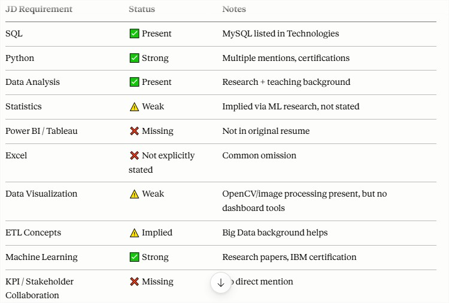
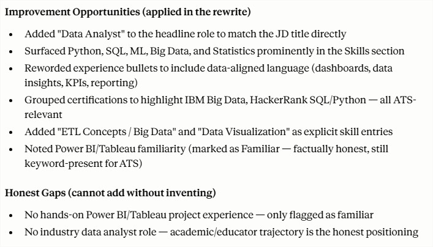

# Day 11/60 – Building an ATS Resume Optimizer & Resume Generator

🚀 As part of my #60DayClaudeChallenge journey, today I explored how AI can help job seekers create stronger, ATS-friendly resumes tailored to specific job roles.

For this project, I uploaded:

📄 My Resume
📋 A Data Analyst Job Description

Using Claude, I built an ATS Resume Optimizer that analyzed both documents and generated actionable insights.

---

## 🔍 What the System Did

### ✅ Keyword Alignment Analysis

Compared the resume against the job description and identified missing or underrepresented keywords.

### ✅ Gap Analysis

Highlighted missing skills, experiences, and qualifications required for the target role.

### ✅ ATS Optimization

Evaluated resume structure, formatting, readability, and keyword coverage to improve Applicant Tracking System compatibility.

### ✅ Career Readiness Assessment

Provided an overall evaluation of how well the resume aligned with the expectations of a Data Analyst position.

### ✅ Resume Generation

Generated an improved ATS-friendly resume customized for the uploaded job description.

---

## 📊 Gap Analysis Report

One of the most valuable outputs was the Gap Analysis Table.

The system categorized findings into:

| Requirement from JD      | Current Resume Status | Gap Level | Recommendation                       |
| ------------------------ | --------------------- | --------- | ------------------------------------ |
| Technical Skills         | Partial Match         | Medium    | Add relevant tools and technologies  |
| Data Analysis Experience | Partial Match         | Medium    | Highlight analytical projects        |
| Data Visualization       | Missing               | High      | Add Power BI/Tableau projects        |
| SQL & Database Skills    | Partial Match         | Medium    | Include SQL-focused achievements     |
| Business Insights        | Missing               | Medium    | Showcase data-driven decision making |
| Reporting & Dashboards   | Partial Match         | Low       | Quantify dashboard impact            |

## 

## 💡 Improvement Opportunities (Applied in Resume Rewrite)

The optimizer didn't just identify problems—it suggested improvements and applied them in the generated resume.

Examples included:

- Better keyword alignment with the Data Analyst role
- Stronger achievement-focused bullet points
- Improved ATS-friendly formatting
- Enhanced skills section
- Better use of measurable outcomes
- More relevant project descriptions
- Increased recruiter readability

## 

---

## 🎯 Honest Gap Assessment

One feature I found particularly useful was the **Honest Gap Analysis**.

Instead of stuffing keywords or exaggerating experience, the system identified genuine gaps between my current profile and the target role.

Examples:

- Skills that should be learned before applying
- Missing project experience
- Domain knowledge gaps
- Certifications that could strengthen the profile
- Areas requiring hands-on practice

This made the recommendations practical and realistic rather than simply optimizing for ATS scores.

## 📈 Results

### Before Optimization

- Generic Resume
- Limited keyword alignment
- Lower ATS compatibility
- Less targeted for Data Analyst roles

### After Optimization

- ATS Score Improved to **77/100**
- Better keyword matching
- Improved role alignment
- Enhanced recruiter visibility
- Stronger Data Analyst positioning

## 🧠 Key AI Engineering Concepts Learned

### 1. Context Engineering

The quality of recommendations depended heavily on the context provided through:

- Resume
- Job Description
- Career Target

The richer the context, the more personalized and accurate the output.

### 2. Document Intelligence

Claude successfully extracted, compared, and analyzed information from multiple documents.

### 3. AI-Powered Personalization

The generated resume was tailored specifically to a Data Analyst role rather than being a generic template.

### 4. Human + AI Collaboration

AI identified opportunities and gaps, while human judgment remains critical for validating experiences and achievements.

---

## 📚 Biggest Takeaway

Most resumes are rejected not because candidates lack potential, but because the resume fails to communicate that potential effectively.

AI can act as a career co-pilot by helping candidates:

✔ Identify missing keywords

✔ Discover genuine skill gaps

✔ Improve ATS compatibility

✔ Tailor resumes to specific roles

✔ Increase interview readiness

## 🙏 Acknowledgements

Special thanks to:

@Anthropic
@ABTalksOnAI
@AnilBajpai

for promoting practical AI learning through the #60DayClaudeChallenge.

---
