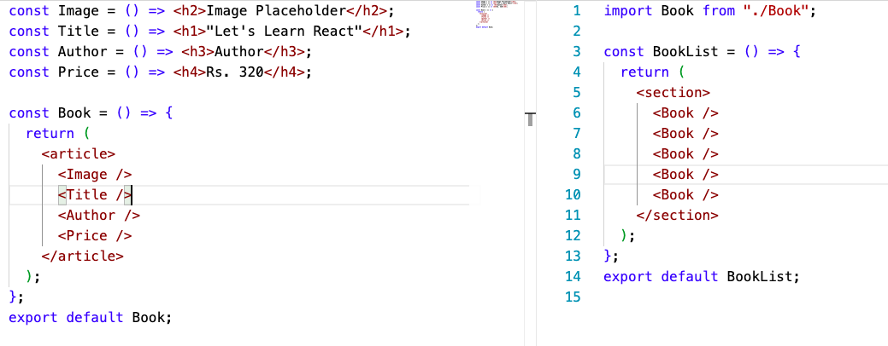
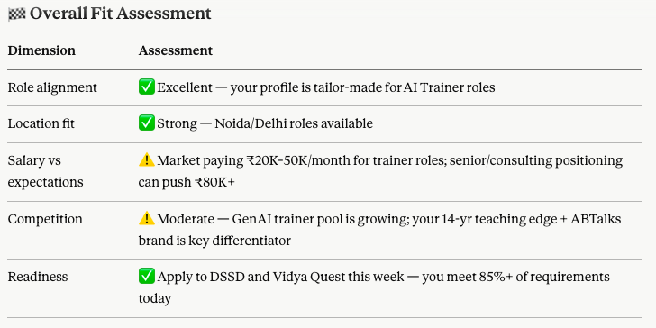
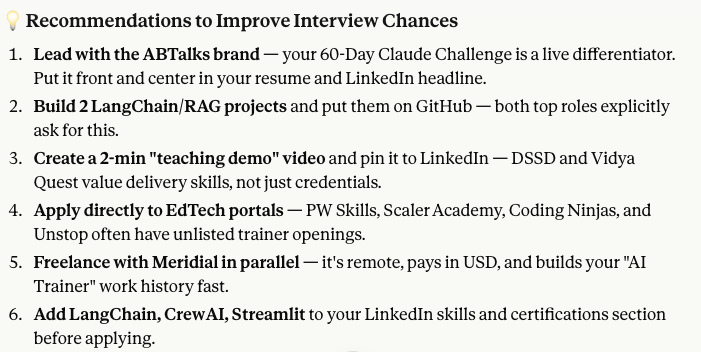
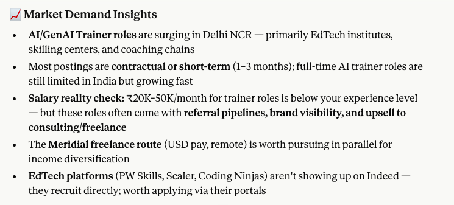
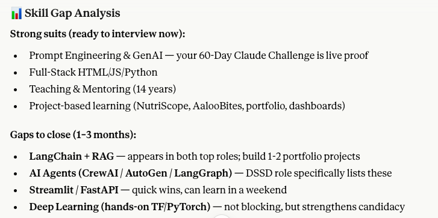

# Day 13/60 – Built an AI Job Search Assistant using Claude Connectors

🚀 As part of the **#60DayClaudeChallenge**, today I explored how AI can transform the job search process from manual searching to personalized opportunity discovery.

Using **Claude Connectors** with **Indeed**, I built an AI Job Search Assistant capable of analyzing my profile, matching roles, identifying skill gaps, and prioritizing opportunities.

Instead of asking:

> "Find me a job."

## I used a structured approach with three carefully designed prompts.

## Step 1: Professional Background Analysis

I asked Claude to understand my:

- Professional experience
- Technical skills
- Teaching background
- Full-Stack Development expertise
- AI Engineering journey

This created a detailed profile that became the foundation for all subsequent analysis.

📸

## 

---

## Step 2: Target Job Requirements

Next, I defined:

- Preferred job roles
- Required skills
- Career objectives
- Industry preferences

This helped Claude understand exactly what opportunities should be prioritized.

📸

## 

---

## Step 3: Job Discovery & Analysis

Using Indeed data through Claude Connectors, Claude was able to:

- Discover relevant job opportunities
- Match opportunities against my profile
- Rank jobs based on suitability
- Identify skill gaps
- Recommend next steps

### Results Generated

✅ Relevant Job Matches

✅ Opportunity Prioritization

✅ Skill Gap Analysis

✅ Career Development Suggestions

✅ Personalized Recommendations

The results were surprisingly accurate and highly personalized.

📸

## 

---

## What Made This Different?

Traditional job searching often looks like this:

```text
Search Jobs
     ↓
Read Description
     ↓
Compare Manually
     ↓
Apply
```

With AI, the workflow becomes:

```text
Professional Profile
        +
Career Goals
        +
External Job Data
        ↓
AI Analysis
        ↓
Role Matching
        ↓
Opportunity Prioritization
        ↓
Career Recommendations
```

📸

## 

## 

---

## Key Learning

This project reinforced one of the most important concepts in AI Engineering:

> Better context produces better outcomes.

The quality of recommendations improved significantly because Claude had access to:

- My professional background
- Career goals
- Target role requirements
- External job market data

Instead of providing generic recommendations, it generated insights tailored specifically to my profile.

---

## Biggest Takeaway

AI is evolving beyond content generation.

It can now act as a career co-pilot by helping professionals:

- Discover relevant opportunities
- Prioritize job applications
- Identify skill gaps
- Plan career growth
- Make better career decisions

## What impressed me most was how Claude transformed raw job listings into actionable career insights.

## Acknowledgements

Special thanks to:

@Anthropic

@ABTalksOnAI

@AnilBajpai

for promoting practical AI learning through the **#60DayClaudeChallenge**.

---

## Hashtags

#60DayClaudeChallenge

#ClaudeAI

#Anthropic

#ClaudeConnectors

#AIEngineering

#PromptEngineering

#ContextEngineering

#JobSearch

#CareerDevelopment

#Indeed

#ArtificialIntelligence

#BuildInPublic

#LearningInPublic
