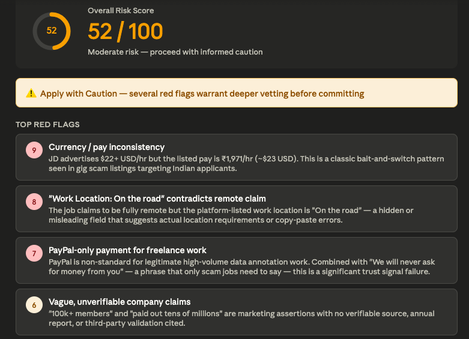
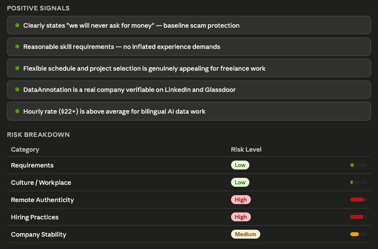

# Day 14/60 – Built an AI Job Red Flag Detector 🚩

As part of the **#60DayClaudeChallenge**, today I explored a different side of AI-assisted job searching.

Most job seekers focus on finding opportunities.

But an equally important question is:

> Should I apply in the first place?

To answer this, I built an **AI Job Red Flag Detector** using Claude.

### 📥 Inputs

* Job Description from LinkedIn
* Company Information
* Hiring Details

### 🎯 Objective

Identify hidden risks before investing time in:

* Applications
* Assessments
* Interviews

### 🔍 What Claude Analyzed

✅ Unrealistic Requirements

✅ Toxic Workplace Signals

✅ Remote Job Authenticity

✅ Hiring Risks

✅ Company Risks

### 📊 Example Output

**Overall Risk Score:** 52/100

**Top Red Flags**

* Severity score between 7–9
* Highlighted potential concerns that deserved further investigation

**Positive Signals**

* Identified 5 positive indicators about the opportunity

**Risk Breakdown**

| Category          | Risk Level |
| ----------------- | ---------- |
| Requirements      | Low        |
| Culture           | Low        |
| Remote            | High       |
| Hiring            | High       |
| Company Stability | Medium     |

**Final Verdict**

⚠️ Apply with Caution

### 🧠 What I Learned

AI can help job seekers evaluate opportunities more objectively by identifying signals that are easy to overlook.

Instead of asking:

> "Can I get this job?"

We should also ask:

> "Is this the right opportunity for me?"

### 💡 Biggest Takeaway

Job search success is not only about finding more opportunities.

It's also about avoiding the wrong ones.

AI can act as a second opinion by helping candidates detect potential risks before investing valuable time and effort.

📸 Sharing screenshots of the prompt, risk analysis, and final assessment below.
## 
## 

Special thanks to @Anthropic, @ABTalksOnAI, and @AnilBajpai for inspiring practical AI learning through the **#60DayClaudeChallenge**.

#60DayClaudeChallenge #ClaudeAI #Anthropic #AIEngineering #JobSearch #CareerDevelopment #PromptEngineering #CareerStrategy #BuildInPublic #LearningInPublic
