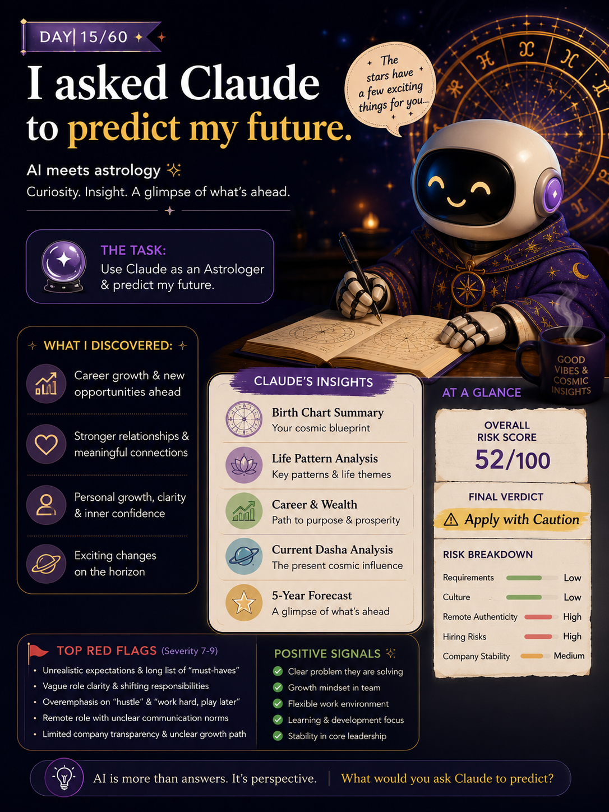

# DAY 15/60

## BUILDING A PERSONAL LIFE ANALYSIS CONSULTANT

### Inputs

📅 Date of Birth

⏰ Birth Time

📍 Birth Place

↓

### Claude Analysis

🔹 Birth Chart Summary

🔹 Life Pattern Analysis

🔹 Career & Wealth Insights

🔹 Current Dasha Analysis

🔹 5-Year Forecast

↓

### Key AI Engineering Learnings

✅ Structured Inputs

✅ Multi-Step Reasoning

✅ Report Generation

✅ Prompt Design

---

### Biggest Takeaway

AI is not just about generating answers.

It can transform structured information into organized reports, forecasts, and actionable insights.

#60DayClaudeChallenge

## 