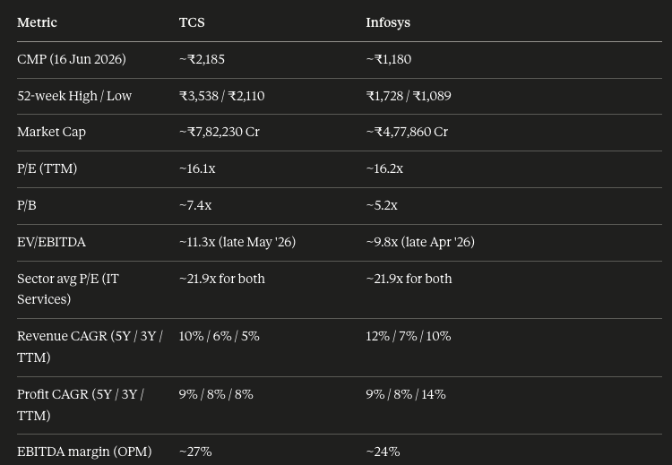
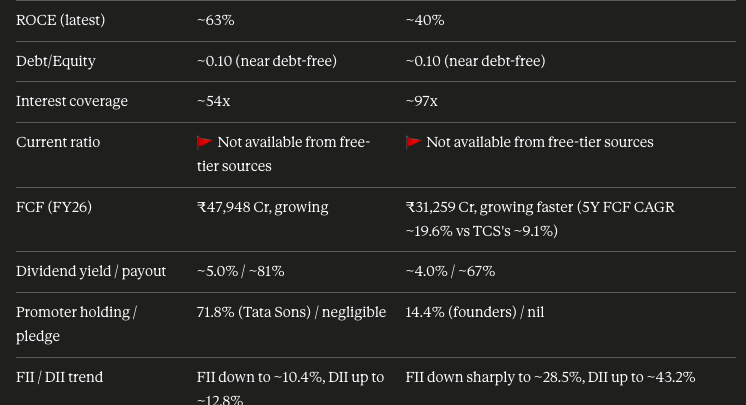
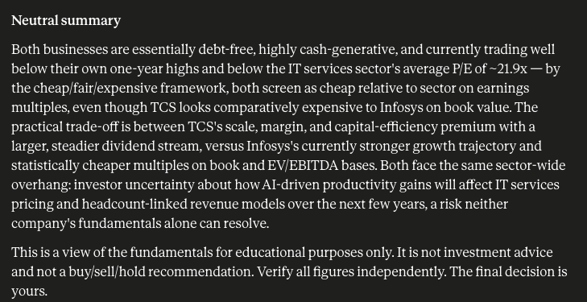

# Day 16/60 – Creating Reusable AI Workflows with Claude Custom Skills

🚀 As part of the **#60DayClaudeChallenge**, today I explored one of the most practical productivity features in Claude: **Custom Skills**.

One challenge I often face when using AI is repeatedly writing long prompts, instructions, and workflows.

Today, I learned how Custom Skills can transform those repeated prompts into reusable workflows that can be used indefinitely.

To understand this concept, I created a **Stock Research Productivity Skill** that helps analyze stocks using a predefined framework.

---

## 🎯 Objective

Build a reusable AI workflow for stock research and analysis.

Instead of manually providing instructions every time, I created a Custom Skill that contains:

- Skill Description
- Analysis Instructions
- Research Framework
- Analysis Modes
- Decision Rules
- Output Structure

Once configured, the workflow can be reused across multiple conversations.

---

## 📊 Use Case: Stock Research Productivity

I tested the skill on stocks such as:

- TCS
- Infosys

The custom workflow automatically generated structured insights and visual analysis.

### Analysis Included

✅ Company Overview

✅ Fundamental Analysis

✅ Technical Analysis

✅ Trend Identification

✅ Risk Assessment

✅ Investment Insights

✅ Charts & Visual Explanations

📸 **Insert Screenshot: TCS Analysis**

📸 **Insert Screenshot: Infosys Analysis**

---

## 🔄 Before vs After

### Traditional Approach

```text
Paste Prompt
      ↓
Add Instructions
      ↓
Define Rules
      ↓
Run Analysis
      ↓
Repeat Again
```

### Custom Skills Approach

```text
Select Custom Skill
        ↓
Enter Stock Name
        ↓
Get Consistent Analysis
```

📸 **Insert Screenshot: Custom Skill Workflow**

---

## 🧠 Key Learnings

### 1. Reusable Workflows

The biggest learning was that AI workflows can be standardized and reused.

Instead of repeatedly explaining the process, the skill remembers it.

---

### 2. Consistency Matters

Custom Skills ensure that every stock is analyzed using the same methodology.

This improves consistency and reduces human error.

---

### 3. Productivity Multiplier

By saving prompts as reusable skills:

- Less prompt writing
- Faster execution
- Better organization
- Repeatable outputs

---

### 4. Workflow Engineering > Prompt Engineering

Prompt Engineering helps create better outputs.

Workflow Engineering helps create systems that produce better outputs repeatedly.

---

## 📚 Biggest Takeaway

Today changed how I think about AI usage.

Instead of creating prompts for every task, we can create reusable workflows that act like specialized assistants.

The real power of AI isn't just asking better questions.

It's building systems that consistently deliver quality answers.

> Reusable Workflows = Scalable Productivity

---

## 📸 Screenshots

## 

## 

## 

## 🙏 Acknowledgements

Special thanks to:

@Anthropic

@ABTalksOnAI

@AnilBajpai

for inspiring practical AI learning through the **#60DayClaudeChallenge**.

---

## 🔖 Hashtags

#60DayClaudeChallenge

#ClaudeAI

#Anthropic

#CustomSkills

#AIWorkflows

#WorkflowEngineering

#PromptEngineering

#StockAnalysis

#Productivity

#AIEngineering

#LearningInPublic

#BuildInPublic

#ArtificialIntelligence
