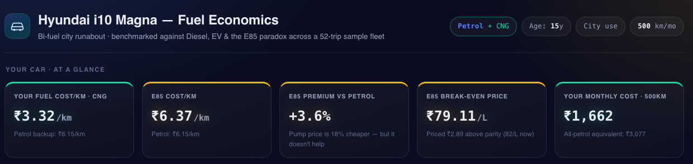
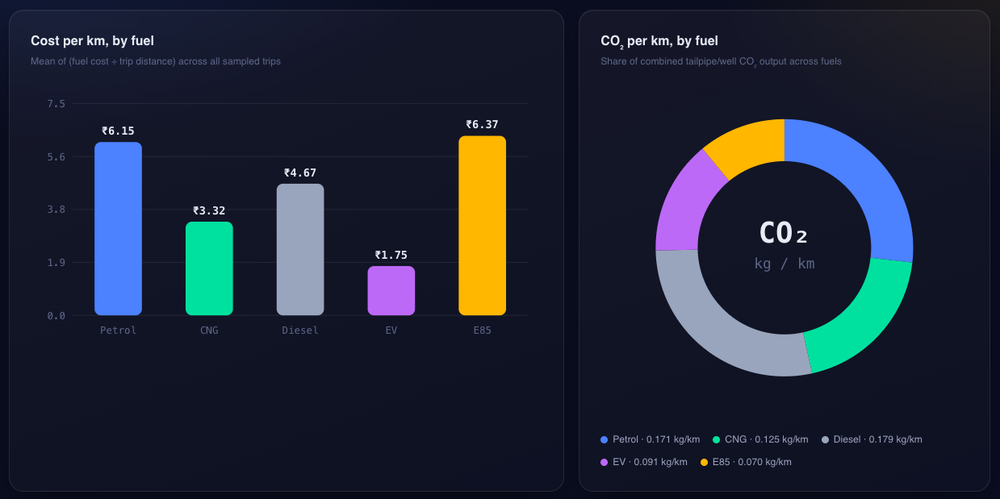
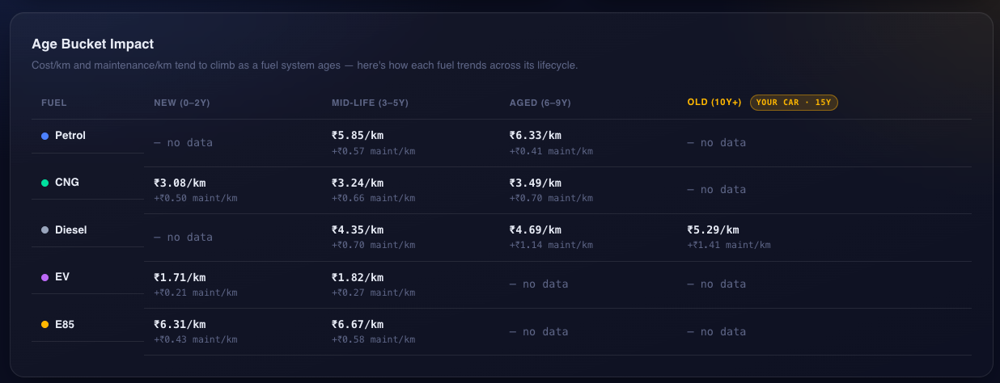
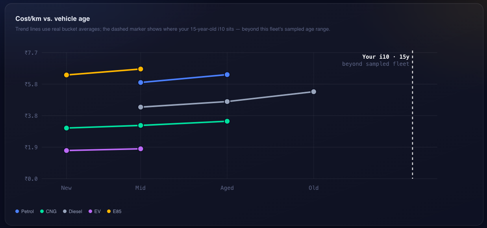
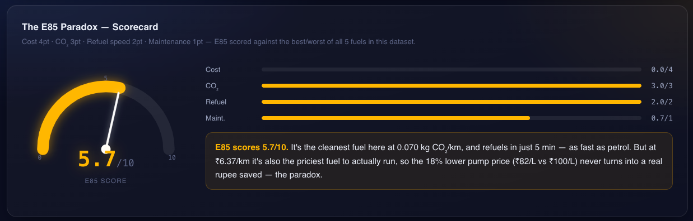
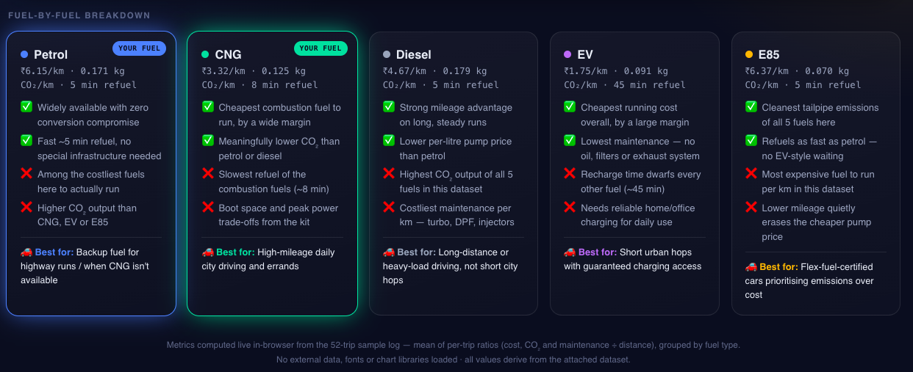

# Day 17/60 – Build an AI Vehicle Cost & Fuel Analysis Dashboard

🚀 As part of the **#60DayClaudeChallenge**, today I explored how Claude can act as a data analyst capable of processing datasets, calculating metrics, generating visualizations, and building complete analytical dashboards.

For this project, I uploaded:

* A CSV dataset containing vehicle-related information
* A prompt describing my car and analysis requirements

Claude processed the data and generated a comprehensive dashboard that provided detailed insights into vehicle costs, fuel efficiency, and performance trends.

---

## 🎯 Objective

Transform raw vehicle data into a meaningful analytics dashboard that supports informed decision-making.

---

## 📊 Dashboard Features

### Fuel Analysis

* Fuel Consumption Tracking
* Mileage Analysis
* Fuel Efficiency Trends
* Cost Per Kilometer

📸 Insert Screenshot: Fuel Analysis Dashboard

---

### Cost Analysis

* Monthly Fuel Expenses
* Annual Fuel Expenses
* Running Cost Estimation
* Ownership Cost Insights

📸 Insert Screenshot: Cost Analysis Charts

---

### Performance Insights

* Vehicle Usage Trends
* Efficiency Comparisons
* Operational Metrics
* Recommendation Engine

📸 Insert Screenshot: Performance Metrics

---

### Data Visualizations

Claude automatically generated:

* Interactive Charts
* Trend Graphs
* Summary Cards
* KPI Dashboards

📸 Insert Screenshot: Dashboard Visualizations

---

## 🧠 Key Learnings

### 1. AI-Powered Data Analysis

Claude can process structured datasets and generate meaningful business insights.

### 2. Dashboard Generation

AI can transform raw CSV data into professional dashboards with minimal effort.

### 3. Business Intelligence Workflow

This project closely resembles real-world BI workflows used by:

* Consultants
* Financial Analysts
* Operations Teams
* Data Analysts

### 4. Structured Inputs Matter

Better datasets and clearer prompts produce more accurate and actionable insights.

---

## 📚 Biggest Takeaway

The true value of data lies in its interpretation.

AI can significantly reduce the effort required to:

* Clean Data
* Analyze Data
* Visualize Data
* Generate Insights
* Support Decision Making

This project demonstrated how quickly AI can move from raw data to executive-level dashboards.

> CSV + Context + AI = Actionable Insights

---

## 📸 Screenshots
## 
## 
## 
## 
## 
## 

---

## 🙏 Acknowledgements

Special thanks to:

@Anthropic

@ABTalksOnAI

@AnilBajpai

for inspiring practical AI learning through the **#60DayClaudeChallenge**.

---

## 🔖 Hashtags

#60DayClaudeChallenge

#ClaudeAI

#Anthropic

#DataAnalytics

#BusinessIntelligence

#DashboardDevelopment

#CSVAnalysis

#AIEngineering

#DataVisualization

#LearningInPublic

#BuildInPublic
