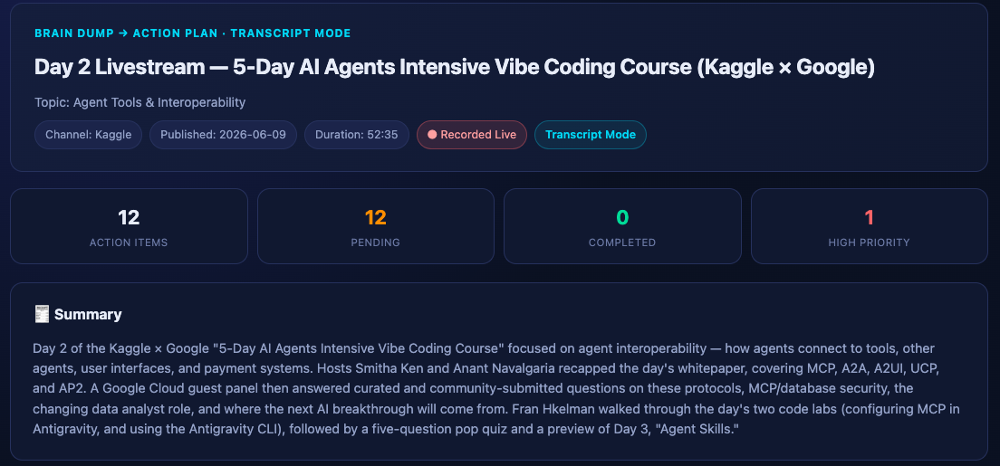
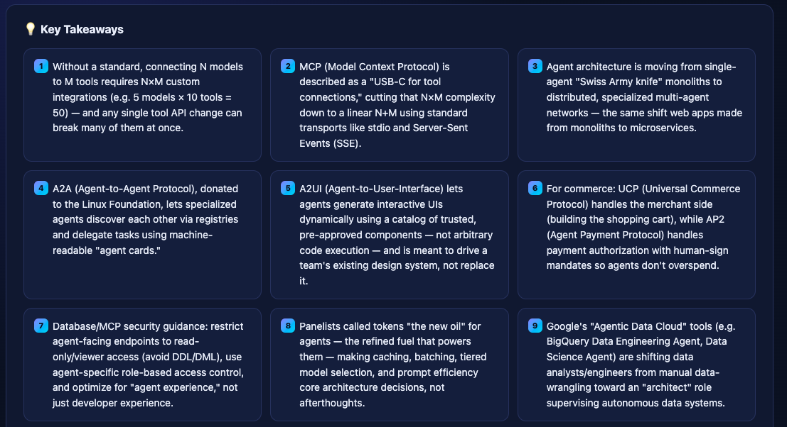
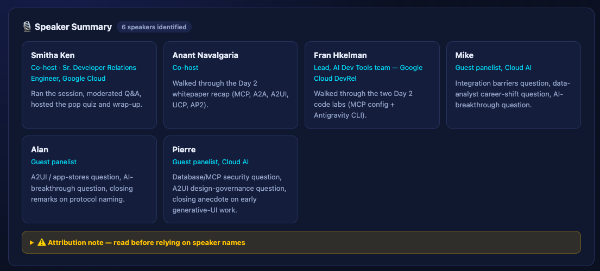
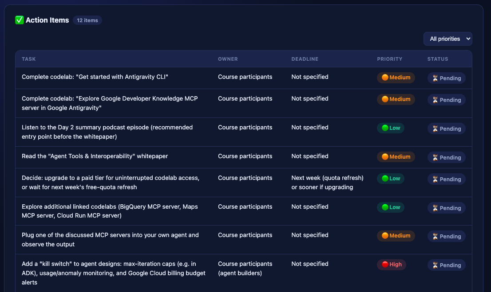
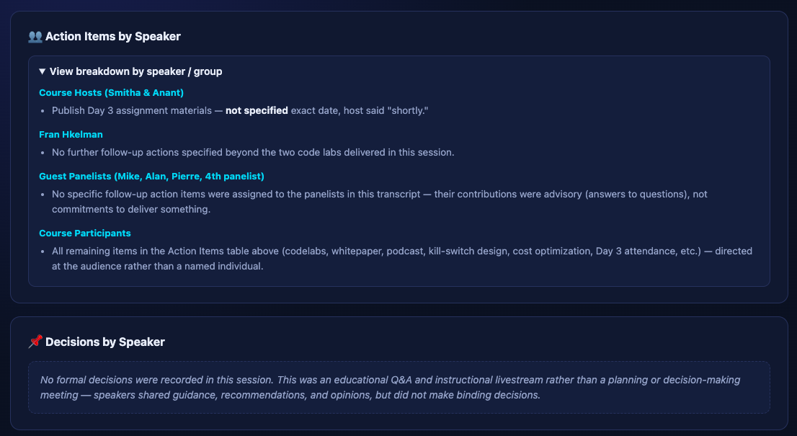
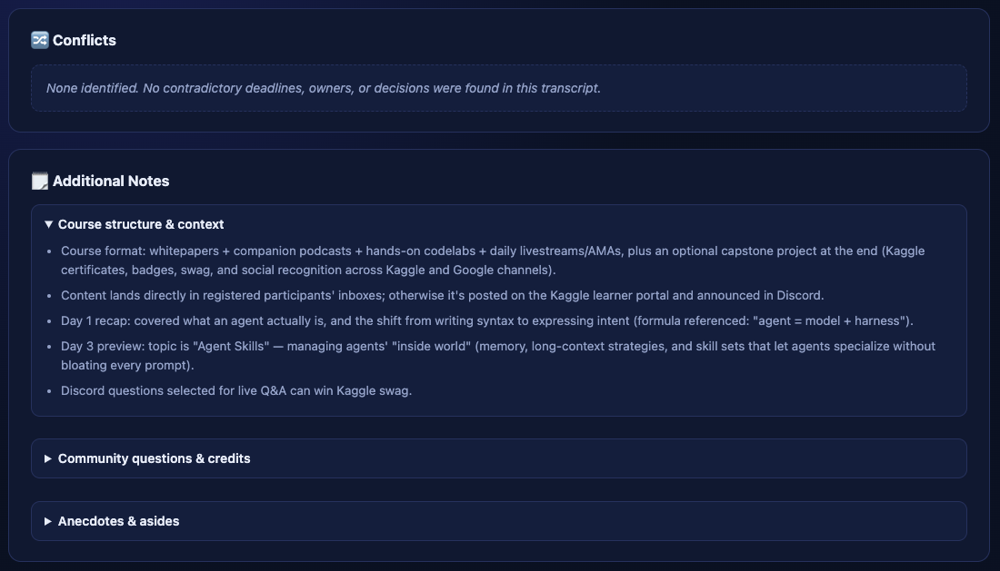

# Day 18/60 – Build a Brain Dump Action Planner Skill

🚀 As part of the **#60DayClaudeChallenge**, today I explored how Claude Custom Skills can transform unstructured information into actionable insights.

One common challenge when learning from videos, meetings, podcasts, or research content is converting large amounts of information into clear action items.

To solve this, I created a **Brain Dump Action Planner Skill** using Claude.

The objective was simple:

> Transform raw information into structured dashboards, action plans, and decision logs automatically.

---

## 🎯 Objective

Build a reusable workflow that converts unstructured content into an organized HTML dashboard.

Instead of manually reviewing notes and creating summaries, the workflow automatically:

* Extracts key insights
* Identifies action items
* Organizes priorities
* Creates decision logs
* Generates implementation plans

---

## 📺 Demo Source

For testing, I used the transcript from the following YouTube Live session:

https://www.youtube.com/live/PGI_S59EoRA

The transcript was provided as input to the skill.

Claude analyzed the content and generated a structured HTML dashboard containing actionable information.

📸 **Insert Screenshot: YouTube Transcript Input**

---

## 🛠️ What the Custom Skill Generates

### Key Insights

Automatically identifies the most important ideas and concepts discussed.

📸 **Insert Screenshot: Key Insights Section**

---

### Action Items

Converts discussion points into executable tasks.

📸 **Screenshots**
## 
## 
## 
## 
## 
## 
---

### Project Dashboard

Creates a structured overview of important topics, priorities, and next steps.

📸 **Insert Screenshot: Project Dashboard**

---

### Decision Log

Captures important decisions, recommendations, and strategic considerations.

📸 **Insert Screenshot: Decision Log**

---

### Implementation Roadmap

Organizes activities into a logical execution sequence.

📸 **Insert Screenshot: Roadmap Section**

---

## 🔄 Before vs After

### Traditional Workflow

```text id="workflow1"
Watch Video
      ↓
Take Notes
      ↓
Organize Notes
      ↓
Create Tasks
      ↓
Build Action Plan
```

### AI Workflow

```text id="workflow2"
Video Transcript
        ↓
Brain Dump Action Planner Skill
        ↓
HTML Dashboard
        ↓
Action Plan
```

📸 **Insert Screenshot: Workflow Comparison**

---

## 🧠 Key Learnings

### 1. Custom Skills Enable Reusable Workflows

Instead of writing the same prompts repeatedly, the workflow can be reused indefinitely.

---

### 2. AI Can Structure Unstructured Information

Large transcripts and notes can be automatically transformed into organized outputs.

---

### 3. Workflow Engineering Matters

The value wasn't just generating summaries.

The value was creating a repeatable process that consistently produces actionable outputs.

---

### 4. Knowledge → Action

Many people consume information.

Few convert it into execution plans.

This workflow helps bridge that gap.

---

## 📚 Biggest Takeaway

Today's learning reinforced an important concept:

> AI is most valuable when it helps convert information into action.

Rather than generating another summary, the Brain Dump Action Planner produces:

* Insights
* Decisions
* Priorities
* Tasks
* Roadmaps

This makes AI a practical productivity and execution tool.

---

## 📸 Suggested Screenshots

### Screenshot 1

Custom Skill Configuration

### Screenshot 2

Skill Instructions

### Screenshot 3

YouTube Transcript Input

### Screenshot 4

Generated HTML Dashboard

### Screenshot 5

Key Insights

### Screenshot 6

Action Items

### Screenshot 7

Decision Log

### Screenshot 8

Implementation Roadmap

### Screenshot 9

Workflow Comparison

---

## 🙏 Acknowledgements

Special thanks to:

@Anthropic

@ABTalksOnAI

@AnilBajpai

for inspiring practical AI learning through the **#60DayClaudeChallenge**.

---

## 🔖 Hashtags

#60DayClaudeChallenge

#ClaudeAI

#Anthropic

#CustomSkills

#WorkflowEngineering

#PromptEngineering

#Productivity

#KnowledgeManagement

#ActionPlanning

#AIEngineering

#LearningInPublic

#BuildInPublic

#ArtificialIntelligence
