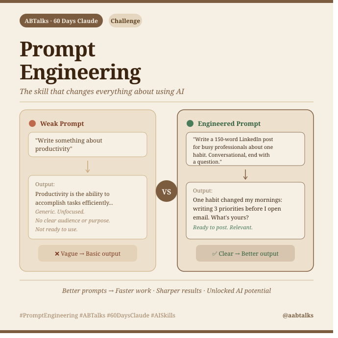

# 🚀 Day 02: Prompt Engineering vs Normal Googling

**60 Days Claude AI Challenge**
**Author:** Dhaneshwar Kumar
**Day:** 02/60

---

## 📖 Introduction

When most people need information, they search on Google using a few keywords and browse multiple websites to find the answer.

With Prompt Engineering, we interact directly with AI models using structured instructions, context, constraints, and expected output formats to obtain highly personalized and actionable results.

This experiment demonstrates the difference between traditional Googling and Prompt Engineering.

---

## 🎯 Scenario

### Goal

Create an image explaining Prompt Engineering.

---

# Method 1: Normal Googling

### Search Query

```text
Create an image explaining Prompt Engineering.
```

### What Happened?

- Multiple websites were displayed.
- Different design templates appeared.
- Manual exploration was required.
- Several tools needed to be evaluated.
- Significant time was spent finding the right inspiration.

### Screenshot



---

# Method 2: Prompt Engineering

### Prompt Used

```text
You are an AI educator teaching complete beginners.
Explain Prompt Engineering in simple language.
Include:
* What Prompt Engineering is
* Why it matters when using AI tools like Claude
* One example of a weak prompt
* One example of an improved prompt
* Three practical benefits of writing better prompts
Also create a LinkedIn-ready image concept.
Image Requirements:
* Square LinkedIn post (1080×1080)
* Claude-inspired brown, beige and cream colors
* Professional and minimal design
* Main title: "Prompt Engineering"
* Show a visual comparison:
  * Weak Prompt → Basic Output
  * Engineered Prompt → Better Output
* Modern AI and productivity-themed visuals
add abtalks 60 days claude challenge in the heading
Output Format:
Section 1: Explanation
Section 2: Weak vs Improved Prompt Example
Section 3: Detailed Image Generation Prompt
```

### What Happened?

- AI understood the context.
- AI generated a complete visual design.
- No manual browsing was required.
- Results were personalized.
- Output was ready to share on LinkedIn.

### Screenshot



---

## 📊 Comparison

| Aspect            | Normal Googling | Prompt Engineering    |
| ----------------- | --------------- | --------------------- |
| Input             | Keywords        | Detailed Instructions |
| Output            | Multiple Links  | Direct Solution       |
| Personalization   | Low             | High                  |
| Time Required     | Higher          | Lower                 |
| Creativity        | User Driven     | AI Assisted           |
| Context Awareness | Limited         | Strong                |
| Iteration Speed   | Slow            | Fast                  |

---

## 💡 Key Learning

Prompt Engineering is not about replacing search engines.

It is about communicating effectively with AI systems so they can generate results that are:

- Personalized
- Context-aware
- Actionable
- Faster to obtain
- Easier to refine

The quality of AI output is directly related to the quality of the prompt.

> Better prompts lead to better outcomes.

---

## 🎯 Day 02 Takeaway

Today I learned that Prompt Engineering transforms AI from a simple information retrieval tool into a collaborative problem-solving partner.

Small improvements in prompts can significantly improve the quality of generated outputs.

---
