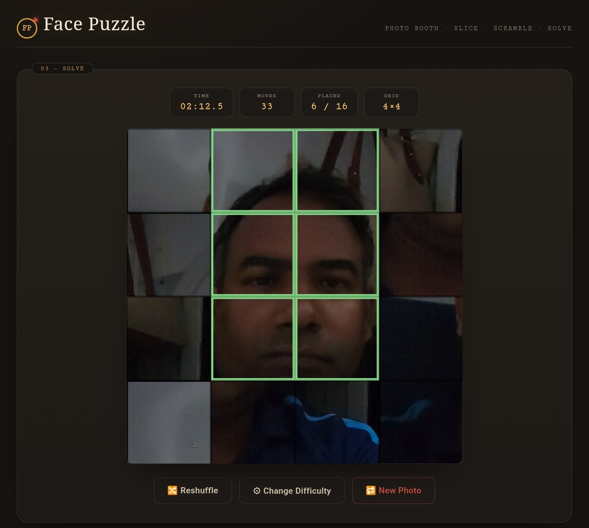
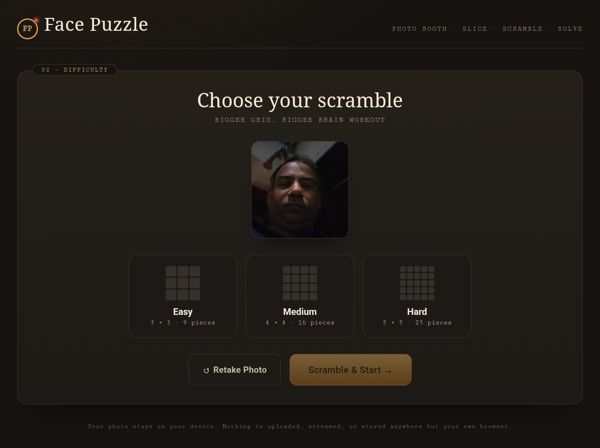
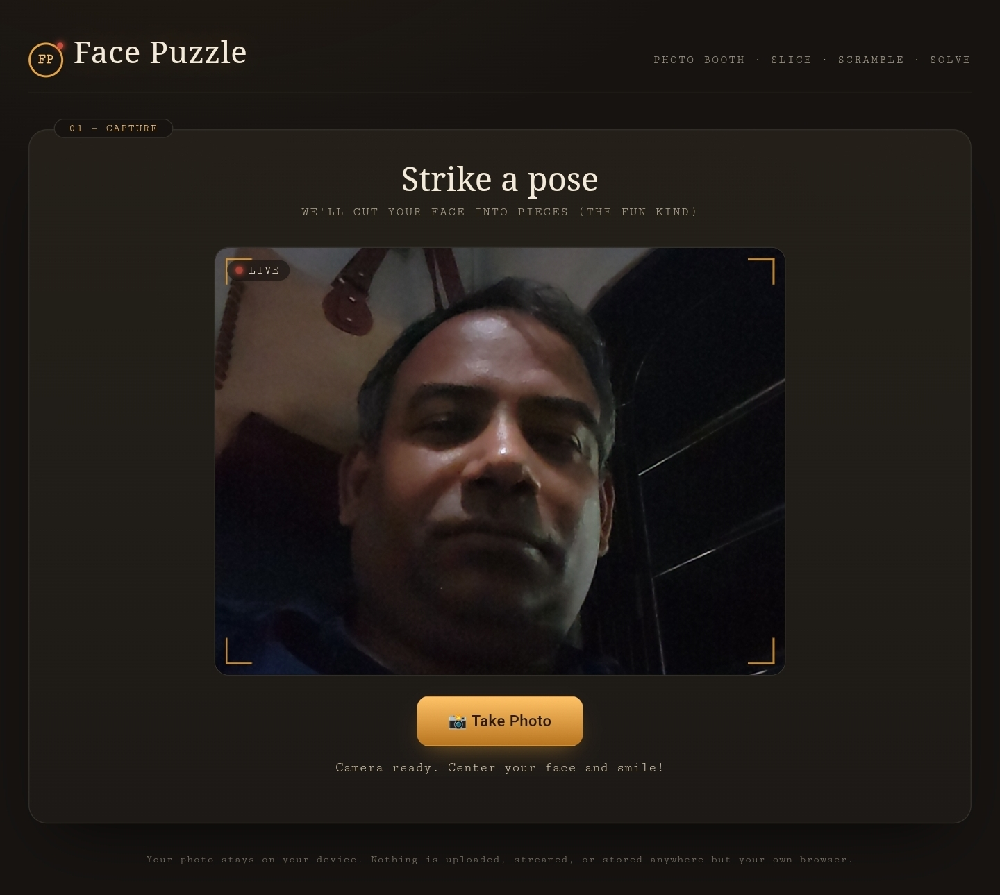
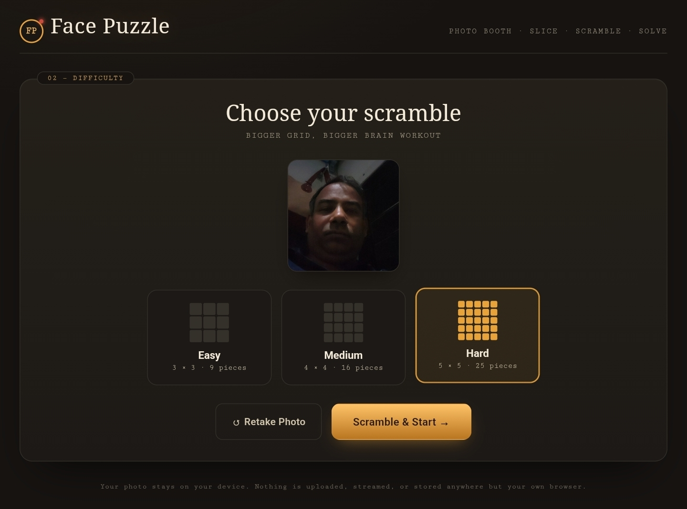
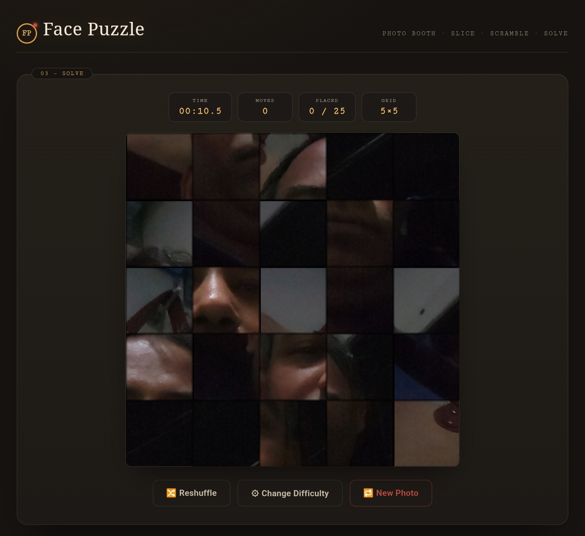

Day 20/60 – Build a Camera-Based Face Puzzle Game

🚀 As part of the #60DayClaudeChallenge, today I built a browser-based Face Puzzle Game using HTML, CSS, and JavaScript with the help of Claude.

This project combines camera access, image processing, game logic, and interactive user experiences into a single web application.

Unlike traditional puzzle games, users can create personalized puzzles using their own photos.

---

🎯 Project Objective

Build an interactive puzzle game that can:

- Access the device camera
- Capture a live photo
- Convert the photo into puzzle pieces
- Shuffle pieces automatically
- Allow users to solve the puzzle
- Support multiple difficulty levels

📷 Camera Integration

One of the most exciting features of this project is the ability to use the device camera directly from the browser.

Users can:

- Open the camera
- Capture a photo instantly
- Generate a puzzle from the captured image

This creates a unique experience because every puzzle is personalized.

🎮 Difficulty Levels

🟢 Easy Mode

- 3 × 3 Grid
- 9 Puzzle Pieces
- Suitable for beginners

🟡 Medium Mode

- 4 × 4 Grid
- 16 Puzzle Pieces
- Moderate challenge

🔴 Hard Mode

- 5 × 5 Grid
- 25 Puzzle Pieces
- Advanced difficulty

🧩 Features Implemented

Camera Capture

Supports:

- Mobile Cameras
- Laptop Cameras
- Tablet Cameras

Dynamic Puzzle Generation

The application automatically:

- Splits the image into pieces
- Shuffles the pieces
- Creates a playable game board

Drag-and-Drop Gameplay

Players can:

- Move puzzle pieces
- Swap positions
- Reconstruct the original image

Win Detection

The game automatically detects when the puzzle is completed and displays a success message.

🧠 Key Learnings

1. Browser Camera APIs

Learned how web applications can securely access device cameras.

2. Dynamic Image Processing

Captured images can be transformed into interactive puzzle components.

3. Game Logic Design

Implemented:

- Puzzle generation
- Piece shuffling
- Difficulty management
- Win detection

4. AI-Assisted Development

Claude accelerated development by helping generate:

- UI Components
- Event Handling Logic
- Puzzle Mechanics
- Responsive Design

---

📚 Biggest Takeaway

This project demonstrated how modern web technologies can combine:

📷 Camera Access

🧩 Dynamic Image Processing

🎮 Interactive Gameplay

🤖 AI-Assisted Development

to create engaging user experiences.

The most rewarding part was seeing a live photo transformed into a playable puzzle within seconds.

«AI doesn't replace creativity—it helps bring ideas to life faster.»

---

📸  Screenshots

## 
## 
## 
## 
## 

---

🙏 Acknowledgements

Special thanks to:

@Anthropic

@ABTalksOnAI

@AnilBajpai

for inspiring practical AI learning through the #60DayClaudeChallenge.

---

🔖 Hashtags

#60DayClaudeChallenge

#ClaudeAI

#Anthropic

#GameDevelopment

#HTML

#JavaScript

#WebDevelopment

#PuzzleGame

#CameraAPI

#FrontendDevelopment

#AIEngineering

#LearningInPublic

#BuildInPublicSuggested filename: Day20_Camera_Based_Face_Puzzle_Game.md