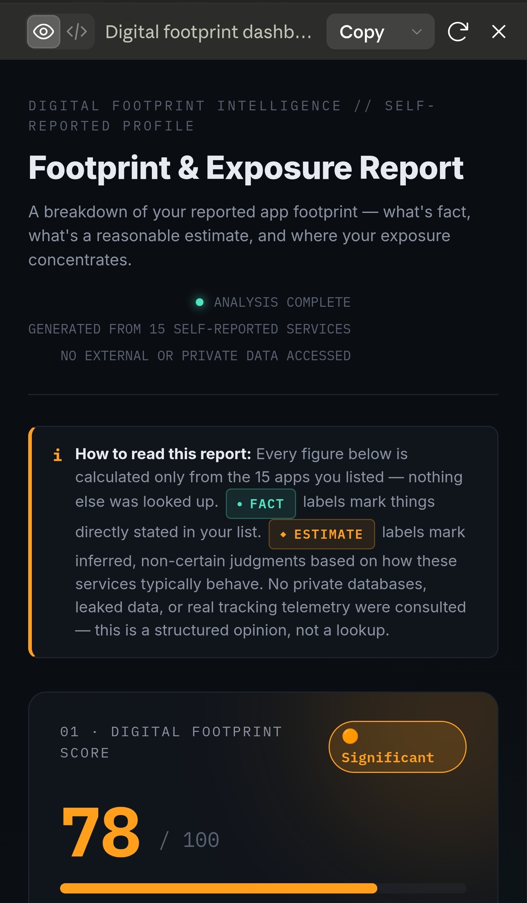
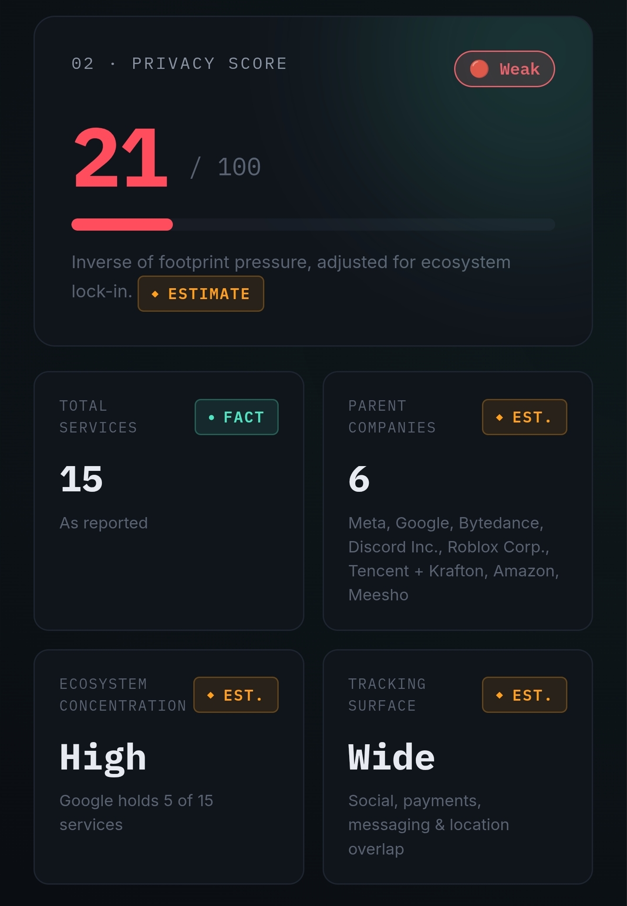
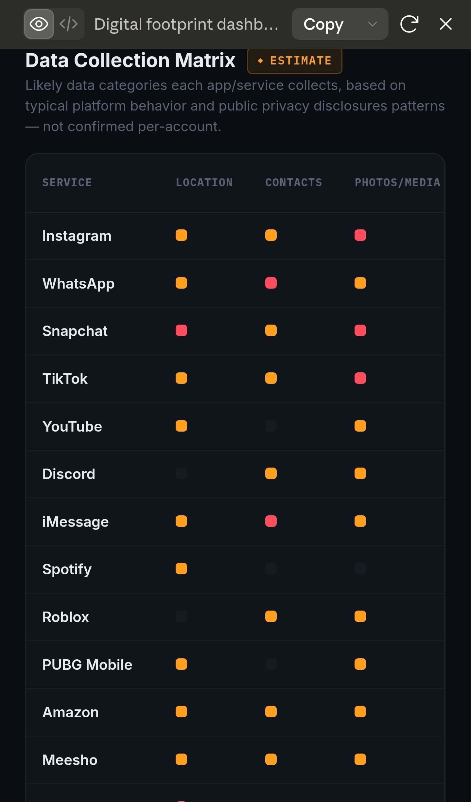
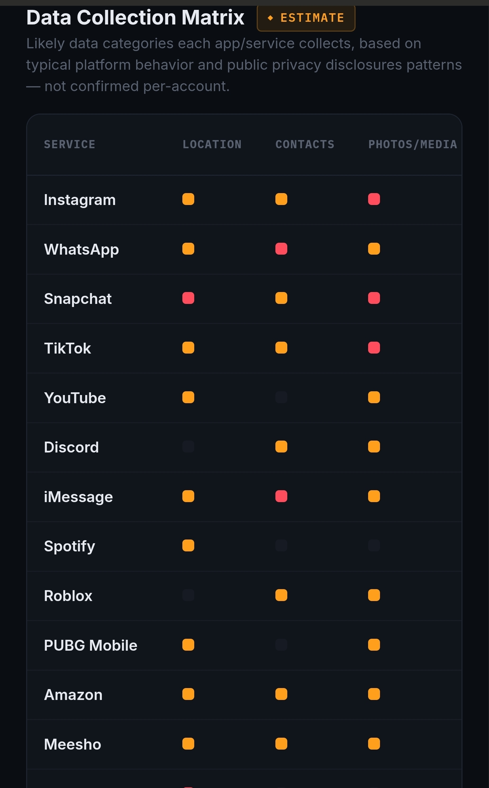
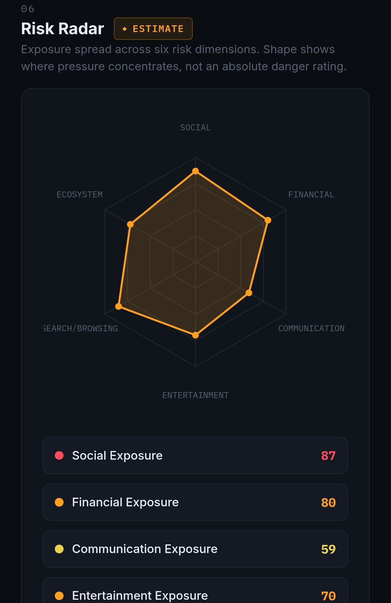
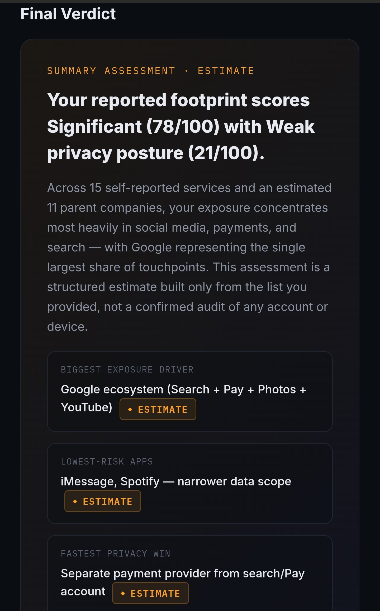

Day 21/60 – Build a Digital Privacy Intelligence Dashboard

🚀 As part of the #60DayClaudeChallenge, today I explored how AI can analyze digital behavior and transform scattered information into a comprehensive privacy intelligence report.

In today's connected world, we interact with dozens of digital platforms daily, often without fully understanding our online exposure.

This project focused on building a dashboard that helps visualize and understand personal privacy risks.

---

🎯 Objective

Create a visually rich dashboard that provides insights into:

- Digital Exposure
- Privacy Risks
- Data Collection Practices
- Personal Data Value
- Privacy Improvement Opportunities

---

📊 Dashboard Components

1. Digital Footprint Score (0–100)

Measures overall online presence and exposure.

📸 Insert Screenshot: Digital Footprint Score

---

2. Privacy Score (0–100)

Evaluates current privacy posture based on available information.

📸 Insert Screenshot: Privacy Score

---

3. Exposure Heatmap

Visual representation of high-risk and low-risk exposure areas.

📸 Insert Screenshot: Exposure Heatmap

---

4. Company Exposure Ranking

Ranks organizations based on the amount of personal information potentially collected.

📸 Insert Screenshot: Company Exposure Ranking

---

5. Data Collection Matrix

Maps:

- Data Types
- Collection Sources
- Usage Patterns
- Potential Risks

📸 Insert Screenshot: Data Collection Matrix

---

6. Risk Radar

Provides a visual overview of major privacy risk categories.

📸 Insert Screenshot: Risk Radar

---

7. Digital Twin Profile

Illustrates how organizations may infer:

- Interests
- Behaviors
- Preferences
- Demographics

from collected data.

📸 Insert Screenshot: Digital Twin Profile

---

8. Most Valuable Data Assets

Identifies personal information with the highest value and sensitivity.

📸 Insert Screenshot: Most Valuable Data Assets

---

9. Privacy Improvement Plan

Provides actionable recommendations for reducing digital exposure and improving privacy.

📸 Insert Screenshot: Privacy Improvement Plan

---

🧠 Key Learnings

1. Privacy is Data Awareness

Understanding what information is collected is the first step toward protecting it.

2. Visualization Improves Understanding

Dashboards make complex privacy information easier to interpret.

3. AI-Powered Analysis

Claude can transform fragmented information into structured intelligence reports.

4. Digital Identity Mapping

Organizations can often build detailed profiles from seemingly harmless data points.

---

📚 Biggest Takeaway

Privacy is no longer only a technical issue.

It is also an awareness issue.

AI can help users better understand:

- Their digital footprint
- Data exposure risks
- Privacy vulnerabilities
- Improvement opportunities

«You cannot protect what you do not understand.»

This project demonstrated how AI can help bridge that gap.

---

📸 Screenshot

## 
## 
## 
## 
## 
## 

🙏 Acknowledgements

Special thanks to:

@Anthropic

@ABTalksOnAI

@AnilBajpai

for inspiring practical AI learning through the #60DayClaudeChallenge.

---

🔖 Hashtags

#60DayClaudeChallenge

#ClaudeAI

#Anthropic

#DigitalPrivacy

#CyberSecurity

#PrivacyAwareness

#DataProtection

#AIEngineering

#DashboardDesign

#DataAnalytics

#LearningInPublic

#BuildInPublic