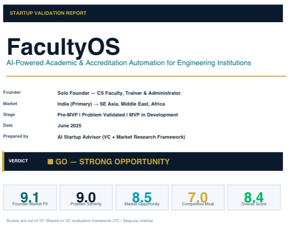
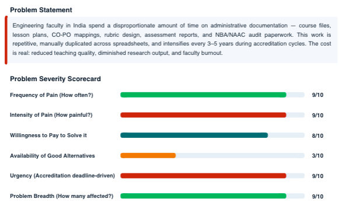
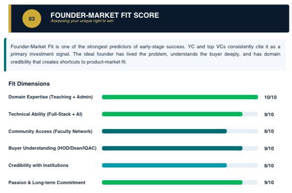
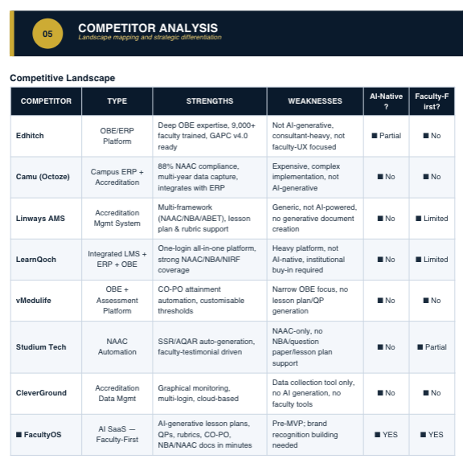
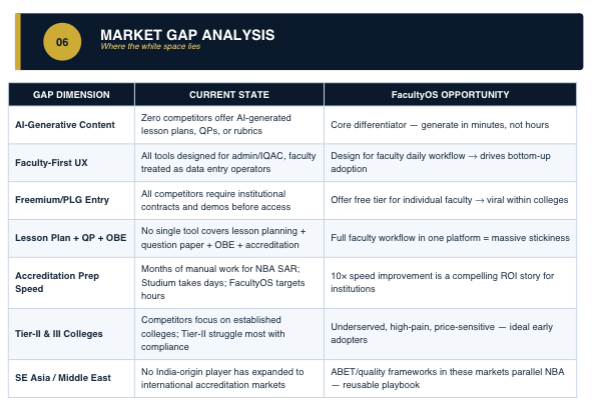
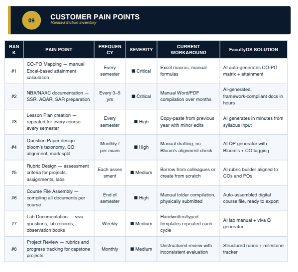
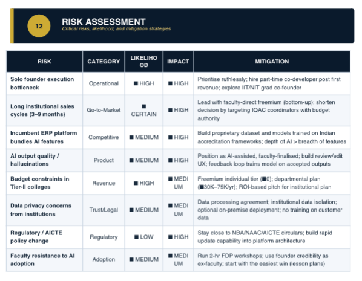

# Day 22/60 – Validate Your Startup Idea Like a VC

🚀 As part of the **#60DayClaudeChallenge**, today I explored how AI can help founders evaluate startup ideas before investing significant time, money, and effort into building products.

Many founders fall in love with solutions.

Investors focus on problems.

To understand this difference, I used Claude to analyze my startup idea:

## 🎯 Startup Idea: FacultyOS

FacultyOS aims to help faculty members streamline academic, administrative, and productivity-related workflows through a unified platform.

The objective was not to build the product.

The objective was to answer a more important question:

> Is this a problem worth solving?

---

## 🔍 What Claude Evaluated

Instead of focusing on features, Claude analyzed the business fundamentals.

### Problem-Solution Fit

* Is the problem real?
* Is it painful enough?
* Are people actively seeking solutions?

📸 **Insert Screenshot: Problem-Solution Fit Analysis**

---

### Target Customer Analysis

Claude helped identify:

* Primary Users
* Secondary Users
* Decision Makers
* Paying Customers

📸 **Insert Screenshot: Customer Analysis**

---

### Market Pain Points

The analysis highlighted:

* Faculty workload challenges
* Administrative overhead
* Productivity bottlenecks
* Existing workflow inefficiencies

📸 **Insert Screenshot: Pain Point Analysis**

---

### Competitive Landscape

Claude examined:

* Existing alternatives
* Indirect competitors
* Potential differentiators
* Market positioning opportunities

📸 **Insert Screenshot: Competitor Analysis**

---

### Risk Assessment

One of the most valuable outputs.

Claude identified:

* Adoption risks
* Market risks
* Product risks
* Business model risks
* Execution risks

📸 **Insert Screenshot: Risk Assessment**

---

### Value Proposition Analysis

The analysis helped clarify:

* Why FacultyOS matters
* Who benefits most
* What makes it different
* Why users would switch

📸 **Insert Screenshot: Value Proposition Canvas**

---

### Validation Priorities

Instead of recommending development, Claude suggested:

* Customer interviews
* Problem validation
* Pilot testing
* Early adopter feedback
* Market demand verification

📸 **Insert Screenshot: Validation Roadmap**

---

## 🧠 Key Learnings

### 1. Validation Before Development

Building a product without validating the problem is one of the biggest startup risks.

---

### 2. Customer Pain Matters More Than Features

A product succeeds when it solves an important problem, not when it has more features.

---

### 3. AI as a Startup Advisor

Claude acted as:

* Investor
* Strategist
* Market Research Assistant
* Critical Thinking Partner

all within a single workflow.

---

### 4. Better Questions Lead to Better Startups

Some of the most valuable questions generated were:

* Who will pay for this?
* Why now?
* What alternatives exist?
* How painful is the problem?
* What evidence supports demand?

---

## 📚 Biggest Takeaway

The most exciting part of a startup is often building.

The most important part is validation.

This exercise showed me that AI can help founders think more strategically before writing a single line of code.

Instead of asking:

> "How do I build this?"

we should first ask:

> "Should I build this?"

That mindset shift alone can save months of effort.

---

## 📸 Screenshots

## 
## 
## 
## 
## 
## 
## 

## 🙏 Acknowledgements

Special thanks to:

@Anthropic

@ABTalksOnAI

@AnilBajpai

for inspiring practical AI learning through the **#60DayClaudeChallenge**.

---

## 🔖 Hashtags

#60DayClaudeChallenge

#ClaudeAI

#Anthropic

#StartupValidation

#FacultyOS

#Entrepreneurship

#ProductStrategy

#StartupIdeas

#AIEngineering

#BuildInPublic

#LearningInPublic

#Innovation
