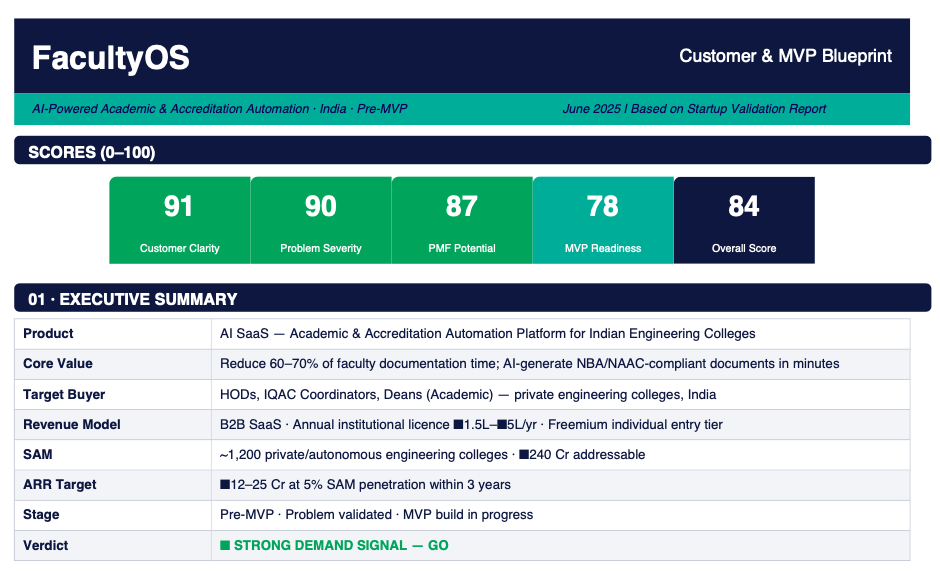
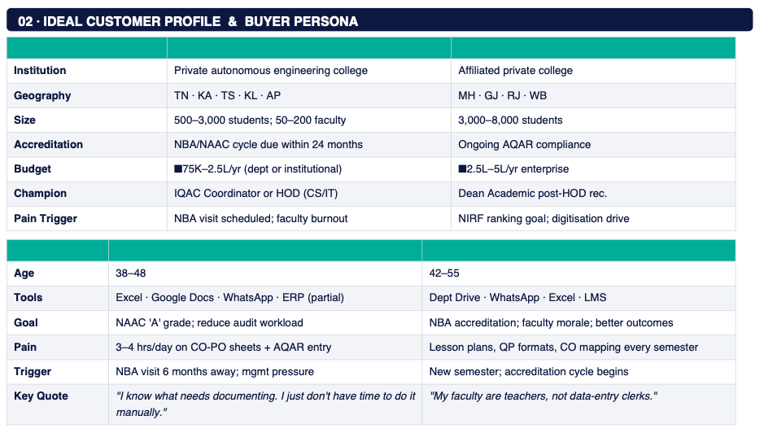
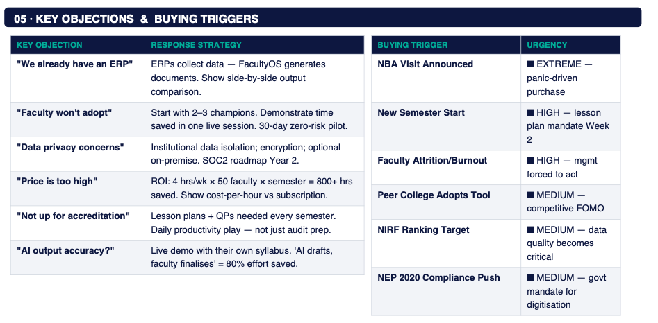
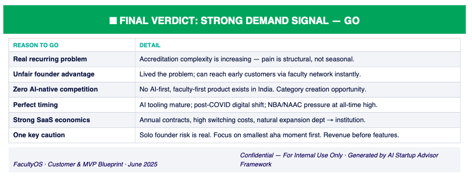

# Day 23/60 – Build Your Customer & MVP Blueprint

🚀 As part of the **#60DayClaudeChallenge**, today I explored one of the most important startup activities before writing code:

> Understanding customers and defining the right MVP.

Using Claude, I transformed my startup idea, **FacultyOS**, into a complete Customer & MVP Blueprint covering customer personas, pain points, customer journeys, MVP priorities, pricing, risks, and execution plans.

The goal was simple:

**Validate what to build, who to build it for, and what should be prioritized first.**

---

## 🎯 Startup Idea: FacultyOS

FacultyOS is an AI-powered Academic & Accreditation Automation Platform designed for engineering colleges.

### Core Value Proposition

Reduce faculty documentation effort by **60–70%** through AI-generated academic and accreditation workflows.

Target areas include:

- Lesson Plans
- CO-PO Mapping
- NBA Documentation
- NAAC Documentation
- Question Paper Generation
- Rubric Design

📸 **Insert Screenshot: FacultyOS Overview**

---

## 👥 Ideal Customer Profile (ICP)

Claude helped identify the most likely early adopters.

### Primary Customers

- IQAC Coordinators
- Heads of Department (HODs)
- Deans (Academic)

### Target Institutions

- Private Engineering Colleges
- Autonomous Institutions
- Colleges preparing for NBA/NAAC accreditation

📸 **Insert Screenshot: Ideal Customer Profile**

---

## 😓 Top Customer Pain Points

The analysis identified recurring faculty challenges:

### Critical Problems

- Manual CO-PO Mapping
- NBA / NAAC Documentation
- Lesson Plan Creation
- Question Paper Design
- Course File Preparation

### Operational Challenges

- Faculty Burnout
- Administrative Overload
- Repetitive Documentation Tasks

📸 **Insert Screenshot: Customer Pain Points**

---

## 🛣️ Customer Journey Mapping

Claude generated a complete customer journey:

1. Awareness
2. Consideration
3. Trial
4. Decision
5. Onboarding
6. Expansion
7. Advocacy

Understanding the customer journey helped clarify where FacultyOS can create value.

📸 **Insert Screenshot: Customer Journey Map**

---

## 🚧 Objections & Buying Triggers

### Common Objections

- "We already have an ERP."
- "Faculty won't adopt it."
- "The pricing is too high."
- "We are not currently preparing for accreditation."

### Buying Triggers

- NBA Visit Announced
- New Semester Begins
- Faculty Burnout
- NIRF Ranking Goals
- Digital Transformation Initiatives

📸 **Insert Screenshot: Objections & Buying Triggers**

---

## 🏗️ MVP Prioritization

One of the most valuable outputs was learning what NOT to build.

### Must Have Features

✅ AI Lesson Plan Generator

✅ CO-PO Mapping Automation

✅ Basic Dashboard

✅ PDF/Word Export

✅ User Authentication

### Should Have

- Question Paper Generator
- Rubric Builder
- Course File Assembly

### Don't Build Yet

❌ Mobile App

❌ Marketplace

❌ Full ERP Integration

❌ Multi-College Admin Panel

📸 **Insert Screenshot: MVP Prioritization**

---

## 💰 Pricing Strategy

Claude also generated an initial pricing hypothesis.

### Free Tier

- Individual Faculty
- Limited Usage

### Starter Plan

- Single Department

### Standard Plan

- Small Colleges

### Enterprise Plan

- Large Institutions

This helped visualize a potential revenue path even before building the product.

📸 **Insert Screenshot: Pricing Model**

---

## ⚠️ Risks & Mitigation

Every startup has risks.

FacultyOS was evaluated across:

- Founder Risk
- Sales Cycle Risk
- Competition Risk
- AI Output Quality Risk
- Budget Constraints

Each risk was paired with mitigation strategies.

📸 **Insert Screenshot: Risk Analysis**

---

## 📅 30-Day MVP Roadmap

Claude generated a practical execution plan:

### Week 1

- Customer Discovery Interviews
- Define MVP Scope
- Launch Landing Page

### Week 2

- Build MVP Core Features

### Week 3

- Pilot Outreach
- Product Iteration

### Week 4

- Close Pilot Institutions
- Gather Testimonials
- Plan Next Features

📸 **Insert Screenshot: MVP Roadmap**

---

## 🧠 Key Learnings

### 1. Customer Discovery Before Development

Building features without understanding customers creates unnecessary risk.

### 2. MVP Means Focus

A successful MVP solves one important problem exceptionally well.

### 3. Validation Beats Assumptions

Customer interviews are more valuable than founder assumptions.

### 4. AI as a Startup Advisor

Claude acted as:

- Product Strategist
- Market Research Assistant
- Startup Mentor
- Customer Discovery Partner

---

## 📚 Biggest Takeaway

Today's challenge reinforced an important startup lesson:

> Startups don't fail because they lack features.
>
> They fail because they solve the wrong problems.

The Customer & MVP Blueprint helped transform FacultyOS from an idea into a structured business opportunity with:

- Defined Customers
- Clear Pain Points
- MVP Scope
- Pricing Strategy
- Execution Plan

Most importantly, it provided clarity on **what to build first and what to ignore.**

---

## 📸 Screenshot

## 

## 

## 

## 

## 🙏 Acknowledgements

Special thanks to:

@Anthropic

@ABTalksOnAI

@AnilBajpai

for inspiring practical AI learning through the **#60DayClaudeChallenge**.

---

## 🔖 Hashtags

#60DayClaudeChallenge

#ClaudeAI

#Anthropic

#FacultyOS

#CustomerDiscovery

#StartupValidation

#MVP

#ProductStrategy

#Entrepreneurship

#AIEngineering

#BuildInPublic

#LearningInPublic
