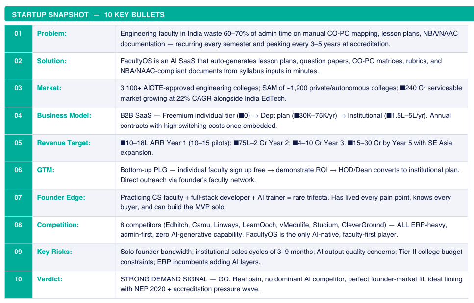
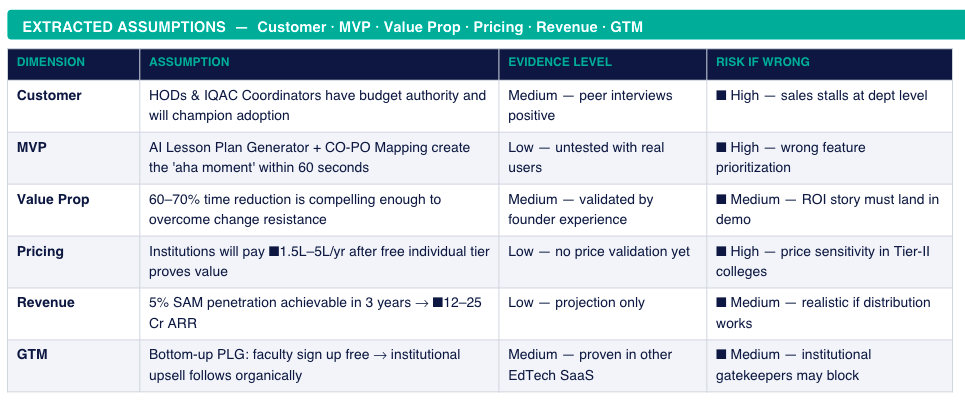
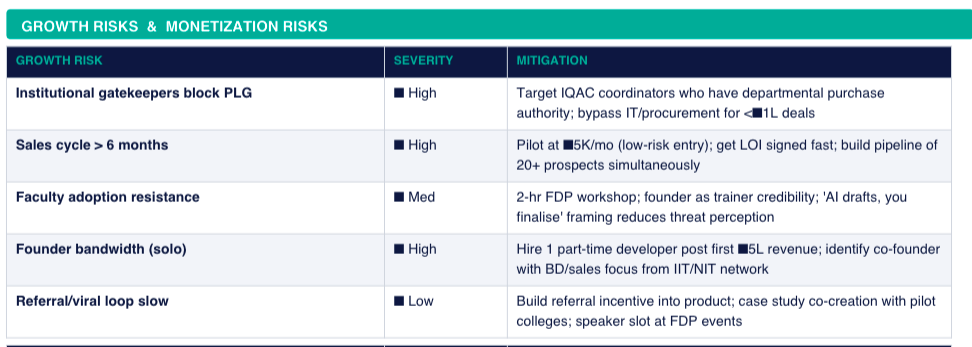
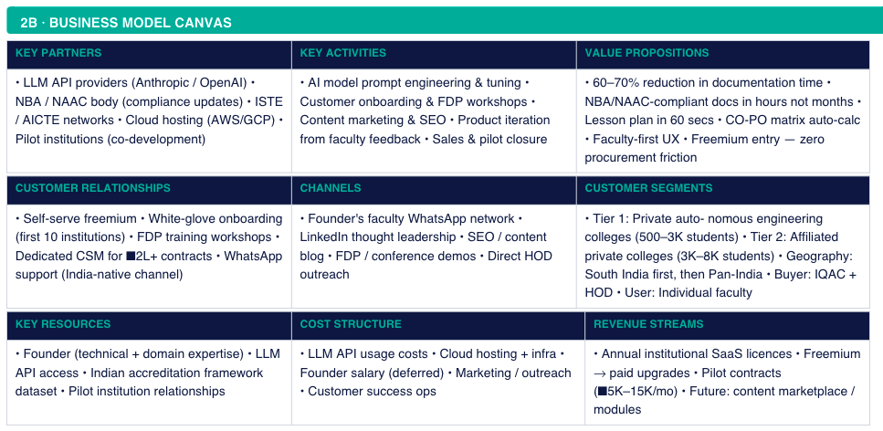
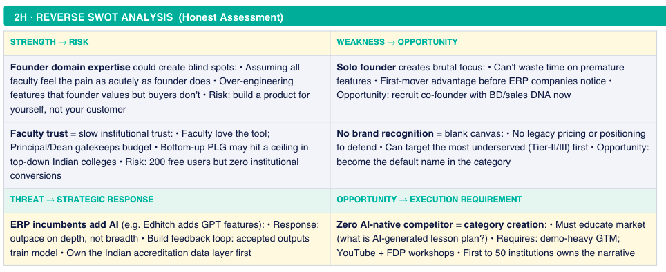
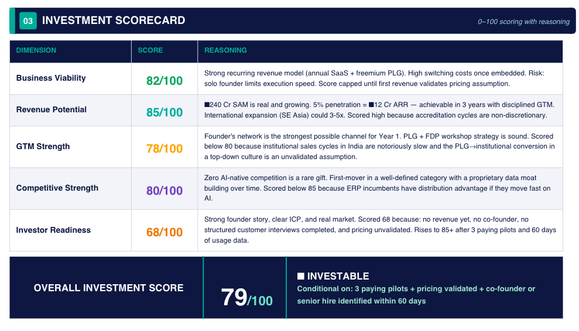
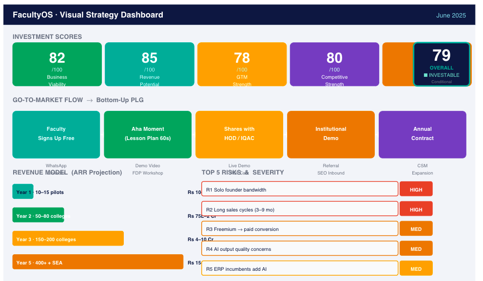

# Day 24/60 – Build a Startup Business Strategy Report

🚀 As part of the **#60DayClaudeChallenge**, today I learned how AI can help transform a startup idea into an investor-ready business strategy.

After validating the problem and defining the MVP for **FacultyOS**, I used Claude to generate a comprehensive **Business Strategy Report** that covered business fundamentals, go-to-market planning, pricing, growth strategy, competitive positioning, investment readiness, and execution priorities.

Rather than focusing only on product features, the report emphasized building a sustainable business.

---

# 🎯 Startup: FacultyOS

**FacultyOS** is an AI-powered Academic & Accreditation Automation Platform designed to reduce the documentation burden for engineering faculty.

The report identified a strong market opportunity by addressing repetitive tasks such as:

- Lesson Plan Generation
- CO-PO Mapping
- NBA / NAAC Documentation
- Question Paper Generation
- Rubric Creation

The goal is to help faculty save time while improving compliance and productivity.

---

# 📊 Business Strategy Components

## Executive Summary

Claude generated an executive summary explaining:

- The problem being solved
- Target customers
- Market opportunity
- Founder advantage
- Business model
- Revenue vision

---

## Business Model Canvas

A complete Business Model Canvas including:

- Key Partners
- Key Activities
- Value Proposition
- Customer Relationships
- Customer Segments
- Revenue Streams
- Cost Structure

---

## Revenue & Pricing Strategy

The report proposed a scalable SaaS pricing model with:

- Free Individual Plan
- Department Plan
- Institutional Plan
- Enterprise Plan
- Pilot Pricing Strategy

It also included projected Annual Recurring Revenue (ARR) milestones over five years.

## Go-To-Market (GTM) Strategy

Claude recommended a **Bottom-Up Product-Led Growth (PLG)** approach:

Faculty → HOD → IQAC → Institution

Channels included:

- LinkedIn
- Faculty Network
- SEO
- Faculty Development Programs (FDPs)
- Conferences

---

## Customer Acquisition Strategy

The report outlined practical acquisition channels:

- Founder Network
- LinkedIn Content
- SEO
- Referral Programs
- Academic Conferences
- Strategic Partnerships

---

## Competitive Position & Moat

One of the most insightful sections compared FacultyOS against existing competitors and identified key competitive advantages:

- AI-native platform
- Faculty-first design
- Proprietary accreditation knowledge
- Workflow stickiness
- Founder domain expertise

---

## Reverse SWOT Analysis

Instead of listing only strengths, Claude highlighted:

- Founder risks
- Business weaknesses
- Market threats
- Growth opportunities

This honest assessment helped identify areas requiring validation before scaling.

---

## Investment Scorecard

The report evaluated FacultyOS across multiple dimensions:

- Business Viability
- Revenue Potential
- GTM Strength
- Competitive Strength
- Investor Readiness

Overall Investment Score:

**79/100 — Investable (Conditional)**

---

## Founder Action Plan

Finally, Claude generated a prioritized execution roadmap including:

- Customer Interviews
- Landing Page
- MVP Development
- Pilot Programs
- Pricing Validation
- Live Product Demonstrations

This transformed strategy into actionable next steps.

---

# 🧠 Key Learnings

### 1. Strategy Comes Before Scaling

A startup needs a clear business strategy before investing heavily in product development.

---

### 2. AI Can Think Beyond Product Development

Claude acted as:

- Business Consultant
- Growth Strategist
- Startup Advisor
- Investor
- Go-To-Market Planner

---

### 3. Execution Matters More Than Ideas

The report emphasized measurable actions, customer validation, and pilot execution instead of assumptions.

---

### 4. Investor Thinking

Building a startup means answering questions like:

- Is the market large enough?
- Why will customers pay?
- What is the competitive advantage?
- How will the business grow?
- What are the biggest risks?

---

# 📚 Biggest Takeaway

One lesson stood out throughout this exercise:

> A great product alone doesn't build a successful startup.

A successful startup also needs:

- A clear business model
- Sustainable revenue strategy
- Strong go-to-market plan
- Competitive differentiation
- Customer validation
- Disciplined execution

This challenge showed me how AI can act as a strategic co-founder—helping founders move beyond ideas and think like entrepreneurs and investors.

---

# 📸 Screenshots

## 

## 

## 

## 

## 

## 

## 

# 🙏 Acknowledgements

Special thanks to:

@Anthropic

@ABTalksOnAI

@AnilBajpai

for inspiring practical AI learning through the **#60DayClaudeChallenge**.

---

# 🔖 Hashtags

#60DayClaudeChallenge

#ClaudeAI

#Anthropic

#FacultyOS

#StartupStrategy

#BusinessStrategy

#ProductStrategy

#Entrepreneurship

#AIEngineering

#BuildInPublic

#LearningInPublic

#StartupJourney
