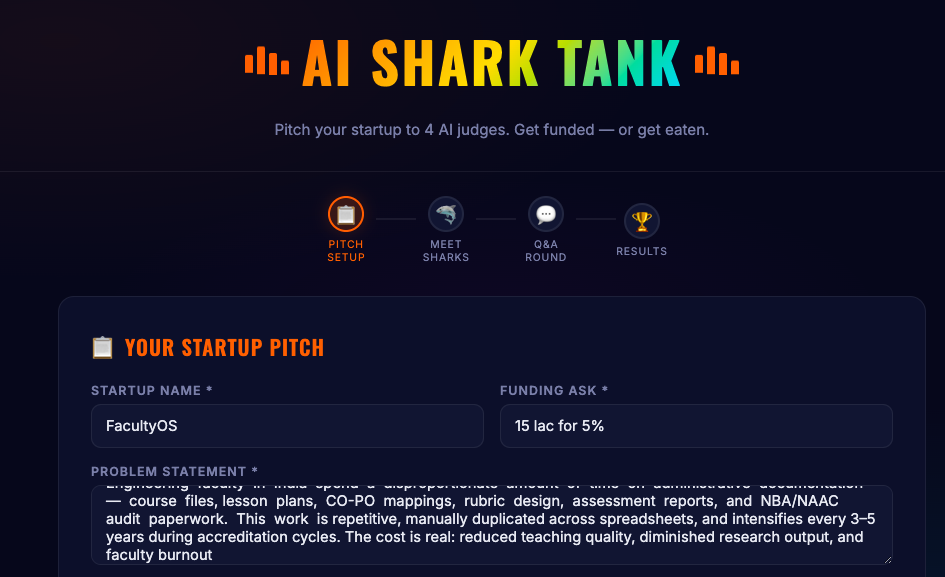
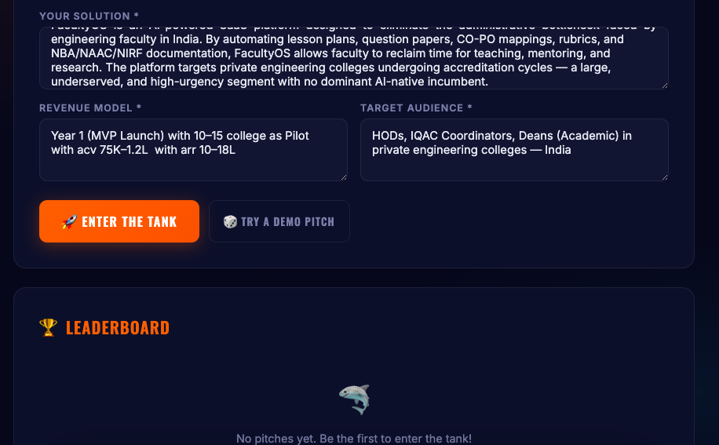
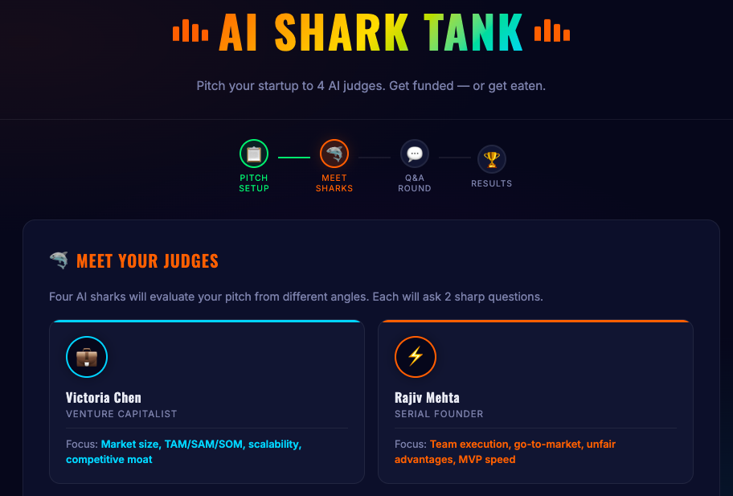
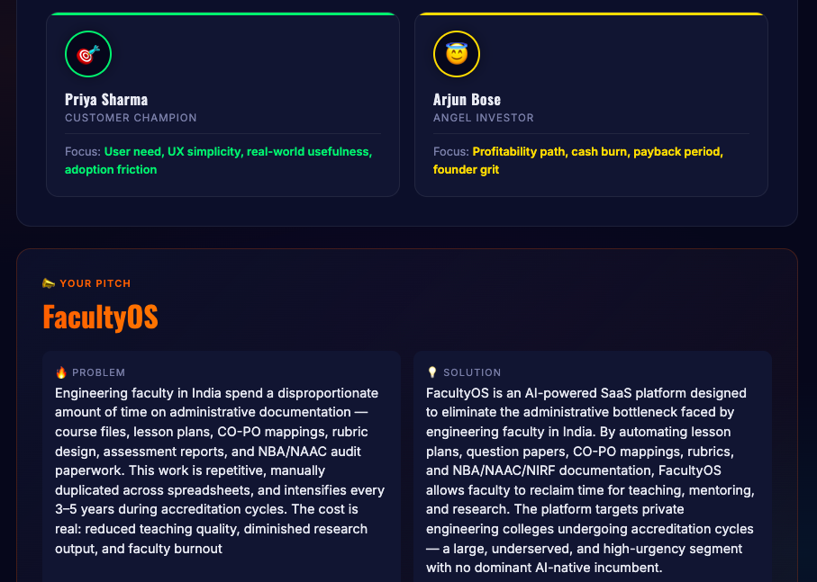

# Day 25/60 – Build an AI Shark Tank Simulator

## Overview

As part of my **#60DayClaudeChallenge**, I built an **AI Shark Tank Simulator** that mimics the experience of pitching a startup to investors.

Instead of providing simple AI-generated feedback, the application creates an interactive investment panel where multiple AI judges evaluate a startup from different business perspectives.

---

# Objective

Build an AI application capable of:

* Accepting a startup pitch
* Simulating investor interviews
* Asking challenging questions
* Evaluating founder responses
* Scoring business potential
* Delivering an investment decision

---

# Key Features

## Startup Pitch Submission

Users provide:

* Startup Name
* Problem Statement
* Solution
* Revenue Model
* Target Audience
* Funding Ask

---

## AI Investor Panel

The simulator creates four independent AI judges:

### 💼 Venture Capitalist

Focus:

* Market Size
* Scalability
* Competitive Advantage
* TAM/SAM/SOM

### ⚡ Serial Founder

Focus:

* Execution
* Go-to-Market Strategy
* Product Development
* Founder Capability

### 🎯 Customer Champion

Focus:

* User Problems
* Product-Market Fit
* Customer Adoption
* User Experience

### 😇 Angel Investor

Focus:

* Profitability
* Financial Discipline
* Cash Flow
* Founder Mindset

Each investor evaluates the same startup using a different decision framework.

---

# Interactive Q&A

Instead of producing instant feedback, the simulator conducts a live Q&A.

Each AI investor:

* Generates challenging questions
* Reviews founder responses
* Provides follow-up reactions
* Builds context before scoring

This makes the evaluation much closer to a real investor meeting.

---

# AI Evaluation

After the interview, the simulator scores the startup across multiple dimensions:

* Market Potential
* Innovation
* Business Model
* Execution Readiness
* Investment Worthiness

These scores contribute to the overall startup rating.

---

# Investment Decision

Based on the pitch and Q&A performance, the AI recommends one of the following:

* Invest
* Reject
* Acquire
* Come Back Later

The simulator also suggests:

* Startup Valuation
* Funding Amount
* Investment Reasoning

---

# Additional Features

* Interactive startup dashboard
* Animated Shark Tank interface
* AI judge verdict cards
* Startup leaderboard
* PDF investment report generation
* Shareable startup evaluation

---

# Technical Learning

During this project, I explored:

* Multi-agent AI design
* Persona-based prompting
* Context-aware conversations
* Sequential AI workflows
* Structured JSON outputs
* Dynamic UI rendering
* AI-driven business evaluation

---

# Key Takeaways

## 1. AI Can Simulate Expert Roles

Different prompts produce distinct investor personalities and evaluation styles.

---

## 2. Context Improves AI Quality

Providing the full pitch and previous Q&A helps AI generate more accurate and relevant decisions.

---

## 3. Multi-Agent Systems Are Powerful

Combining multiple AI perspectives creates richer feedback than relying on a single model.

---

## 4. Great AI Products Need Great UX

Interactive stages, animations, and structured workflows make AI applications more engaging and useful.

---

# Final Reflection

Today's project showed me that AI can move beyond answering questions—it can simulate real-world decision-making.

By combining multiple AI personas with structured workflows, it's possible to build applications that feel like collaborating with a panel of domain experts.

This was another exciting step toward building practical, production-ready AI applications.

---

## 
## 
## 
## 

## Acknowledgements

Special thanks to:

@Anthropic | @ABTalksOnAI | @Anil Bajpai

for inspiring practical AI learning through the **#60DayClaudeChallenge**.

---

## Hashtags

#60DayClaudeChallenge

#ClaudeAI

#AIEngineering

#Startup

#SharkTank

#MultiAgentAI

#PromptEngineering

#GenerativeAI

#BuildInPublic

#LearningInPublic
