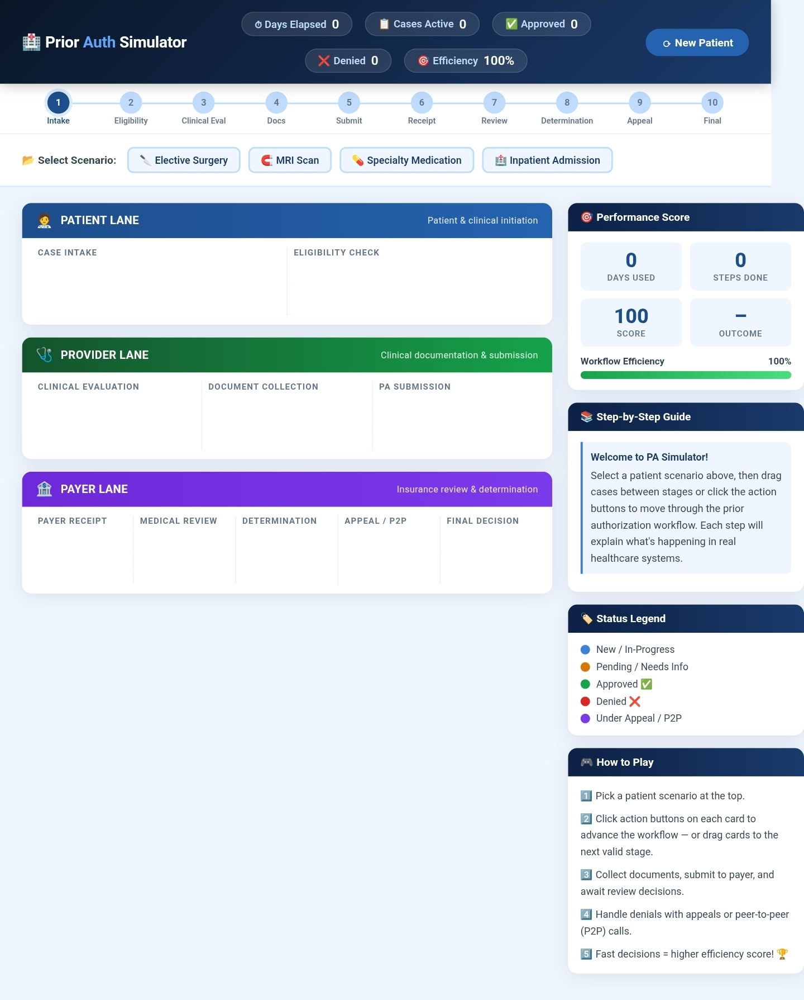

Day 26/60 – Build a Prior Authorization Workflow Simulator

🚀 As part of the #60DayClaudeChallenge, today I built an interactive Prior Authorization (PA) Workflow Simulator using HTML, CSS, and vanilla JavaScript with the help of Claude.

The objective was to transform one of the most complex healthcare administrative processes into an intuitive, visual, and interactive learning experience.

---

🎯 Project Objective

Build a self-contained web application that simulates the complete US Healthcare Prior Authorization workflow through an engaging drag-and-drop interface.

The simulator enables users to understand how healthcare providers, patients, and payers interact during the authorization process.

---

🏥 Workflow Lanes

The application models three key participants:

👤 Patient

- Initiates the treatment request
- Provides required information
- Tracks authorization status

🩺 Provider

- Evaluates medical necessity
- Collects supporting documentation
- Submits authorization requests
- Manages appeals

🏢 Payer

- Reviews submitted requests
- Evaluates medical necessity
- Approves, pends, or denies requests
- Handles peer-to-peer reviews

📸 Insert Screenshot: Workflow Lanes

---

📋 Patient Scenarios

The simulator supports multiple real-world healthcare cases:

- Elective Surgery
- MRI Scan
- Specialty Medication
- Inpatient Admission

Each scenario follows a unique authorization path.

---

🔄 Interactive Workflow

Users can progress through every stage of the authorization lifecycle:

- Medical Necessity Evaluation
- Prior Authorization Document Collection
- Submission to Payer
- Clinical Review
- Approval
- Pend
- Denial
- Appeal
- Peer-to-Peer Review

Each step includes educational explanations to help users understand why the process exists.
---

📊 Dashboard Features

The simulator includes:

- Progress Tracker
- Days Elapsed Counter
- Efficiency Score
- Workflow Summary
- Approval Celebration Animation
- Restart / New Patient Workflow

These features make the experience interactive, measurable, and engaging.

---

🧠 Key Learnings

1. AI Can Simulate Business Workflows

Complex operational processes can be transformed into interactive learning tools.

2. Gamification Improves Learning

Visual interactions and progress tracking make difficult concepts easier to understand.

3. Workflow Design Matters

Breaking large processes into clear stages improves usability and user engagement.

4. Rapid Prototyping with AI

Claude accelerated UI design, workflow logic, and application development, enabling a production-style prototype in significantly less time.

---

📚 Biggest Takeaway

This project reinforced that AI can do much more than generate code.

It can help build interactive simulations that educate users, simplify business processes, and improve understanding of complex systems.

Whether in healthcare, finance, education, or enterprise software, AI-assisted workflow simulators have tremendous potential for training and decision support.

«Great software doesn't just automate processes—it helps people understand them.»

---

📸 Screenshot
## 

---

🙏 Acknowledgements

Special thanks to:

- Anthropic
- AB Talks on AI
- Anil Bajpai

for inspiring practical AI learning through the #60DayClaudeChallenge.

---

🔖 Hashtags

#60DayClaudeChallenge

#ClaudeAI

#Anthropic

#Healthcare

#HealthTech

#WorkflowAutomation

#PriorAuthorization

#AIEngineering

#HTML

#JavaScript

#BuildInPublic

#LearningInPublic