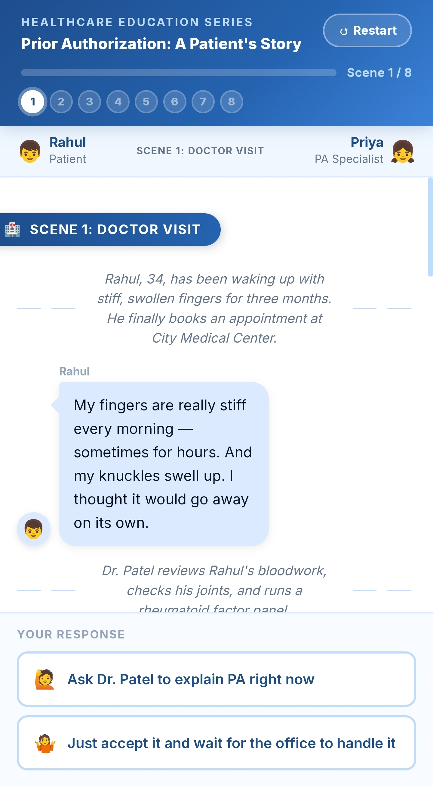
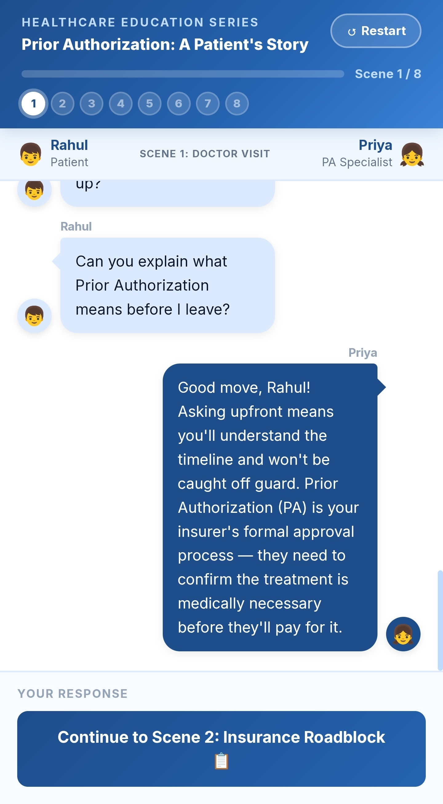

Day 27/60 – Build a Prior Authorization Story Simulator

🚀 As part of the #60DayClaudeChallenge, today I built a Prior Authorization Story Simulator that transforms a complex healthcare workflow into an interactive storytelling experience.

Rather than explaining the Prior Authorization process through static diagrams, this application guides users through a realistic conversation between a patient and a healthcare operations specialist.

The result is a more engaging and intuitive way to understand one of the most important administrative workflows in US healthcare.

---

🎯 Project Objective

Build a single-file HTML application that teaches the Prior Authorization process using storytelling.

The application combines:

- Interactive conversations
- Progress tracking
- Educational explanations
- Workflow visualization

to create an immersive learning experience.

---

👥 Characters

👦 Rahul — Patient

Represents a patient seeking approval for medical treatment.

Appears on the left side of the conversation.

📸 Insert Screenshot: Rahul Conversation

---

👧 Priya — Healthcare Operations Specialist

Guides Rahul through every step of the Prior Authorization process.

Appears on the right side of the conversation.

📸 Insert Screenshot: Priya Conversation

---

📖 Narrator & Doctors

Narrators and doctors appear as centered italic messages, providing context, explanations, and clinical updates throughout the story.

📸 Insert Screenshot: Narrator Messages

---

📚 Story Journey

The simulator progresses through 8 interactive scenes, including:

Scene 1

Patient consultation

Scene 2

Medical necessity evaluation

Scene 3

Document collection

Scene 4

Prior Authorization submission

Scene 5

Insurance review

Scene 6

Approval, Pend, or Denial

Scene 7

Appeal and Peer-to-Peer Review

Scene 8

Final outcome and workflow summary

Each scene builds on the previous one, creating a realistic learning experience.

📸 Insert Screenshot: Story Progress

---

💬 Interactive Features

The application includes:

- Dynamic chat interface
- Append-only conversation feed
- Progress bar
- Scene navigation
- Responsive design
- Modern healthcare-themed UI

These features make the learning experience interactive and engaging.

📸 Insert Screenshot: Application Interface

---

🧠 Key Learnings

1. Storytelling Improves Learning

Complex business workflows become easier to understand when presented through realistic conversations.

---

2. AI Can Create Interactive Experiences

Claude helped generate not only the application structure but also engaging dialogues and educational content.

---

3. User Experience Matters

Presenting information as a guided story improves engagement compared to traditional documentation.

---

4. Modern Web Development

This project demonstrated how a complete interactive application can be built using:

- HTML
- Tailwind CSS
- Vanilla JavaScript

without external frameworks.

---

📚 Biggest Takeaway

Today's project showed that education doesn't have to rely on static documents or presentations.

By combining AI, storytelling, and interactive design, we can create applications that make complicated workflows easier to understand and more enjoyable to learn.

«The best learning experiences don't just explain—they engage.»

---

📸 Screenshots

## 
## 
Workflow Summary

---

🙏 Acknowledgements

Special thanks to:

- Anthropic
- AB Talks on AI
- Anil Bajpai

for inspiring practical AI learning through the #60DayClaudeChallenge.

---

🔖 Hashtags

#60DayClaudeChallenge

#ClaudeAI

#Anthropic

#Healthcare

#HealthTech

#Storytelling

#WorkflowSimulation

#AIEngineering

#HTML

#JavaScript

#LearningInPublic

#BuildInPublic