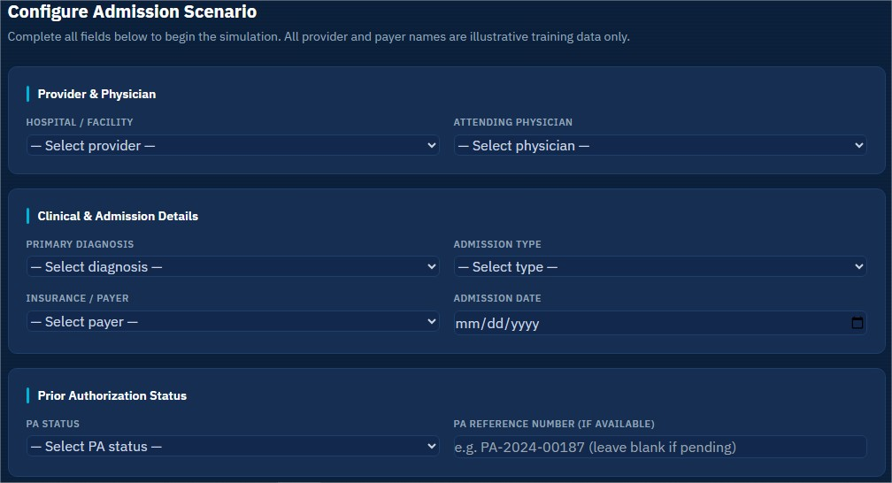
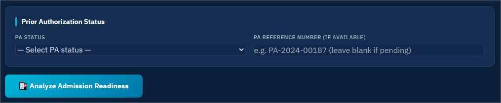
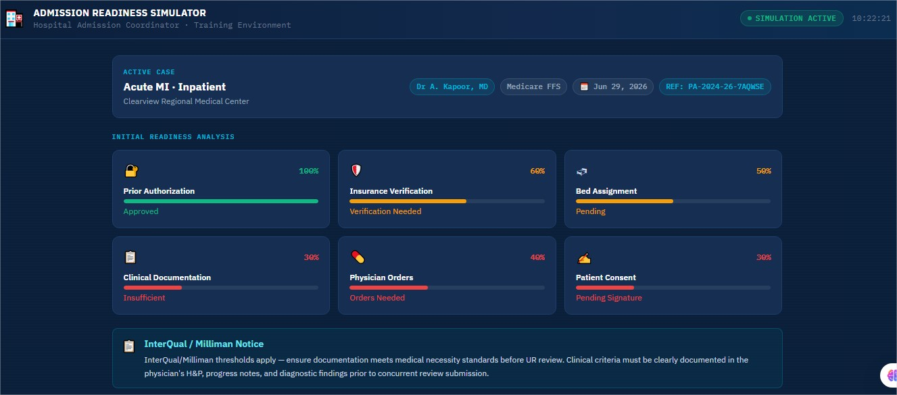
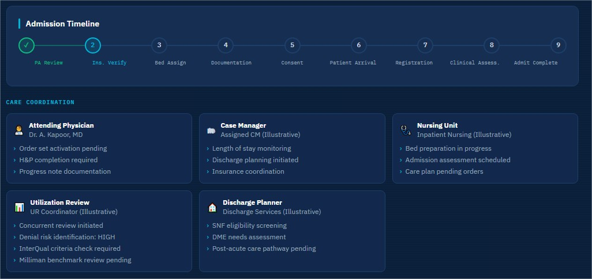
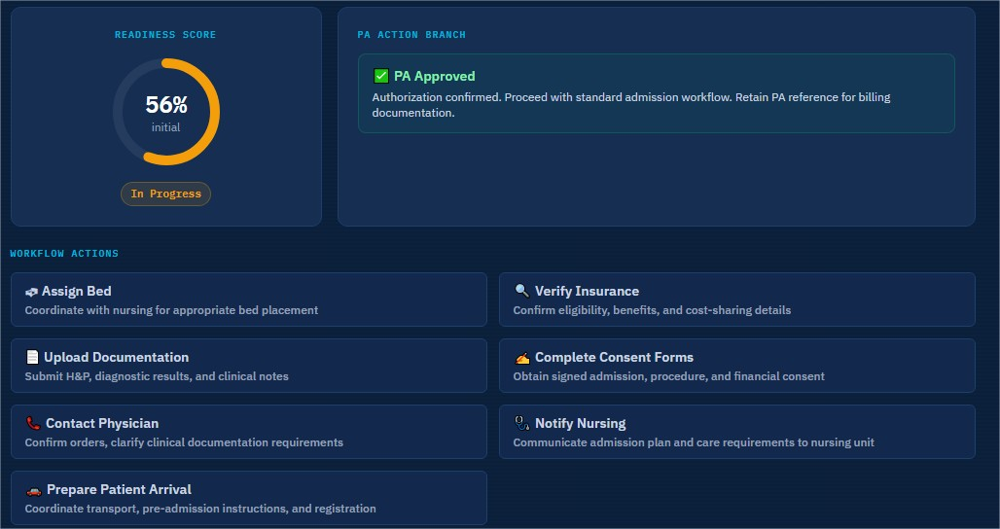
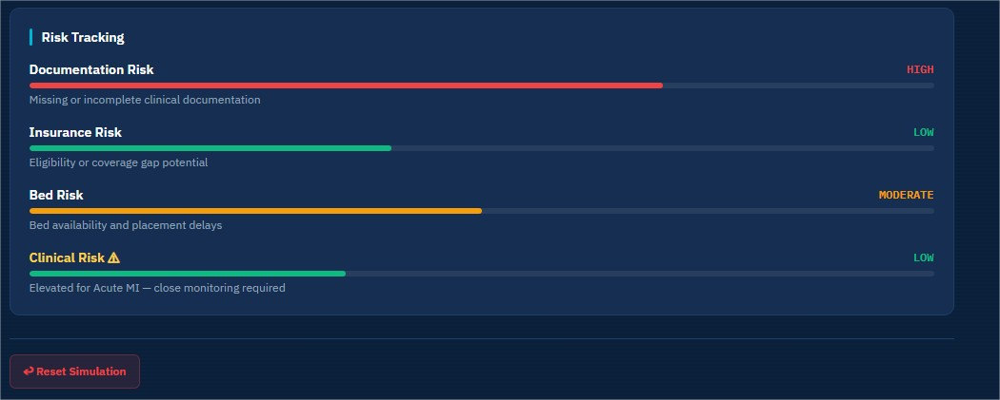

# Day 28/60 – Build a Hospital Admission Readiness Simulator

🚀 As part of the **#60DayClaudeChallenge**, today I built a **Hospital Admission Readiness Simulator** that transforms a complex hospital admission workflow into an interactive learning experience.

In this application, the user takes on the role of a **Hospital Admission Coordinator**, responsible for ensuring that all clinical and administrative requirements are completed before a patient is admitted.

The simulator demonstrates how AI can be used to build educational tools that simplify healthcare operations.

---

# 🎯 Project Objective

Build a single-file HTML application that simulates the hospital admission readiness process through an interactive workflow.

The simulator guides users through patient setup, admission planning, authorization checks, and regulatory requirements before confirming admission readiness.

---

# 👨‍⚕️ User Role

The application places the user in the role of:

**Hospital Admission Coordinator**

Responsibilities include:

- Reviewing patient information
- Verifying provider details
- Confirming admission type
- Checking Prior Authorization status
- Ensuring admission readiness

📸 **Insert Screenshot: User Role & Setup**

---

# 🏥 Patient Setup

The simulator collects essential admission details, including:

### Provider Information

- Provider Name _(Illustrative Training Data)_
- Attending Physician _(Illustrative Training Data)_

### Diagnosis Options

- Acute Myocardial Infarction (Acute MI)
- Congestive Heart Failure (CHF)
- Pneumonia
- Elective Surgery
- Hip Fracture

### Admission Types

- Inpatient
- Observation
- Emergency
- ICU
- Same-Day Surgery

### Additional Information

- Prior Authorization Status
- Planned Admission Date

📸 **Insert Screenshot: Patient Information Form**

---

# ⚠️ CMS Observation Guidance

Whenever **Observation Status** is selected, the simulator automatically displays guidance based on the **CMS 2-Midnight Rule**.

The application explains:

- Observation vs. Inpatient admission
- Cost-sharing differences
- Skilled Nursing Facility (SNF) eligibility
- Billing implications
- Medicare Outpatient Observation Notice (MOON) requirement

This reinforces the importance of regulatory compliance during admission planning.

📸 **Insert Screenshot: CMS 2-Midnight Rule Guidance**

---

# 🧩 Interactive Workflow

The simulator walks users through the complete admission readiness process:

- Patient Information Collection
- Clinical Review
- Admission Type Validation
- Prior Authorization Verification
- Regulatory Checks
- Readiness Confirmation

Each step includes educational explanations to help users understand the purpose behind the workflow.

📸 **Insert Screenshot: Admission Workflow**

---

# 🧠 Key Learnings

### 1. AI Can Simulate Healthcare Operations

Complex administrative workflows can be transformed into interactive learning experiences.

---

### 2. Role-Based Learning Improves Engagement

Placing users in the role of an Admission Coordinator makes the workflow more realistic and memorable.

---

### 3. Regulatory Guidance Can Be Embedded

Important healthcare policies, such as the CMS 2-Midnight Rule and MOON notification, can be integrated directly into the workflow to support decision-making.

---

### 4. Rapid Application Development with AI

Claude accelerated the development of the UI, workflow logic, validation, and educational content, enabling a functional prototype in a short time.

---

# 📚 Biggest Takeaway

Hospital admission is more than collecting patient information.

It requires coordination between providers, payers, and regulatory requirements.

This project demonstrated how AI can help build interactive training tools that make complex healthcare processes easier to understand and practice.

> AI has the potential to transform healthcare education by turning policies into guided, hands-on learning experiences.

---

# 📸 Screenshots

## 

## 

## 

## 

## 

## 

---

# 🙏 Acknowledgements

Special thanks to:

- Anthropic
- AB Talks on AI
- Anil Bajpai

for inspiring practical AI learning through the **#60DayClaudeChallenge**.

---

# 🔖 Hashtags

#60DayClaudeChallenge

#ClaudeAI

#Anthropic

#Healthcare

#HealthTech

#HospitalAdmission

#MedicalEducation

#WorkflowSimulation

#HealthcareOperations

#AIEngineering

#BuildInPublic

#LearningInPublic
