# Day 29/60 – Build Operation Lifeline: Supply Chain Crisis Lab

🚀 As part of the **#60DayClaudeChallenge**, today I built **Operation Lifeline: Supply Chain Crisis Lab**, an interactive business simulation that transforms supply chain management into a hands-on learning experience.

The application places the user in the role of a supply chain leader responsible for guiding a fictional company through unexpected disruptions while balancing operational performance, financial impact, and customer satisfaction.

Rather than presenting business concepts through static content, the simulator encourages users to learn by making decisions and observing their consequences.

---

# 🎯 Project Objective

Build a complete browser-based simulation that teaches supply chain resilience, crisis management, negotiation, leadership, and AI adoption through an interactive workflow.

The application is designed to help beginners understand complex supply chain concepts using plain language, guided explanations, and real-world scenarios.

---

# 🏢 Company Generation

Every simulation begins with a randomly generated fictional company, including:

- Industry
- Annual Revenue
- Factory Locations
- Warehouses
- Supplier Network
- Inventory Days
- Lead Time
- Operating Countries

Each playthrough is unique, encouraging users to think strategically in different business contexts.

📸 **Insert Screenshot: Company Overview**

---

# ⚠️ Crisis Generation

The simulator randomly introduces a major disruption, such as:

- Factory Fire
- Supplier Bankruptcy
- Port Strike
- Cyberattack
- Flood
- Raw Material Shortage
- Political Conflict
- Shipping Delay

Each crisis includes urgency levels, business impact, and contextual explanations to help users understand the situation.

📸 **Insert Screenshot: Crisis Scenario**

---

# 🛡️ War Room Decision Making

Players enter the War Room and choose three response actions from six available options.

Every decision influences key business metrics, including:

- Cost
- Inventory
- Profit
- Delivery Speed
- Customer Satisfaction

Animated progress bars provide immediate visual feedback on the impact of each decision.

📸 **Insert Screenshot: War Room**

---

# 🤝 Supplier Negotiation

The simulator includes a four-round negotiation with suppliers.

Each decision affects:

- Trust
- Price
- Lead Time

A final negotiation score evaluates the effectiveness of the player's strategy.

📸 **Insert Screenshot: Supplier Negotiation**

---

# 👔 CEO Boardroom

Players answer five leadership-focused multiple-choice questions covering:

- Crisis Leadership
- Resource Allocation
- Risk Management
- Communication
- Strategic Thinking

The simulator generates a leadership score based on the responses.

📸 **Insert Screenshot: CEO Boardroom**

---

# 🤖 AI Strategy Selection

The final strategic phase allows players to invest in two AI capabilities:

- Demand Forecasting
- Inventory Optimization
- Supplier Risk Monitoring
- Warehouse Vision
- Procurement Copilot

The simulator explains how each investment improves business resilience and operational performance.

📸 **Insert Screenshot: AI Strategy Selection**

---

# 📊 Executive Dashboard

At the end of the simulation, a personalized dashboard summarizes performance across multiple dimensions:

- Overall Crisis Score
- Leadership Score
- Negotiation Score
- Resilience Score
- Cost Control
- Risk Management
- Customer Satisfaction

It also highlights:

- Biggest Mistake
- Best Decision
- Expert Recommendations
- Lessons Learned

# Screenshots

## 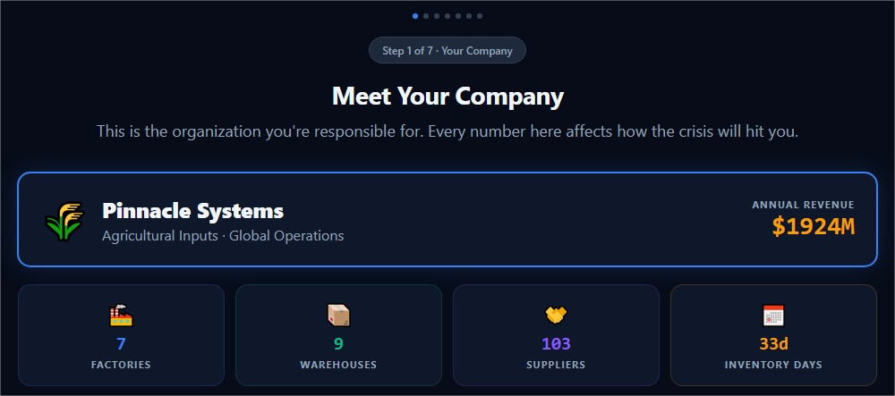

## 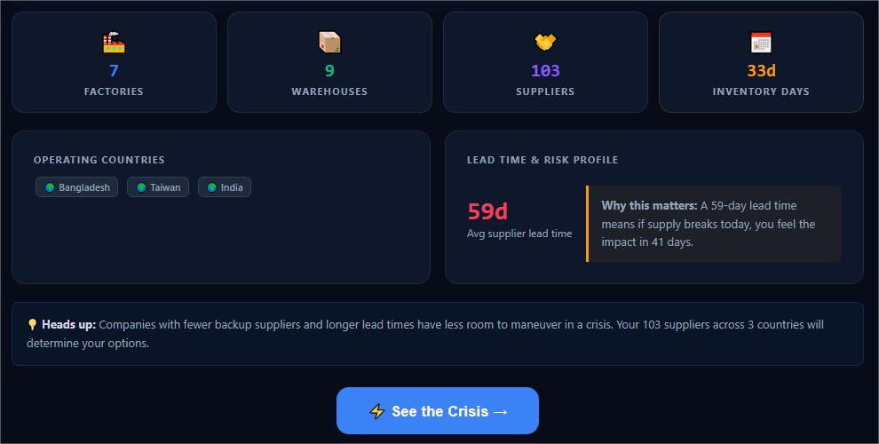

## 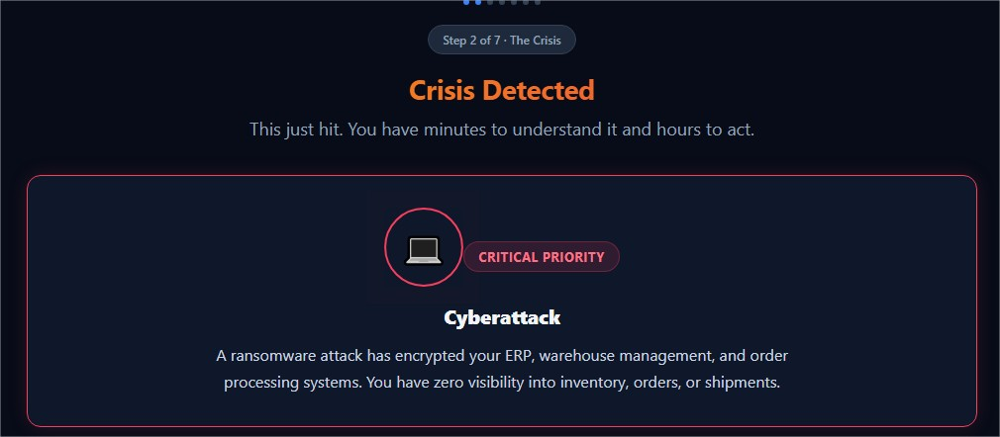

## 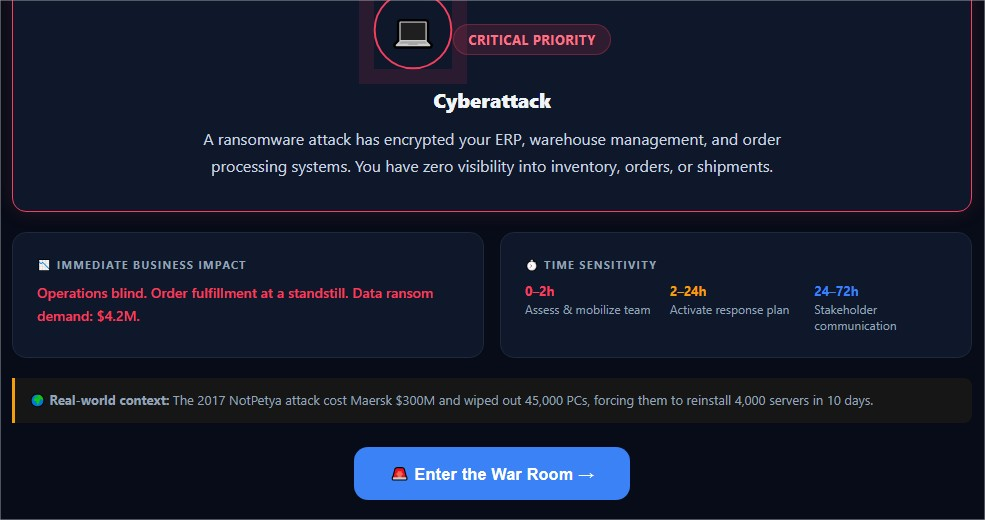

## 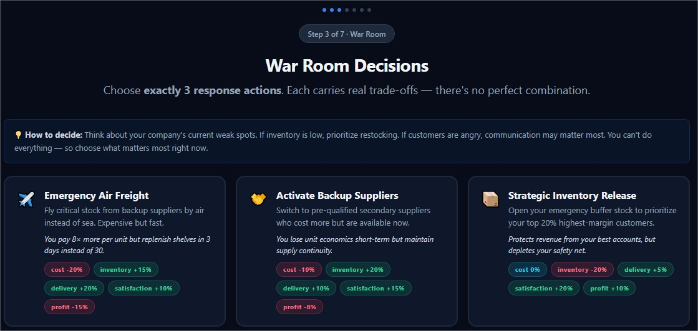

## 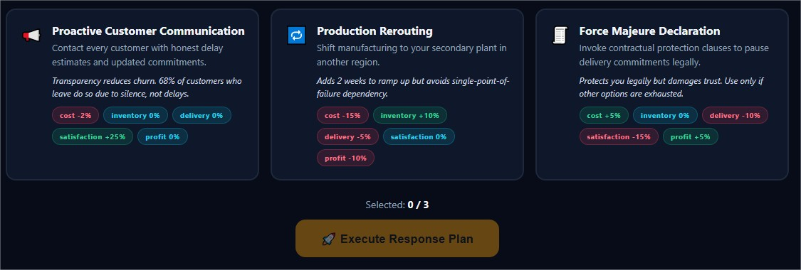

## 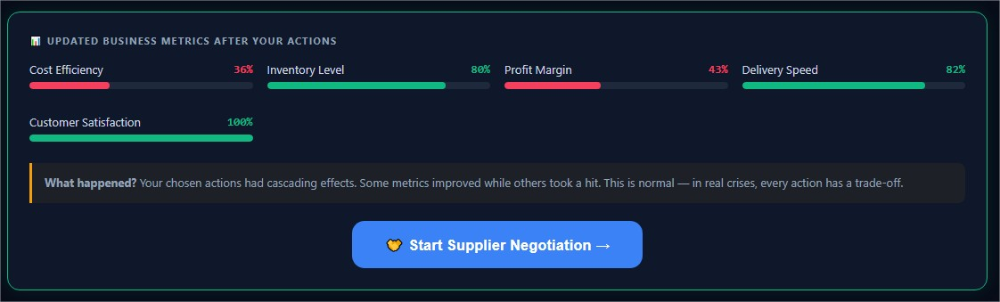

## 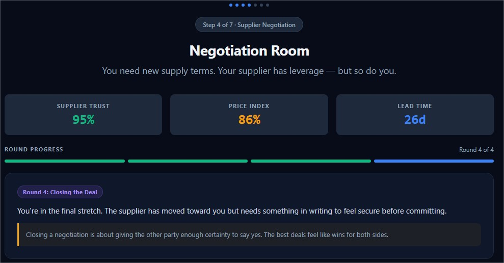

## 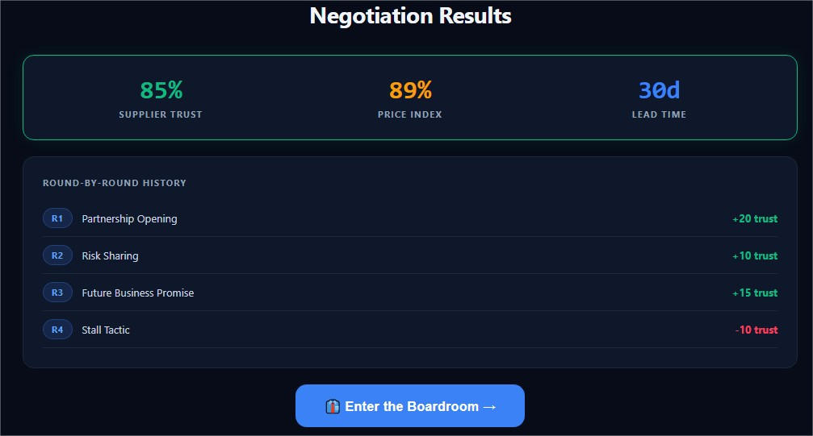

## 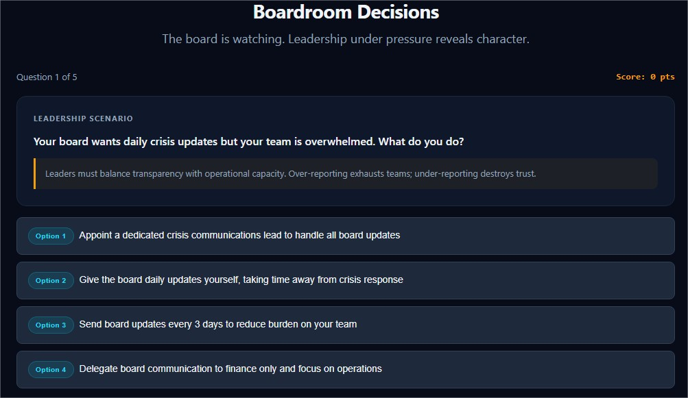

## 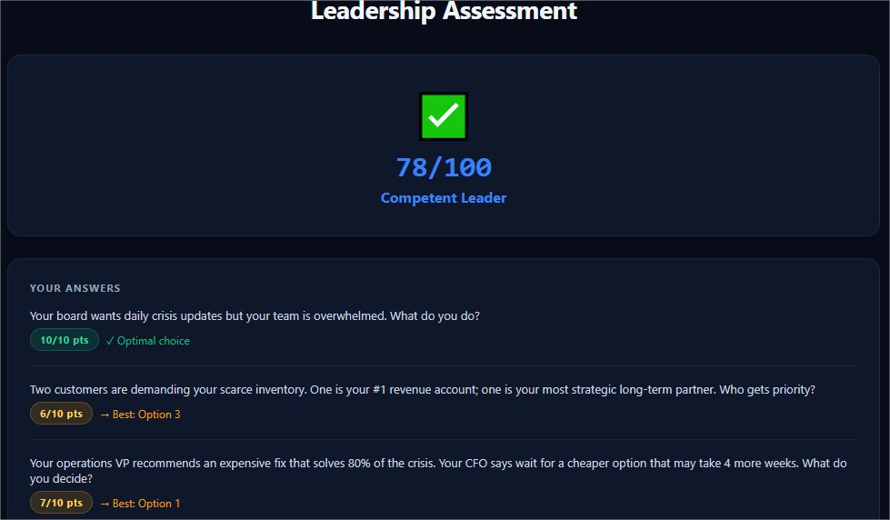

## 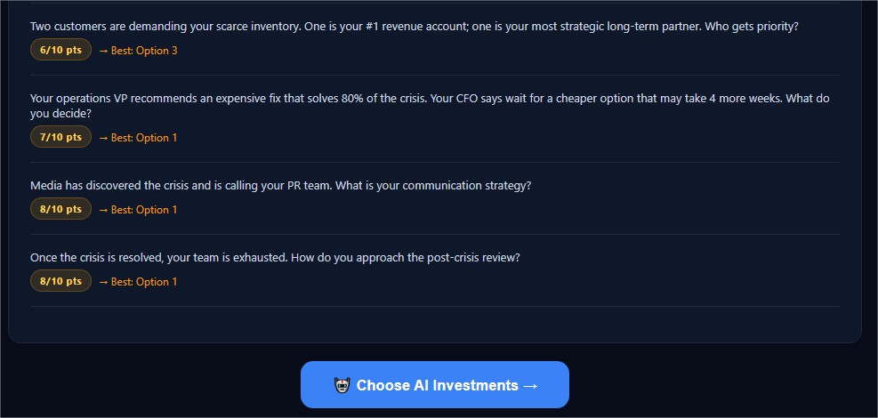

## 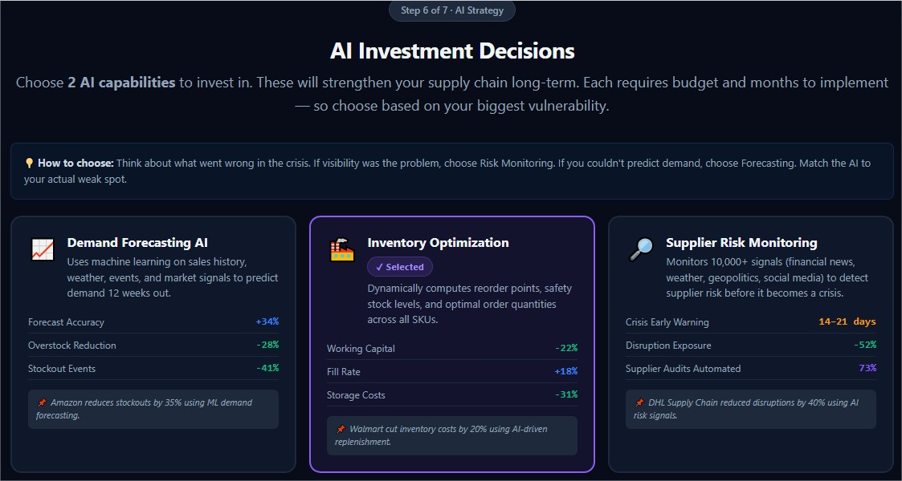

## 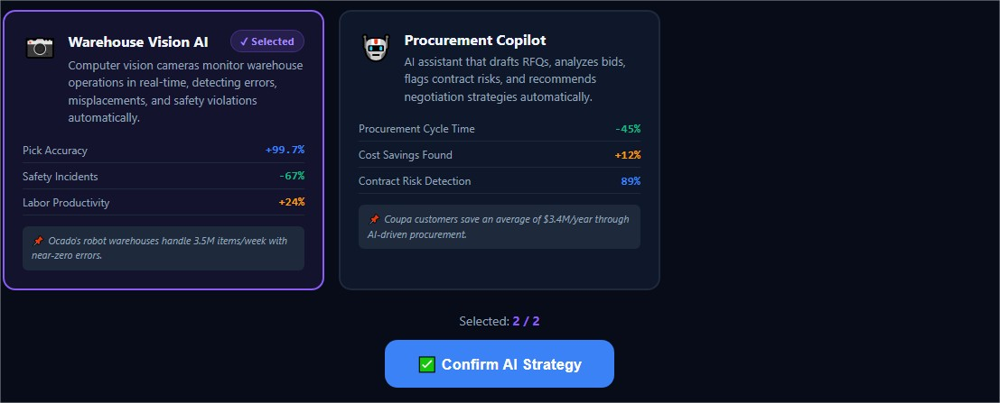

## 

## 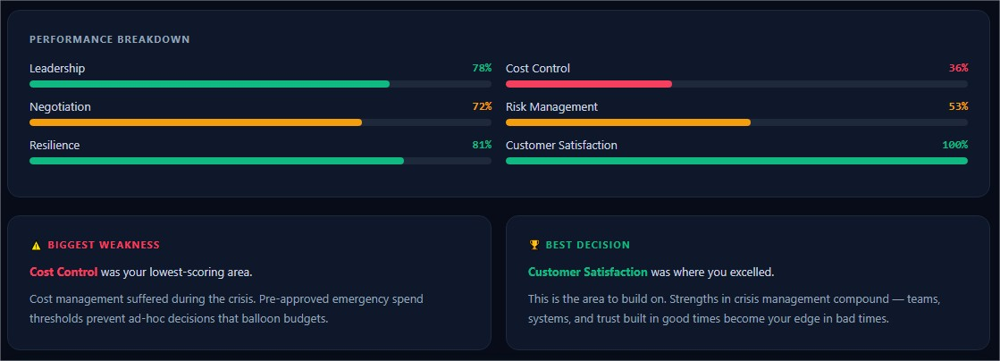

## 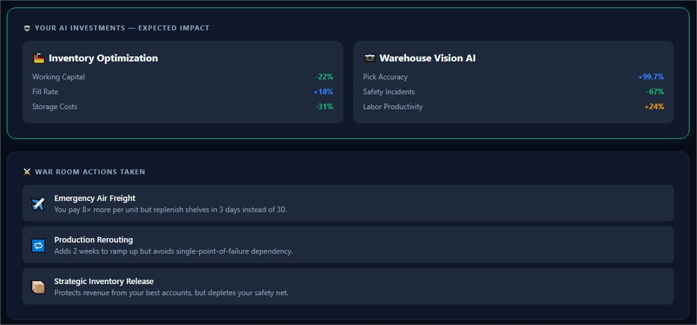

## 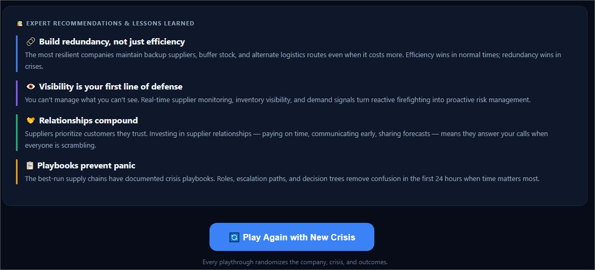

---

# 🧠 Key Learnings

### 1. AI Can Build Interactive Business Simulations

AI is capable of creating immersive educational experiences that go beyond traditional content generation.

---

### 2. Decision-Based Learning Improves Understanding

Allowing users to make decisions and experience their consequences makes complex business concepts more engaging and memorable.

---

### 3. Storytelling + Simulation = Better Learning

Combining realistic scenarios with interactive gameplay helps simplify topics such as supply chain resilience and crisis management.

---

### 4. AI Accelerates Rapid Prototyping

Claude significantly reduced development time by helping design workflows, business logic, user interactions, and educational content.

---

# 📚 Biggest Takeaway

Supply chain management is about making informed decisions under uncertainty.

This project demonstrated how AI can transform complex operational concepts into interactive simulations that help users build confidence through practice.

> The best way to learn decision-making is by making decisions.

---

# 📸 Suggested Screenshots

1. Welcome Screen
2. Company Profile Cards
3. Crisis Overview
4. War Room Decisions
5. Supplier Negotiation
6. CEO Boardroom
7. AI Strategy Selection
8. Executive Dashboard
9. Personalized Feedback & Lessons Learned

---

# 🙏 Acknowledgements

Special thanks to:

- Anthropic
- AB Talks on AI
- Anil Bajpai

for inspiring practical AI learning through the **#60DayClaudeChallenge**.

---

# 🔖 Hashtags

#60DayClaudeChallenge

#ClaudeAI

#Anthropic

#SupplyChain

#BusinessSimulation

#CrisisManagement

#DecisionMaking

#AIEngineering

#BusinessStrategy

#LearningInPublic

#BuildInPublic
