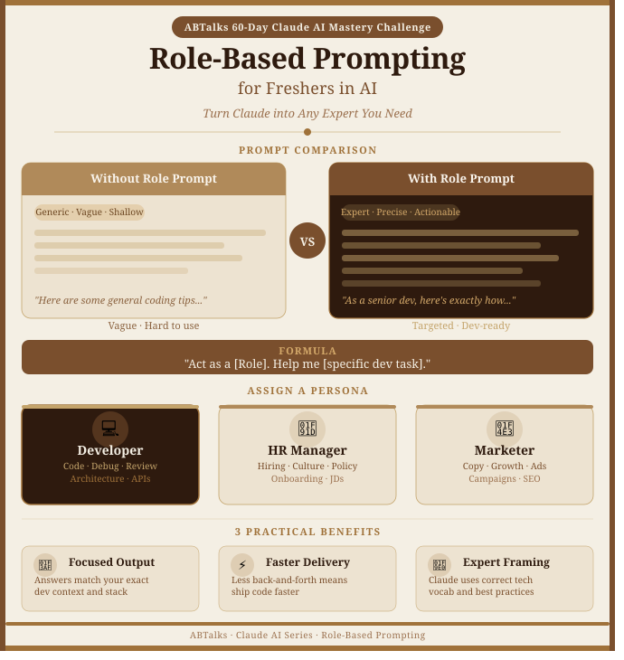
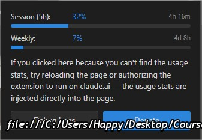

# 🚀 Day 03/60 Role-Based Prompting: Turning AI from a Search Engine into a Senior Mentor
Welcome to the team! Here's your complete training guide on Role-Based Prompting — written specifically for you as a software developer working with AI tools like Claude.

---

## What is Role-Based Prompting?

Role-Based Prompting means giving Claude a specific identity or job title *before* asking your question. You're essentially telling Claude: "Think like this type of expert, then answer me."

Instead of asking a plain question, you start with: *"Act as a [Role]..."* — and that one change transforms the entire quality of the response.

---

## Why It Matters When Using Claude

Claude is trained on enormous amounts of knowledge — documentation, code, design patterns, HR policies, marketing playbooks, you name it. But without a role, it tries to answer for *everyone*, which means it answers for *no one* perfectly. Assigning a role tells Claude which slice of that knowledge to activate and at what depth.

---

## How It Affects Software Development

As a fresher, you'll use Claude constantly — to understand code, fix bugs, write functions, review PRs, and learn best practices. Without a role prompt, Claude gives you textbook answers. With a developer role, it speaks your language: it references real patterns like MVC or REST, mentions specific tools like `pytest` or `ESLint`, and thinks the way a senior engineer on your team would.

It's the difference between Googling a concept and asking a senior dev sitting next to you.

---
### Screenshot

---

## Without a Role Prompt

**Prompt:** *"How do I handle errors in my code?"*

**Claude's response:** "You should use try-catch blocks to handle errors. Make sure to log the error message and handle edge cases. Always validate user input before processing it..."

> Surface-level. No mention of your language, framework, or actual use case.

---

## With a Role Prompt

**Prompt:** *"You are a senior backend developer with 10 years of experience in Node.js. How do I handle errors in my Express API?"*

**Claude's response:** "In Express, use a centralized error-handling middleware placed after all your routes. Create a custom `AppError` class that extends `Error` — include a `statusCode` and `isOperational` flag to distinguish programmatic bugs from user-facing errors. Use `next(err)` to pass errors down the chain. For async routes, wrap them in a `catchAsync` utility to avoid repetitive try-catch blocks. In production, never expose stack traces — log internally with Winston or Pino and return a sanitized JSON response..."

> Specific. Uses your stack. Gives you production-grade code you can actually use today.

---

## Three Practical Benefits

**1. Outputs match your tech stack** — When Claude knows it's a senior Node.js dev, it won't suggest Python syntax or generic pseudocode. You get answers in your actual language, with your actual tools.

**2. You ship faster** — The less time you spend clarifying follow-up questions, the faster you move. A well-roled prompt often gets you to a usable answer in one shot.

**3. You learn how experts think** — Reading Claude's role-framed responses exposes you to vocabulary, patterns, and reasoning that senior engineers use. It's passive mentorship baked into every query.

---

## The Master Formula for Developers

> *"You are a [senior/expert] [role] with experience in [your tech stack]. Help me [specific task]."*

Try it right now: *"You are a senior React developer. Help me refactor this component to use custom hooks instead of inline state logic."*

## Claude Usage Tracker
### Screenshot

---