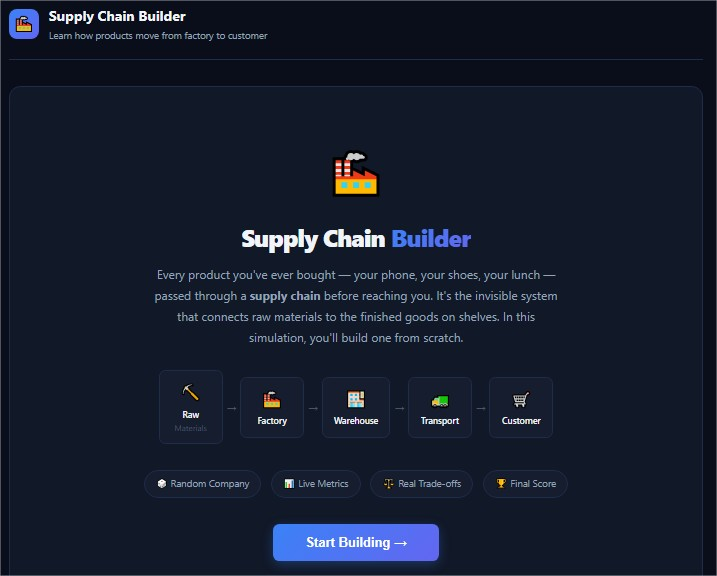
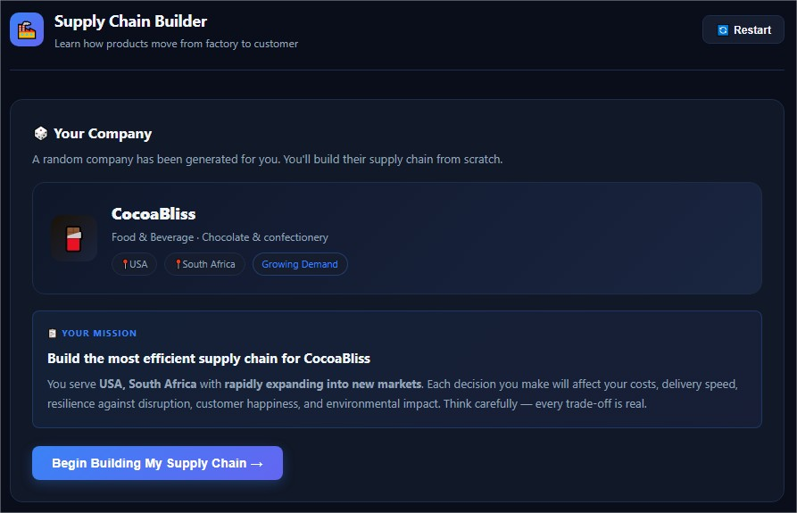
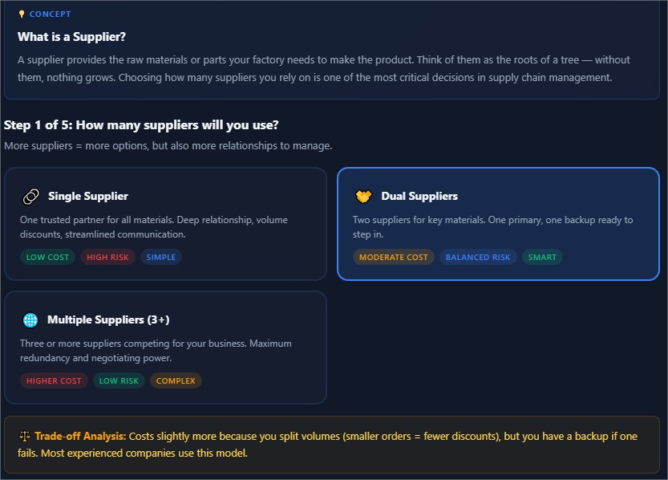
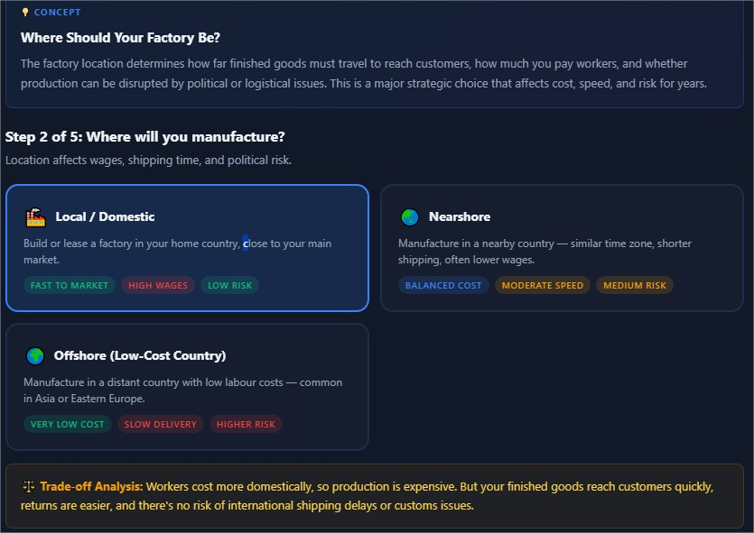
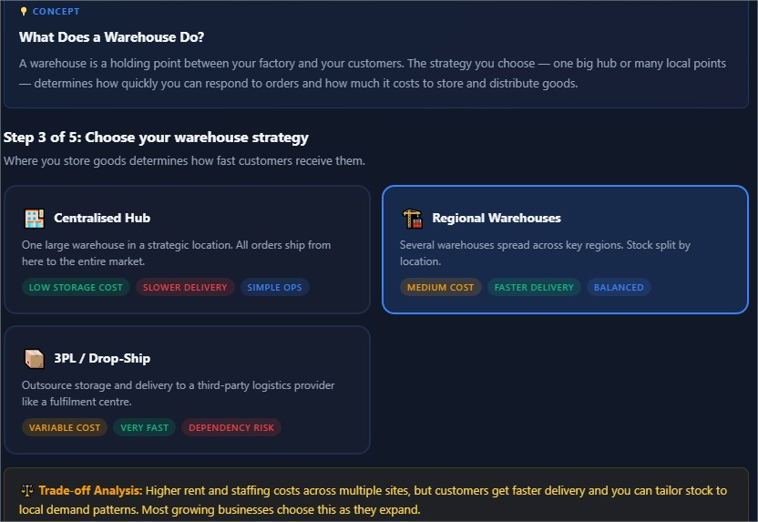
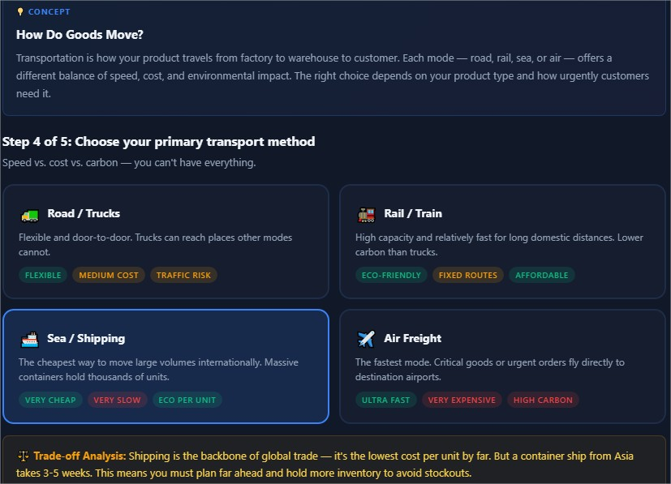
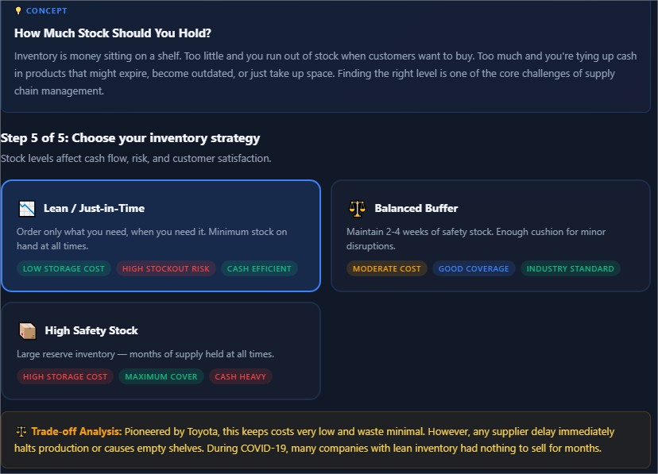
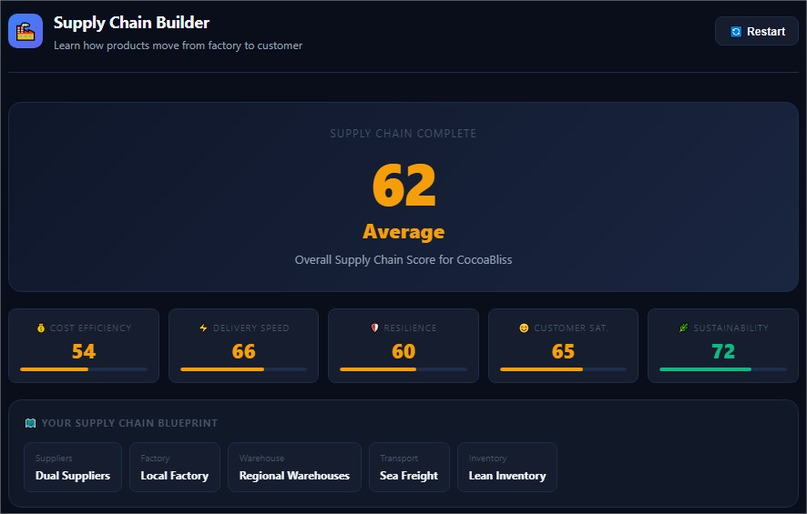
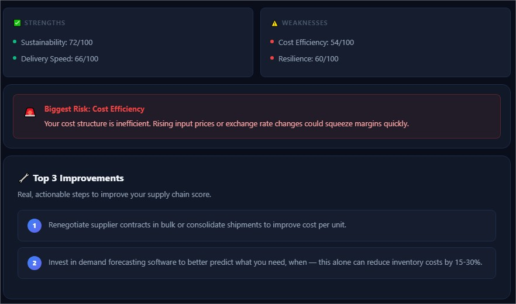

# Day 30/60 – Build a Supply Chain Builder & Optimizer

🚀 As part of the **#60DayClaudeChallenge**, today I built **Supply Chain Builder**, an interactive React application designed to teach supply chain management through simulation and decision-making.

Rather than reading theoretical concepts, users learn by managing a fictional company's supply chain and observing the consequences of their decisions.

The application was built as a **single-file HTML application** using React (CDN), HTML, CSS, and Vanilla JavaScript, allowing it to run completely offline without any backend or external services.

---

# 🎯 Project Objective

Build an interactive educational application that introduces beginners to supply chain management using guided explanations, realistic business scenarios, and optimization strategies.

The simulator helps users understand not only _what_ decisions to make, but also _why_ they matter and _how_ they influence business performance.

---

# 🏢 Random Company Generator

Every new simulation creates a unique fictional company with randomized business characteristics, including:

- Industry
- Annual Revenue
- Number of Factories
- Warehouses
- Supplier Network
- Inventory Days
- Lead Time
- Operating Countries

This ensures that each playthrough presents different challenges and encourages strategic thinking.

📸 **Insert Screenshot: Company Overview**

---

# 📦 Supply Chain Optimization

Players make decisions across key areas of supply chain management, such as:

- Inventory Planning
- Supplier Selection
- Warehouse Operations
- Logistics Strategy
- Lead Time Management
- Distribution Planning

Before each decision, the simulator explains:

- What the concept means
- Why it is important
- How it impacts the business

This beginner-friendly approach makes complex topics easier to understand.

📸 **Insert Screenshot: Optimization Decisions**

---

# 📊 Live Business Metrics

As decisions are made, the application dynamically updates key business indicators, including:

- Operating Cost
- Inventory Levels
- Delivery Performance
- Customer Satisfaction
- Business Efficiency

Users receive immediate feedback, helping them connect decisions with outcomes.

📸 **Insert Screenshot: Business Metrics Dashboard**

---

# ⚛️ React-Based Architecture

The application is organized into reusable React components using `useState`, demonstrating modern frontend development practices while maintaining a single-file architecture.

This modular approach improves readability, maintainability, and scalability.

📸 **Insert Screenshot: React Components**

---

# 🧠 Key Learnings

### 1. AI Accelerates Frontend Development

Claude significantly reduced development time by assisting with component structure, application logic, and user experience design.

---

### 2. Interactive Learning Improves Understanding

Users retain concepts more effectively when they actively make decisions instead of passively reading explanations.

---

### 3. Reusable Components Simplify Development

Using React components and state management creates cleaner, more maintainable applications.

---

### 4. Business Simulations Build Practical Skills

Simulations provide a safe environment to explore business decisions and understand operational trade-offs.

---

# 📚 Biggest Takeaway

Supply chain management involves balancing cost, speed, inventory, and customer satisfaction.

This project demonstrated how AI can help transform these complex business concepts into interactive learning experiences that are engaging, accessible, and practical.

> The best way to understand a business system is to experience it through simulation.

---

# 📸 Screenshots

## 

## 

## 

## 

## 

## 

## 

## 

## 

---

# 🙏 Acknowledgements

Special thanks to:

- Anthropic
- AB Talks on AI
- Anil Bajpai

for inspiring practical AI learning through the **#60DayClaudeChallenge**.

---

# 🔖 Hashtags

#60DayClaudeChallenge

#ClaudeAI

#Anthropic

#ReactJS

#SupplyChain

#BusinessSimulation

#FrontendDevelopment

#AIEngineering

#LearningInPublic

#BuildInPublic
