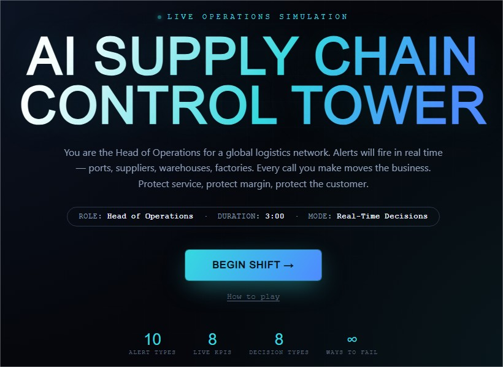
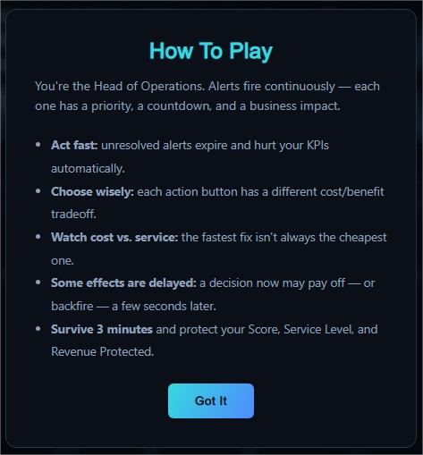
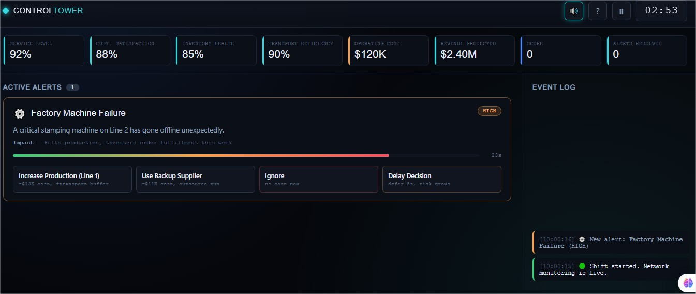
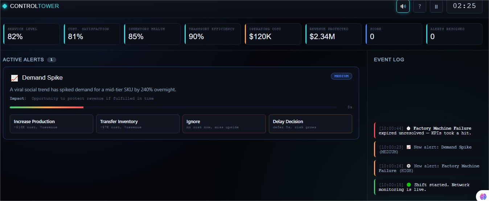
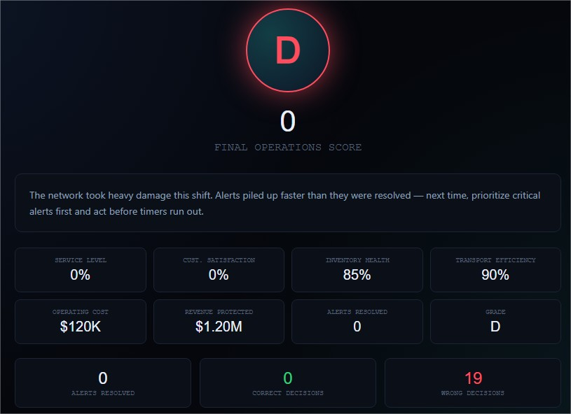

# Day 31/60 – Build an AI Supply Chain Control Tower

🚀 As part of the **#60DayClaudeChallenge**, today I built an **AI Supply Chain Control Tower**, an interactive web application that simulates the responsibilities of a **Head of Operations** managing a global supply chain.

The application was developed as a **single self-contained HTML file** using HTML, CSS, and Vanilla JavaScript, allowing it to run completely offline without external libraries or backend services.

The objective was to transform complex operational data into an intuitive decision-support experience.

---

# 🎯 Project Objective

Build an interactive control tower that enables users to monitor supply chain operations, respond to disruptions, and make informed business decisions.

Rather than displaying static dashboards, the simulator encourages users to analyze operational conditions and respond to changing business scenarios.

---

# 🌍 Global Operations Dashboard

The simulator provides a centralized operational view of the business, including:

- Factory Status
- Warehouse Capacity
- Supplier Performance
- Shipment Tracking
- Inventory Availability
- Logistics Overview

These operational metrics help users understand the health of the supply chain at a glance.

📸 **Insert Screenshot: Operations Dashboard**

---

# 📦 Supply Chain Monitoring

The application continuously tracks important operational indicators such as:

- Inventory Levels
- Lead Time
- Order Fulfillment
- Supplier Reliability
- Delivery Performance

Users can quickly identify bottlenecks before they become major business problems.

📸 **Insert Screenshot: Supply Chain Monitoring**

---

# ⚠️ Disruption Management

To simulate real-world operations, the Control Tower introduces supply chain disruptions such as:

- Supplier Delays
- Transportation Issues
- Inventory Shortages
- Warehouse Capacity Constraints

Each alert requires users to assess the situation and make operational decisions.

📸 **Insert Screenshot: Disruption Alerts**

---

# 🤖 AI Decision Support

One of the most valuable features is the AI-powered recommendation engine.

Based on operational conditions, the application suggests actions to:

- Improve delivery performance
- Reduce operational risk
- Optimize inventory
- Strengthen supplier resilience
- Improve customer satisfaction

These recommendations help users understand the reasoning behind operational decisions.

📸 **Insert Screenshot: AI Recommendations**

---

# 📊 Business KPIs

The simulator visualizes key operational metrics through interactive dashboard components, including:

- Inventory Health
- Lead Time
- Service Level
- Cost Efficiency
- Customer Satisfaction
- Operational Performance

Live updates make it easy to understand how decisions influence overall business outcomes.

📸 **Insert Screenshot: KPI Dashboard**

---

# 🧠 Key Learnings

### 1. Dashboards Should Drive Decisions

An effective dashboard does more than present information—it helps users prioritize actions.

---

### 2. AI Enhances Operational Awareness

AI-generated recommendations provide valuable decision support during uncertain operational conditions.

---

### 3. Visualization Simplifies Complexity

Presenting operational data visually makes large-scale supply chain management easier to understand.

---

### 4. Offline-First Applications Are Powerful

Building a fully functional application using only HTML, CSS, and Vanilla JavaScript demonstrates that sophisticated simulations can be created without external frameworks.

---

# 📚 Biggest Takeaway

Supply chain leaders make decisions based on visibility, timing, and operational insight.

This project demonstrated how AI can help build interactive control towers that combine monitoring, analytics, and decision support into a single learning experience.

> Great operations are built on visibility, informed decisions, and continuous adaptation.

---

# 📸 Screenshots

## 

## 

## 

## 

## 

---

# 🙏 Acknowledgements

Special thanks to:

- Anthropic
- AB Talks on AI
- Anil Bajpai

for inspiring practical AI learning through the **#60DayClaudeChallenge**.

---

# 🔖 Hashtags

#60DayClaudeChallenge

#ClaudeAI

#Anthropic

#SupplyChain

#ControlTower

#OperationsManagement

#DashboardDesign

#AIEngineering

#LearningInPublic

#BuildInPublic
