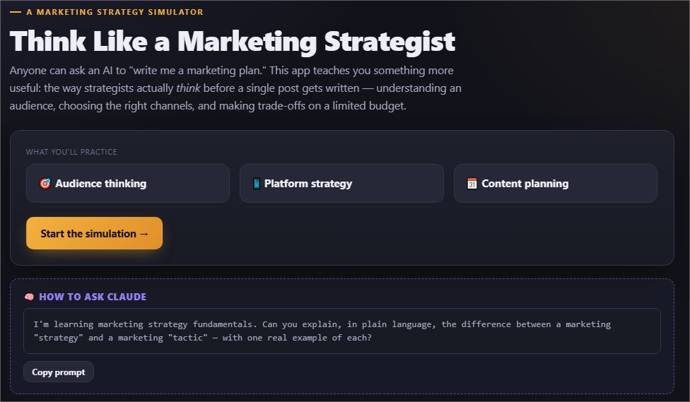
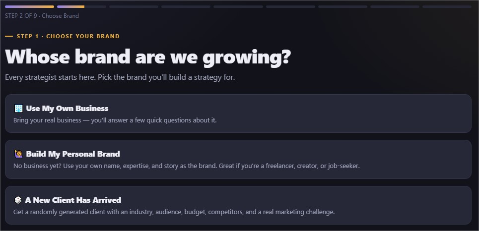
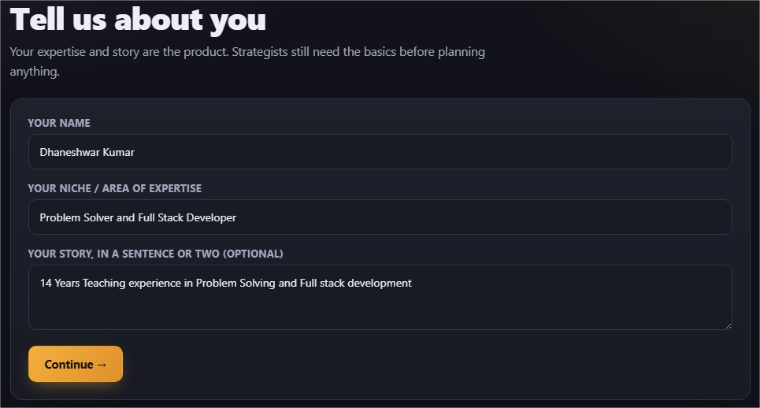
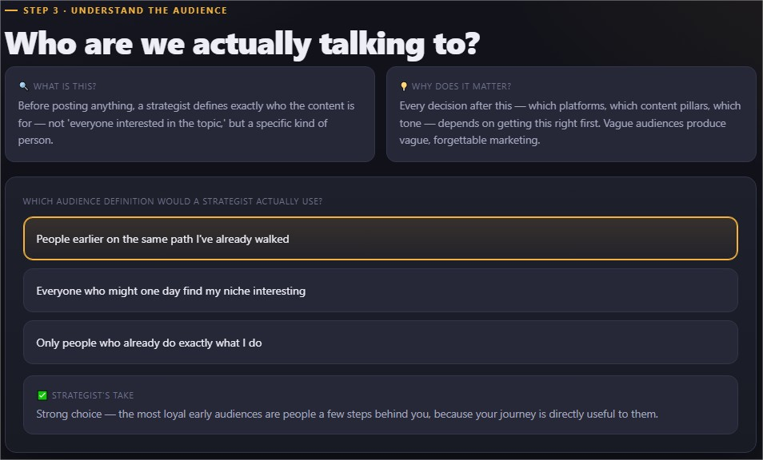
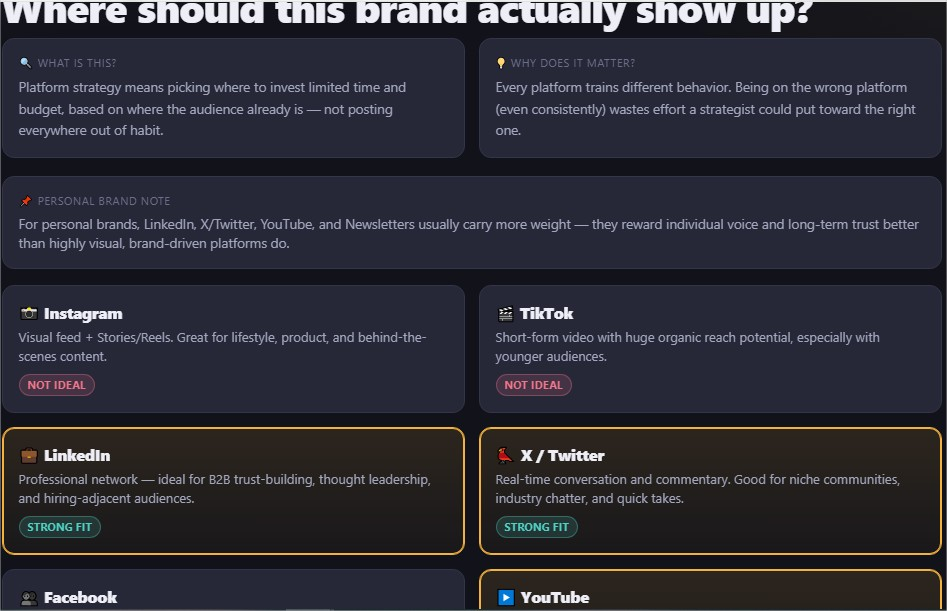
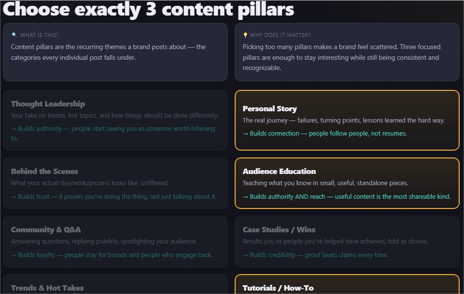
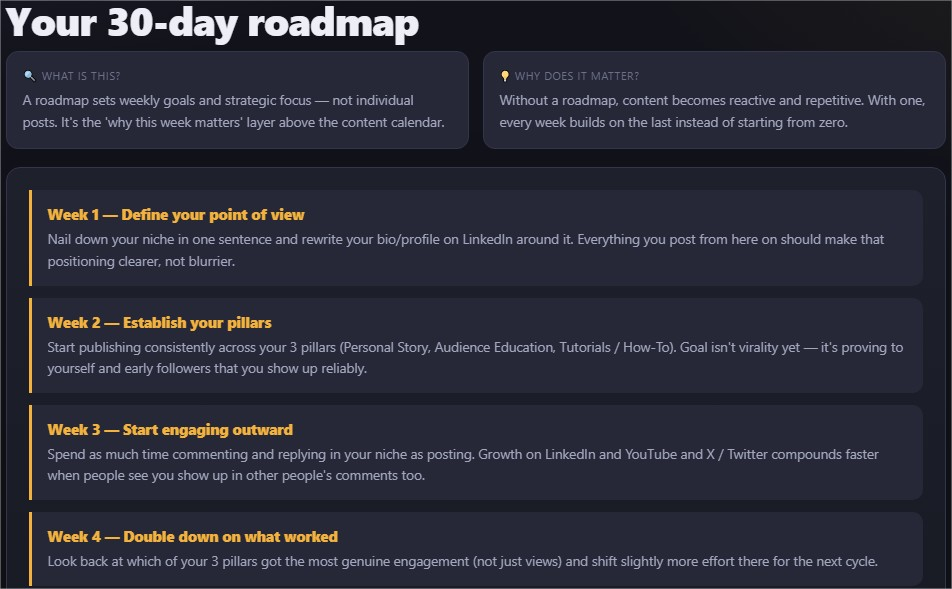
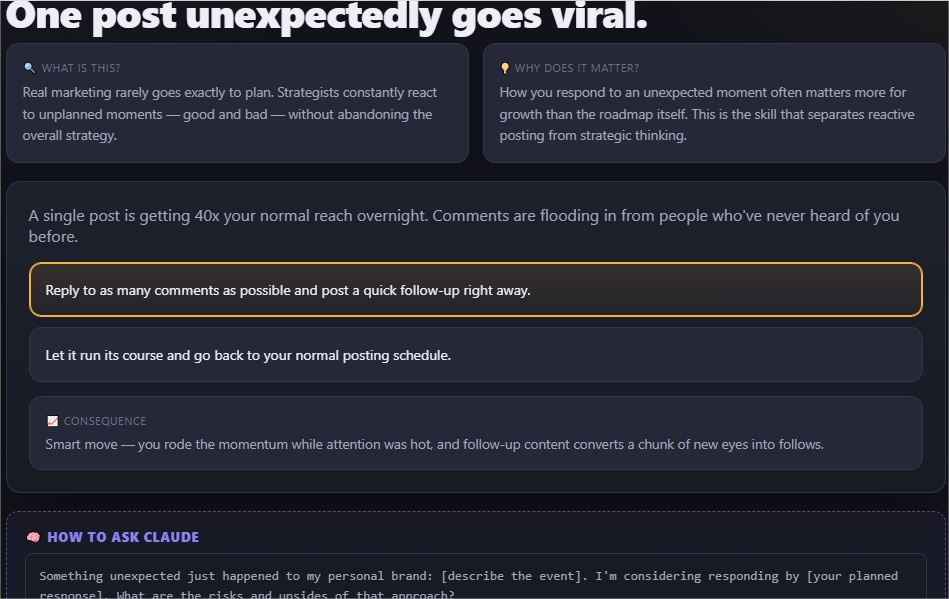
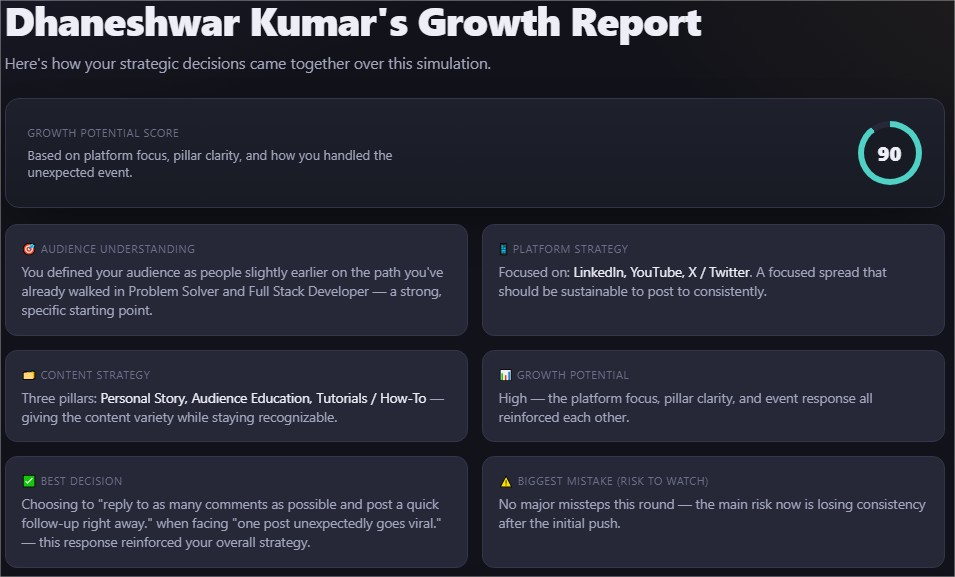

# Day 32/60 – Think Like a Marketing Strategist

🚀 As part of the **#60DayClaudeChallenge**, today I built **Think Like a Marketing Strategist: Grow This Brand**, an interactive React application designed to teach beginners how marketers think and make strategic decisions.

🌐 **Live Demo:** https://euphonious-sopapillas-65e4e6.netlify.app/

Rather than generating ready-made marketing content, the application walks users through the complete marketing planning process while explaining **what each concept means, why it matters, and how it contributes to long-term growth**.

The application was built as a **single self-contained HTML file** using React (CDN), HTML, CSS, and JavaScript, allowing it to run completely offline.

---

# 🎯 Project Objective

Create an interactive learning experience where users develop a marketing strategy for:

- Their own business
- Their personal brand
- A randomly generated client

The goal is to help users understand marketing strategy through guided decision-making instead of passive learning.

---

# 🏢 Three Learning Modes

The application offers three different scenarios:

### Use My Own Business

Users create a customized marketing strategy for their existing business.

### Build My Personal Brand

Users learn how to market themselves by focusing on:

- Expertise
- Personal Story
- Professional Niche
- Thought Leadership

Special emphasis is placed on platforms such as LinkedIn, X (Twitter), YouTube, and newsletters.

### A New Client Has Arrived

The simulator generates a fictional business with randomized:

- Industry
- Target Audience
- Budget
- Competitors
- Marketing Challenges

Each playthrough presents a unique strategic challenge.

📸 **Insert Screenshot: Welcome & Mode Selection**

---

# 👥 Audience Understanding

Before making marketing decisions, users learn how to identify:

- Target Audience
- Customer Needs
- Pain Points
- Goals
- Buying Behavior

Each section explains why audience understanding is the foundation of successful marketing.

📸 **Insert Screenshot: Audience Analysis**

---

# 📱 Platform Strategy

The simulator helps users choose the most suitable marketing channels.

Examples include:

- LinkedIn
- X (Twitter)
- Instagram
- Facebook
- YouTube
- TikTok
- Newsletters

For every platform, the application explains:

- What it is
- Why it matters
- When it is most effective

📸 **Insert Screenshot: Platform Selection**

---

# 📚 Content Pillars

Users generate multiple content themes and select three primary pillars.

Examples include:

- Thought Leadership
- Audience Education
- Behind the Scenes
- Personal Story
- Industry Insights

The simulator explains how each pillar supports different marketing goals.

📸 **Insert Screenshot: Content Pillars**

---

# 🗓️ 30-Day Marketing Roadmap

Based on user choices, the application creates a strategic four-week roadmap.

Examples include:

### Week 1

- Define Brand Positioning
- Optimize Profile
- Clarify Point of View

### Week 2

- Publish Educational Content
- Build Audience Trust

### Week 3

- Increase Community Engagement

### Week 4

- Analyze Results & Improve Strategy

The roadmap focuses on strategy rather than individual posts.

📸 **Insert Screenshot: Marketing Roadmap**

---

# ⚡ Marketing Challenge

To simulate real-world uncertainty, the application introduces a random marketing event.

Examples include:

- Viral Post
- Podcast Invitation
- Negative Feedback
- Competitor Copying Content
- Sudden Follower Growth

Users choose how to respond and immediately see the impact of their decisions.

📸 **Insert Screenshot: Marketing Event**

---

# 📊 Growth Report

At the end of the simulation, users receive a personalized report containing:

- Audience Understanding Score
- Platform Strategy Evaluation
- Content Strategy Assessment
- Growth Potential
- Best Decision
- Biggest Mistake
- Three Marketing Lessons

For personal brands, the lessons emphasize:

- Authenticity
- Consistency
- Niche Clarity

📸 **Insert Screenshot: Growth Report**

---

# 💡 Prompt Engineering Integration

After every major section, the application provides a reusable **"How to Ask Claude"** card.

These prompts help users learn effective prompt engineering while building their marketing strategy.

This makes the simulator both a marketing tutor and an AI learning companion.

📸 **Insert Screenshot: Prompt Cards**

---

# 🧠 Key Learnings

### 1. Marketing Begins with Understanding People

Effective marketing starts by understanding the audience, not by creating content.

---

### 2. Strategy Before Execution

Choosing the right audience, platforms, and messaging creates a stronger foundation than simply publishing more content.

---

### 3. Personal Branding Is Strategic

Growing a personal brand requires authenticity, consistency, and a clearly defined niche.

---

### 4. AI as a Marketing Coach

Claude can guide users through the reasoning behind marketing decisions, making complex concepts easier to understand and apply.

---

# 📚 Biggest Takeaway

Marketing is not about posting more—it is about creating value for the right audience with a clear strategy.

This project demonstrated how AI can transform marketing education into an engaging, interactive learning experience while also teaching better prompt engineering.

> Great marketing starts with great thinking, and AI can help us think more strategically.

---

# 📸 Screenshots

## 

## 

## 

## 

## 

## 

## 

## 

## 

---

# 🙏 Acknowledgements

Special thanks to:

- Anthropic
- AB Talks on AI
- Anil Bajpai

for inspiring practical AI learning through the **#60DayClaudeChallenge**.

---

# 🔖 Hashtags

#60DayClaudeChallenge

#ClaudeAI

#MarketingStrategy

#PersonalBranding

#PromptEngineering

#ReactJS

#AIEngineering

#LearningInPublic

#BuildInPublic

#DigitalMarketing
