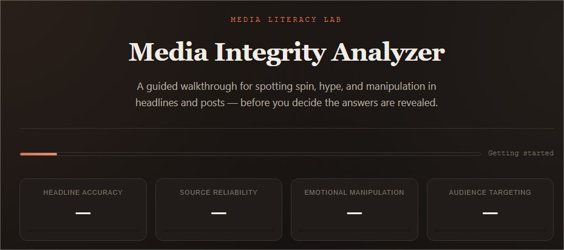
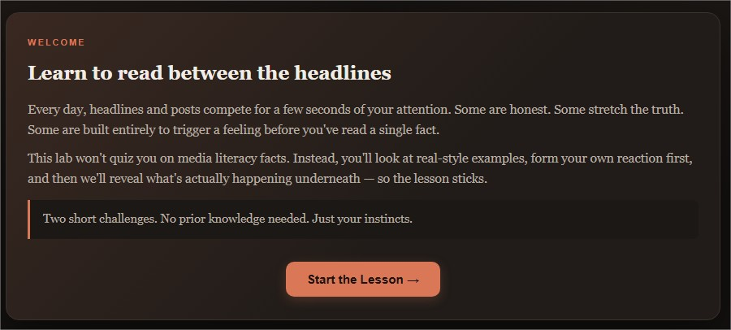
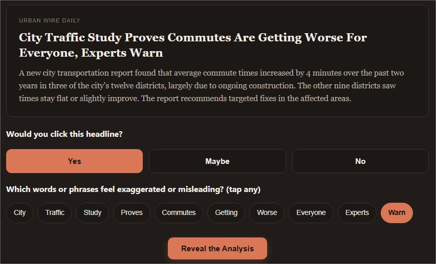
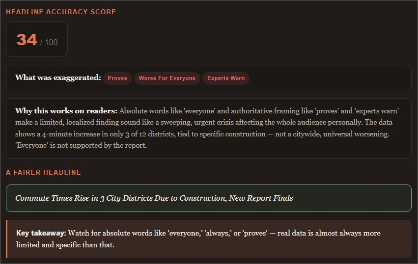
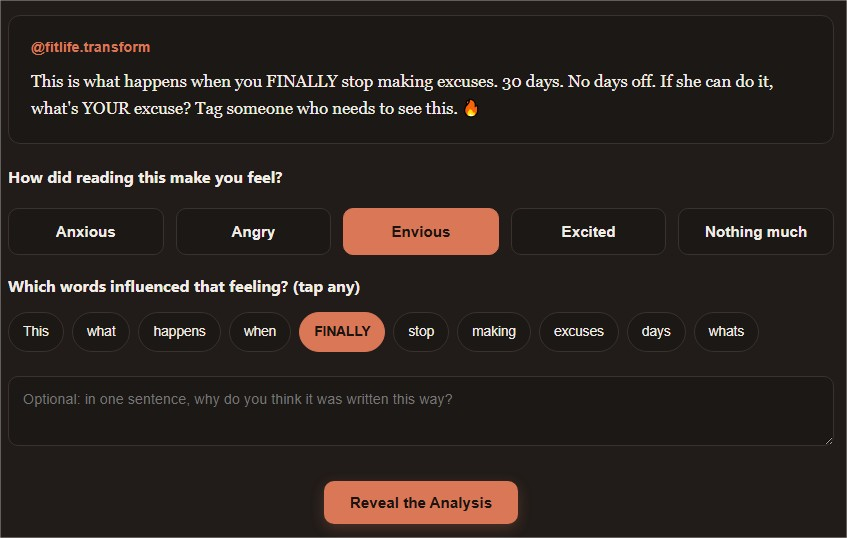
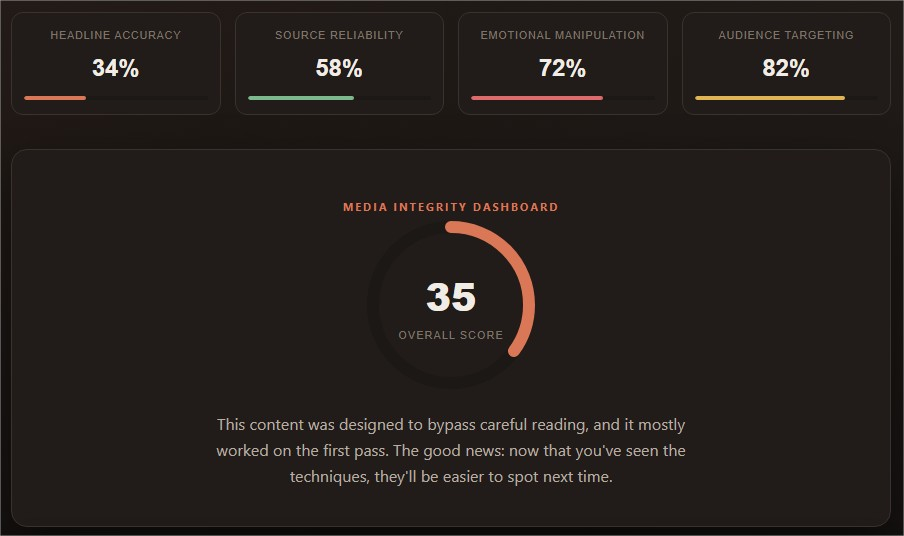
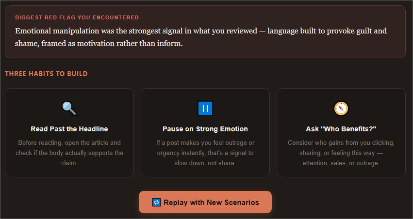

# Day 33/60 – Build a Media Integrity Analyzer

🚀 As part of the **#60DayClaudeChallenge**, today I built **Media Integrity Analyzer**, an interactive educational application designed to help users develop media literacy skills through guided discovery.

Rather than asking users to memorize facts, the application encourages them to analyze headlines, identify emotional manipulation, and evaluate digital content through realistic scenarios.

The project was built as a **single self-contained HTML application** using HTML, CSS, and Vanilla JavaScript, allowing it to run completely offline.

## 🌐 **Live Demo:** https://visionary-snickerdoodle-62e353.netlify.app/

# 🎯 Project Objective

Create an interactive learning experience that teaches users how to evaluate online information more critically.

Instead of testing existing knowledge, the application explains key concepts before each activity and then lets users discover the answers through interaction.

---

# 🎨 Theme Selection

At the beginning, users can personalize the experience by selecting from multiple color themes, including:

- Claude Orange
- Midnight Blue
- Emerald Green
- Purple Gradient

This creates a modern and engaging learning environment.

# 📰 Challenge 1 – Headline Detective

Users are presented with a fictional news headline and a matching article.

They are asked:

- Would you click this?
- Which parts seem exaggerated or misleading?

After making their choices, the application reveals:

- Headline Accuracy Score
- Highlighted misleading phrases
- Explanation of the mismatch
- A fair rewritten headline
- Key learning takeaway

# 💭 Challenge 2 – Emotion Detector

Users analyze a fictional social media post, reel caption, or article excerpt.

They identify:

- Their emotional reaction
- Words that influenced that reaction

The simulator then explains:

- Intended target audience
- Emotional manipulation techniques
- Highlighted emotional phrases
- Neutral rewritten version
- Key takeaway

# 📊 Live Media Integrity Metrics

Throughout the experience, users can monitor:

- Headline Accuracy
- Source Reliability
- Emotional Manipulation
- Audience Targeting

These metrics update dynamically based on user interactions.

# 📈 Media Integrity Dashboard

At the end of the experience, the application generates a personalized report containing:

- Overall Media Integrity Score
- Learning Summary
- Biggest Red Flag Identified
- Three Practical Media Literacy Habits
- Replay Option with New Scenarios

This reinforces learning and encourages continuous improvement.

o
# 🧠 Key Learnings

### 1. Headlines Shape Perception

Small wording changes can significantly influence how people interpret information before reading the full story.

---

### 2. Emotion Influences Decision-Making

Content often appeals to emotions rather than facts.

Recognizing emotional triggers helps users think more critically.

---

### 3. Media Literacy Is a Practical Skill

Evaluating information is an essential skill for navigating today's digital world.

---

### 4. AI Can Support Education

AI can create engaging, interactive learning experiences that encourage critical thinking instead of simply providing answers.

---

# 📚 Biggest Takeaway

Today's project demonstrated that AI can play an important role in improving media literacy.

By combining storytelling, interaction, and guided explanations, educational applications can help users become more thoughtful consumers of digital information.

> The goal isn't to tell people what to think—it's to help them think more carefully.

---

# 📸 Screenshots

## 

## 

## 

## 

## 

## 

## 

---

# 🙏 Acknowledgements

Special thanks to:

- Anthropic
- AB Talks on AI
- Anil Bajpai

for inspiring practical AI learning through the **#60DayClaudeChallenge**.

---

# 🔖 Hashtags

#60DayClaudeChallenge

#ClaudeAI

#MediaLiteracy

#CriticalThinking

#DigitalLiteracy

#AIEngineering

#FrontendDevelopment

#LearningInPublic

#BuildInPublic
