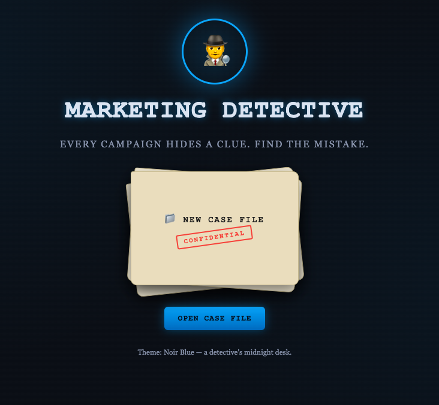
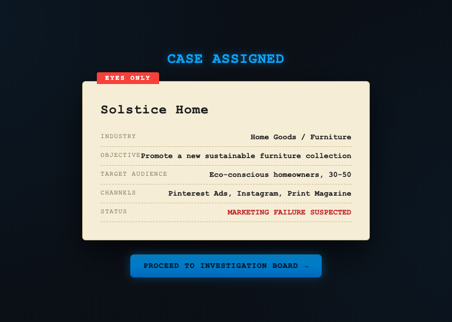
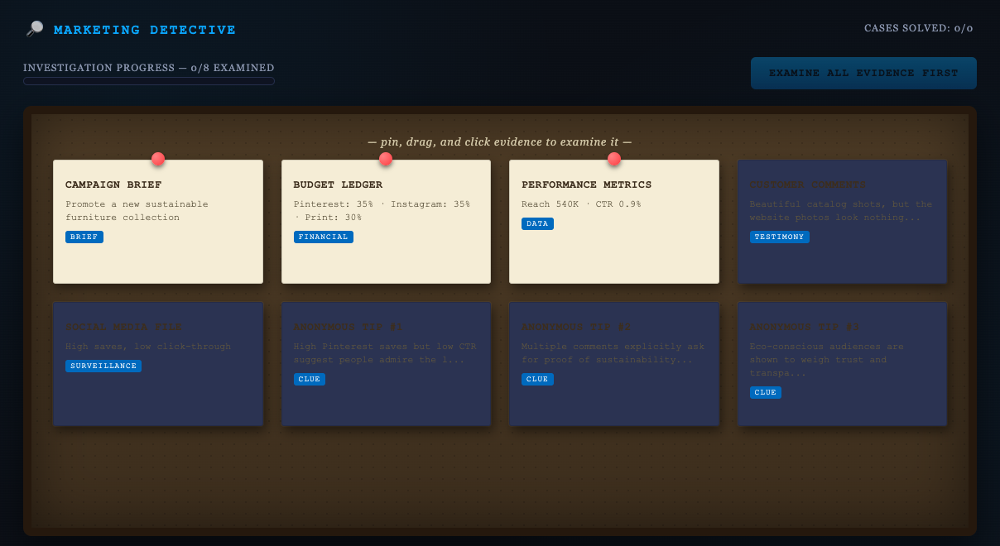
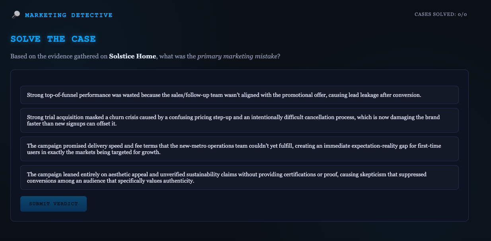
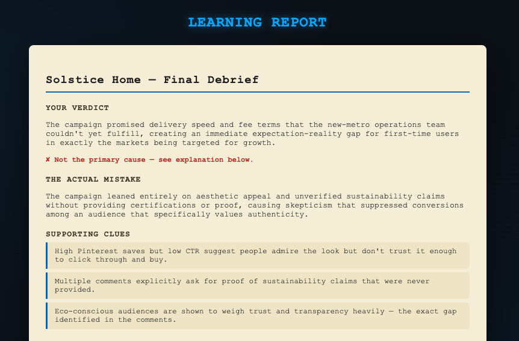

# Day 34/60 – Become a Marketing Detective

🚀 As part of the **#60DayClaudeChallenge**, today I built **Marketing Detective**, an interactive educational application that transforms marketing analysis into a detective-style investigation game.

Instead of simply reading marketing case studies, users become detectives who investigate campaign failures, analyze evidence, uncover hidden clues, and identify the real reasons behind marketing success or failure.

The application was built as a **single self-contained HTML file** using React (CDN) with reusable components, while remaining fully functional as a standalone offline application.

## 🌐 **Live Demo:** https://chic-mochi-47386d.netlify.app/

---

# 🎯 Project Objective

Create an immersive learning experience that teaches marketing strategy through investigation and critical thinking.

Rather than asking users to memorize marketing concepts, the application encourages them to:

- Observe
- Analyze
- Investigate
- Make decisions
- Learn from outcomes

---

# 🎨 Theme Selection

Users begin by selecting their preferred interface theme.

Available themes include:

- 🟠 Claude Orange
- 🔵 Midnight Blue
- 🟢 Emerald Green
- 🟣 Royal Purple

This creates a personalized detective experience.

---

# 📂 Case Assignment

Each replay loads a **random fictional marketing case** from a library of multiple scenarios.

Each case includes:

- Company Name
- Industry
- Campaign Objective
- Target Audience
- Marketing Channels
- Budget Allocation
- Campaign Metrics
- Customer Comments
- Social Media Performance
- Primary Marketing Mistake
- Investigation Clues
- Correct Explanation
- Suggested Improvements

Every playthrough offers a different mystery to solve.

---

# 🕵️ Investigation Board

The heart of the application is an interactive detective board where users examine marketing evidence.

Evidence includes:

- Campaign KPIs
- Customer Feedback
- Social Media Metrics
- Budget Allocation
- Marketing Channels
- Supporting Clues

The detective-style interface encourages curiosity before revealing conclusions.

---

# 🧩 Interactive Investigation

Users interact with draggable evidence cards, compare clues, and piece together the campaign story before making a final decision.

This approach promotes analytical thinking rather than guesswork.

---

# 🎯 Solve the Case

After reviewing the evidence, users identify the primary marketing mistake.

The simulator then reveals:

- Correct Analysis
- Supporting Evidence
- Strategic Explanation
- Improvement Recommendations

---

# 🎉 Case Closed

A detective-style "Case Closed" animation celebrates successful investigations before transitioning to the final learning report.

---

# 📊 Learning Report

Each completed investigation generates a personalized report summarizing:

- Investigation Accuracy
- Marketing Understanding
- Strongest Observation
- Missed Clues
- Suggested Improvements
- Key Marketing Lessons

This reinforces learning through reflection.

---

# 🧠 Key Learnings

### 1. Marketing Is About Investigation

Successful marketers identify patterns, ask questions, and understand customer behavior before making decisions.

---

### 2. Data Needs Context

Campaign metrics become meaningful only when interpreted alongside customer feedback, channel performance, and business objectives.

---

### 3. Gamification Improves Learning

Interactive challenges encourage deeper engagement than traditional reading or presentations.

---

### 4. AI Accelerates Educational Design

Claude helped transform a complex marketing analysis process into an engaging detective-style learning experience.

---

# 📚 Biggest Takeaway

Marketing isn't about guessing what works.

It's about gathering evidence, understanding the audience, analyzing performance, and making informed decisions.

This project showed how AI can transform business education into immersive, hands-on experiences that make learning both practical and enjoyable.

> Great marketers think like detectives—they investigate before they act.

---

# 📸 Suggested Screenshots

## 

## 

## 

## 

## 

---

# 🙏 Acknowledgements

Special thanks to:

- Anthropic
- AB Talks on AI
- Anil Bajpai

for inspiring practical AI learning through the **#60DayClaudeChallenge**.

---

# 🔖 Hashtags

#60DayClaudeChallenge

#ClaudeAI

#MarketingStrategy

#MarketingAnalytics

#Gamification

#InteractiveLearning

#PromptEngineering

#AIEngineering

#LearningInPublic

#BuildInPublic
