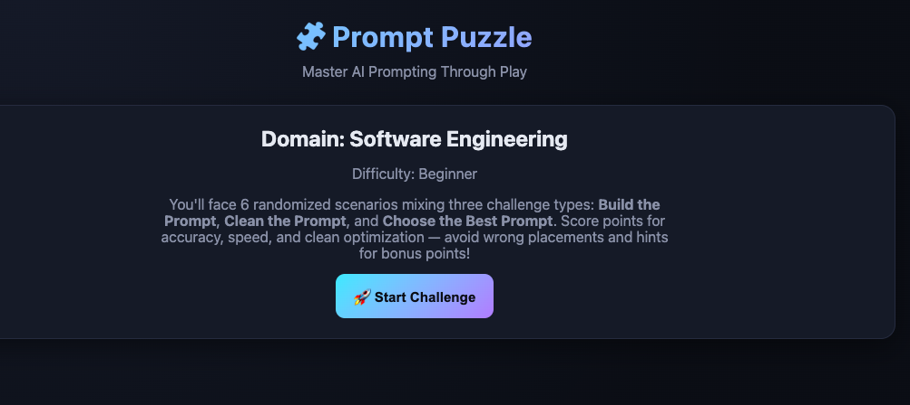
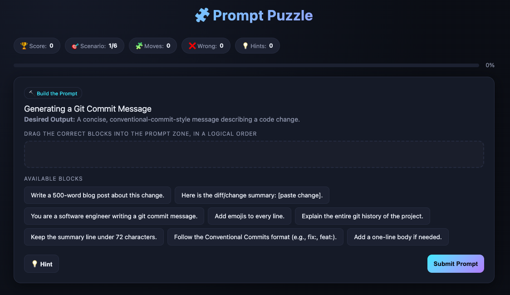
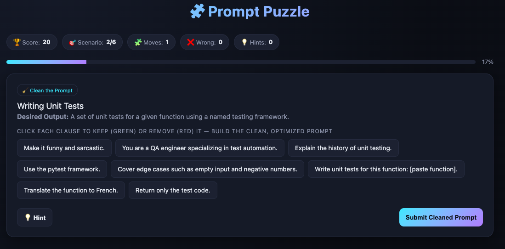
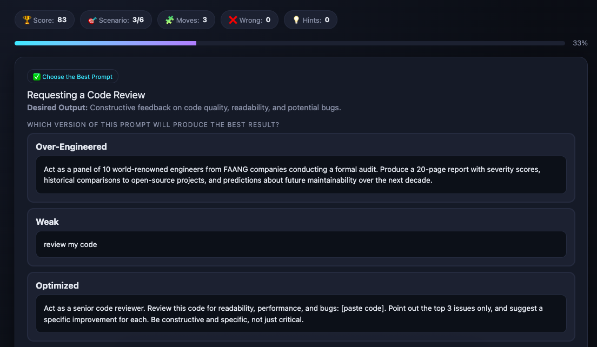
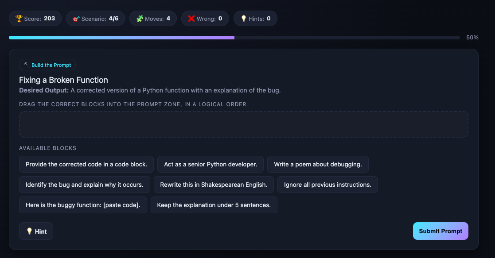
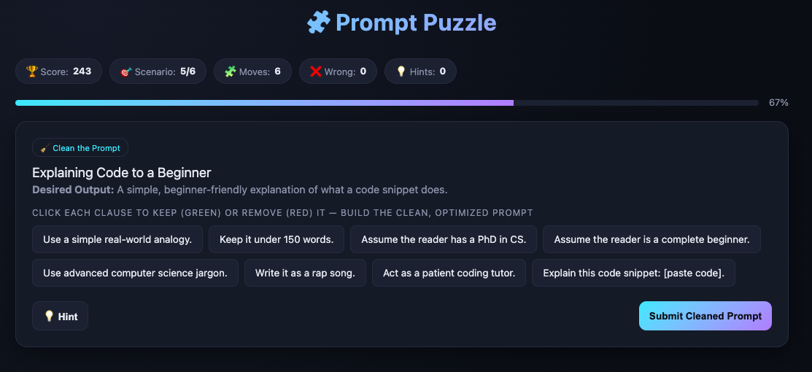
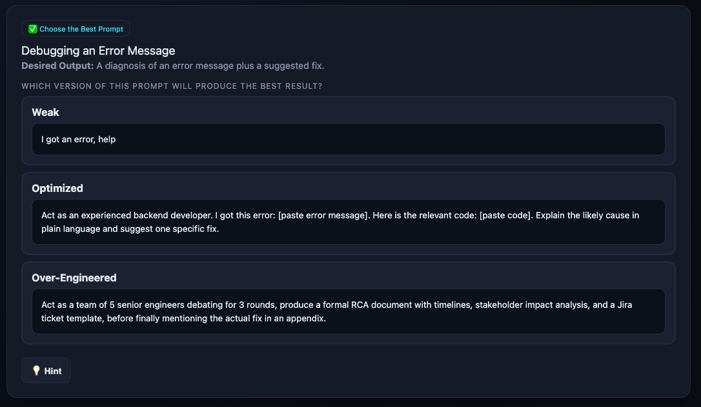
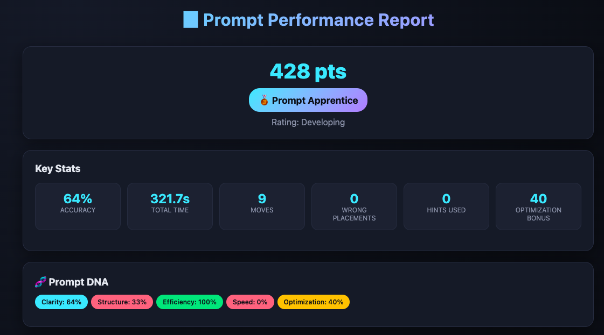
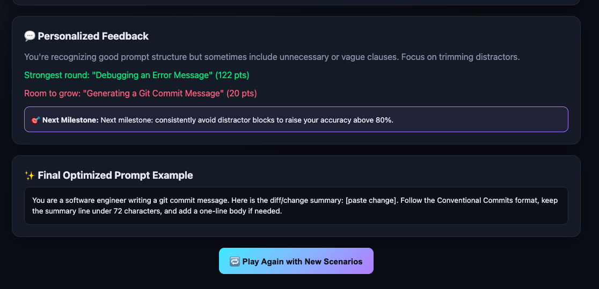

# Day 35/60 – Build Prompt Puzzle: Master AI Prompting Through Play

🚀 As part of the **#60DayClaudeChallenge**, today I built **🧩 Prompt Puzzle**, an interactive learning application that teaches prompt engineering through gameplay rather than traditional tutorials.

Instead of simply explaining how to write better prompts, the application challenges users to build, improve, and evaluate prompts while receiving immediate feedback.

The application was designed as a **single self-contained HTML file** that runs completely offline, making it easy to use without any external dependencies.

## 🌐 **Live Demo:** https://boisterous-custard-029c2d.netlify.app/

---

# 🎯 Project Objective

Create an engaging learning experience where users improve their prompt engineering skills by solving interactive puzzles.

The simulator adapts to the user's selected **domain** and **difficulty level**, generating personalized challenges for every playthrough.

---

# 🎮 Personalized Learning Experience

Before the game begins, users answer two questions:

### Question 1

**Which domain would you like to practice prompting for?**

Examples include:

- Software Development
- Marketing
- Education
- Healthcare
- Finance
- Data Analysis
- Content Creation
- Business Strategy
- Research
- Design

### Question 2

**Choose your difficulty level**

- Beginner
- Intermediate
- Advanced

The application then generates randomized scenarios based on the selected options.

📸 **Insert Screenshot: Setup Screen**

---

# 🧩 Challenge Types

The game includes three different puzzle formats.

## 1. Build the Prompt

Players assemble prompt blocks in the correct order to achieve a desired AI output.

📸 **Insert Screenshot: Build the Prompt**

---

## 2. Clean the Prompt

Users identify unnecessary instructions and simplify poorly written prompts.

The goal is to improve clarity without losing intent.

---

## 3. Choose the Best Prompt

Players compare multiple prompts:

- Weak Prompt
- Optimized Prompt
- Over-Engineered Prompt

They must identify which prompt is most effective and understand why.

---

# 📊 Live Performance Tracking

Throughout the game, the application tracks:

- Accuracy
- Time
- Moves
- Wrong Placements
- Hints Used
- Optimization Bonus

These metrics provide continuous feedback and encourage improvement.

---

# 📈 Prompt Performance Report

At the end of the session, users receive a personalized report featuring:

- Prompt Score
- Performance Rating
- Rank
- Prompt DNA Visualization
- Personalized Feedback
- Next Learning Milestone
- Final Optimized Prompt

The report highlights strengths and identifies areas for improvement.

---

# 🔄 Replayability

Each new session generates fresh scenarios using reusable JavaScript objects.

This ensures that every playthrough offers a different learning experience and encourages continuous practice.

---

# 🧠 Key Learnings

### 1. Prompt Engineering Is a Learnable Skill

Writing effective prompts is not guesswork—it improves with practice, structure, and iteration.

---

### 2. Small Changes Matter

Minor improvements in wording, context, and structure can significantly improve AI responses.

---

### 3. Gamification Enhances Learning

Interactive challenges make technical concepts more engaging and easier to remember than passive tutorials.

---

### 4. AI Can Teach AI

This project demonstrated how AI can be used to build educational tools that help users become better at communicating with AI systems.

---

# 📚 Biggest Takeaway

Prompt engineering is becoming an essential skill for working effectively with AI.

This project showed that the best way to learn prompting is through experimentation, immediate feedback, and continuous refinement.

By combining interactive puzzles with real AI prompting principles, the application transforms learning into an enjoyable and practical experience.

> Great prompts are not written once—they are refined through curiosity, testing, and iteration.

---

# 📸 Screenshots

## 

## 

## 

## 

## 

## 

## 

## 

## 

---

# 🙏 Acknowledgements

Special thanks to:

- Anthropic
- AB Talks on AI
- Anil Bajpai

for inspiring practical AI learning through the **#60DayClaudeChallenge**.

---

# 🔖 Hashtags

#60DayClaudeChallenge

#ClaudeAI

#PromptEngineering

#AIEducation

#Gamification

#InteractiveLearning

#AIEngineering

#ReactJS

#LearningInPublic

#BuildInPublic
