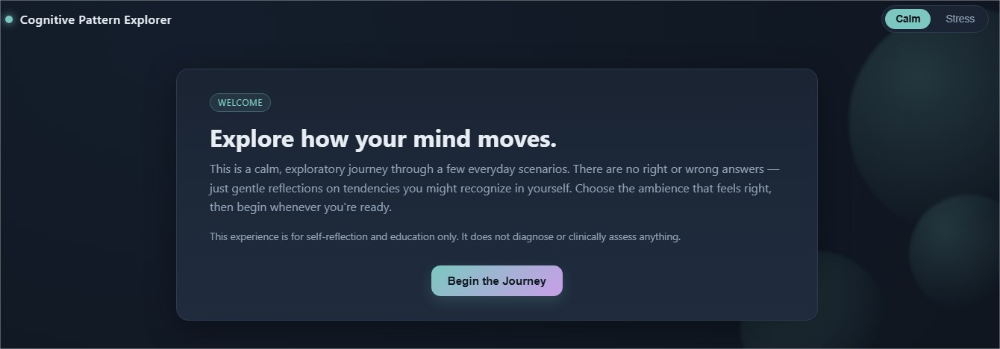
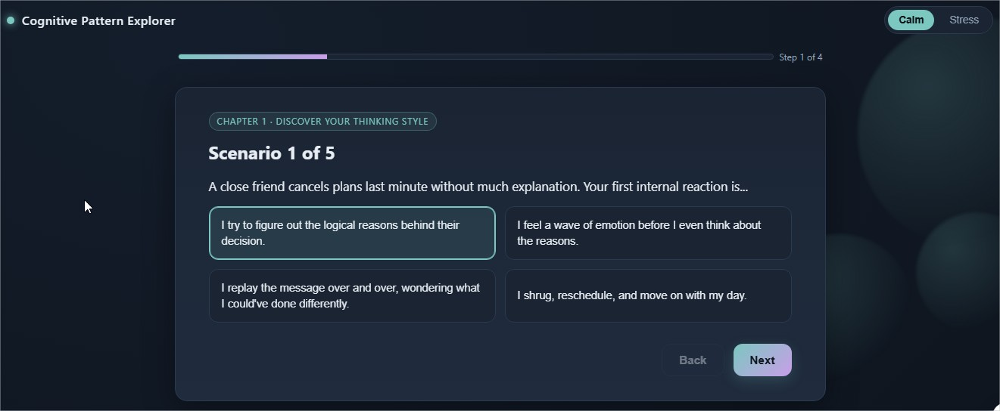
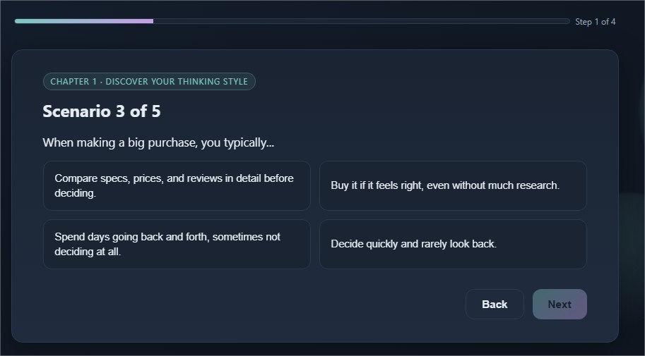
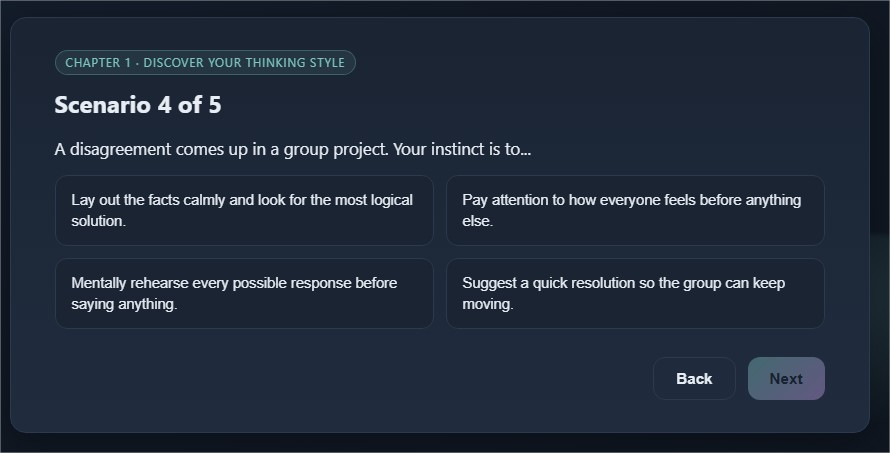
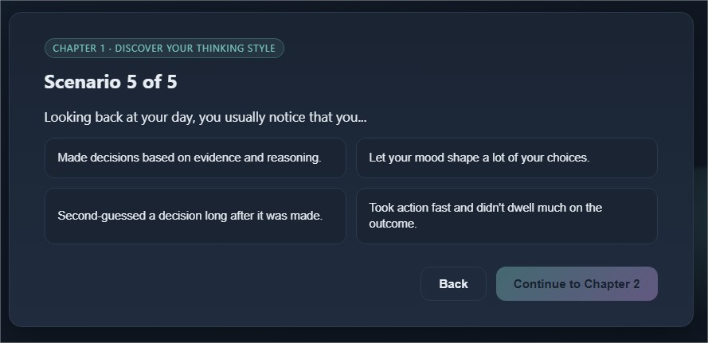
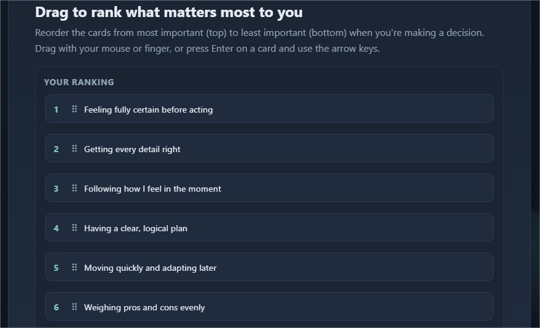
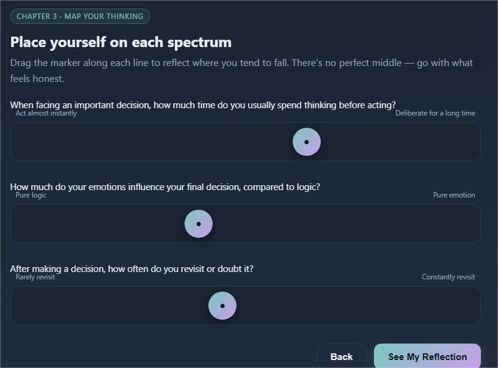
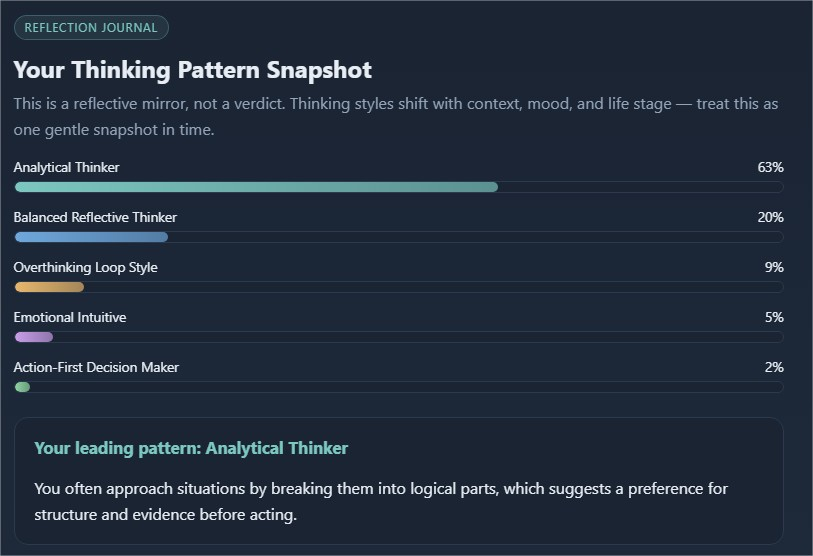

# Day 36/60 – Explore Our Thinking Patterns with Cognitive Pattern Explorer

🚀 As part of the **#60DayClaudeChallenge**, today I built **Cognitive Pattern Explorer**, an interactive self-reflection application designed to help users explore different thinking patterns through guided scenarios and interactive activities.

The application is inspired by psychology and focuses on education and self-awareness rather than assessment.

## 🌐 **Live Demo:** https://starlit-semifreddo-1dee29.netlify.app/

> **Educational Purpose:** This application is intended for learning and self-reflection only. It does **not** diagnose or clinically assess mental health.

Built as a **single self-contained HTML file**, the application uses HTML, CSS, and Vanilla JavaScript to provide a fully offline experience.

---

# 🎯 Project Objective

Create a calm, game-like experience that encourages users to reflect on how they think, prioritize, and make decisions.

Rather than assigning labels, the application offers supportive observations using reflective language to help users better understand their cognitive preferences.

---

# 🌿 Start Screen

The experience begins by allowing users to choose between:

- 🌱 Calm Mode
- ⚡ Stress Mode

This sets the tone for the reflection journey and personalizes the scenarios that follow.

---

# 🧠 Chapter 1 – Discover Your Thinking Style

Users explore realistic everyday scenarios and choose how they would respond.

The application identifies patterns across five thinking tendencies:

- Analytical Thinker
- Emotional Intuitive
- Overthinking Loop Style
- Action-First Decision Maker
- Balanced Reflective Thinker

The emphasis is on observation rather than judgment.

---

# 🎯 Chapter 2 – Choose Your Priorities

Users organize draggable cards representing different priorities and values.

This interactive exercise encourages reflection on how priorities influence decisions and problem-solving approaches.

📸 **Insert Screenshot: Priority Cards**

---

# 🛤️ Chapter 3 – Map Your Thinking

Using draggable timeline elements, users visualize the sequence of thoughts and actions they typically follow when facing challenges.

This activity highlights how different thinking patterns can influence decision-making processes.

---

# 📖 Final Reflection Journal

At the end of the experience, users receive a personalized Reflection Journal featuring:

- Percentage breakdown across thinking tendencies
- Personalized observations
- Reflection prompts
- Strengths to build upon
- Suggestions for future self-awareness

The language remains supportive and exploratory, avoiding definitive conclusions.

---

# 🎨 User Experience Highlights

The application includes:

- Calm modern aesthetic
- Smooth transitions
- Ambient animations
- Progress indicators
- Responsive layout
- Keyboard accessibility
- Reduced motion support
- Offline functionality

These features create a welcoming and inclusive learning experience.

---

# 🧠 Key Learnings

### 1. Reflection Encourages Growth

Helping users explore their thinking patterns can promote greater self-awareness without requiring formal assessments.

---

### 2. Language Matters

Using reflective language such as _"you often..."_ or _"this suggests..."_ creates a more supportive and educational experience than absolute labels.

---

### 3. Interaction Deepens Learning

Drag-and-drop activities and visual timelines encourage active participation and make abstract concepts easier to understand.

---

### 4. AI Can Enhance Educational Experiences

AI-assisted design helped transform psychological concepts into an engaging, accessible, and interactive application.

---

# 📚 Biggest Takeaway

Understanding how we think is an important part of personal growth.

This project demonstrated that technology can encourage curiosity and self-reflection in a respectful, non-judgmental way.

Rather than telling users who they are, the application invites them to explore their own thinking patterns and discover new perspectives.

> Self-awareness begins with observation, not judgment.

---

# 📸 Screenshots

## 

## 

## 

## 

## 

## 

## 

## 

---

# 🙏 Acknowledgements

Special thanks to:

- Anthropic
- AB Talks on AI
- Anil Bajpai

for inspiring practical AI learning through the **#60DayClaudeChallenge**.

---

# 🔖 Hashtags

#60DayClaudeChallenge

#ClaudeAI

#SelfReflection

#Psychology

#UXDesign

#FrontendDevelopment

#AIEngineering

#LearningInPublic

#BuildInPublic
