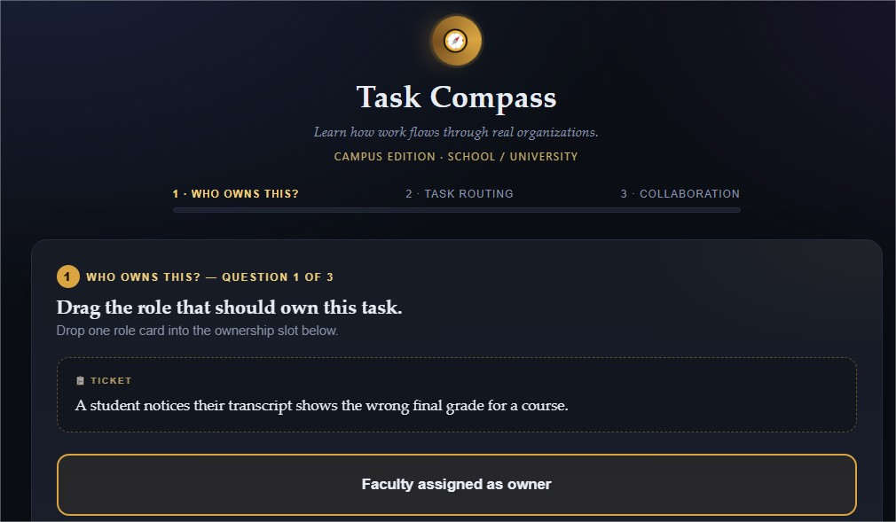
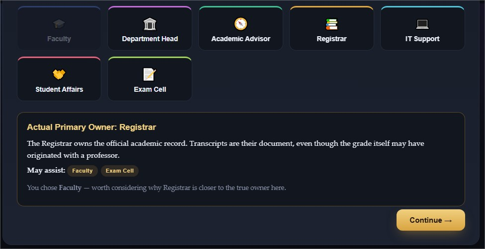
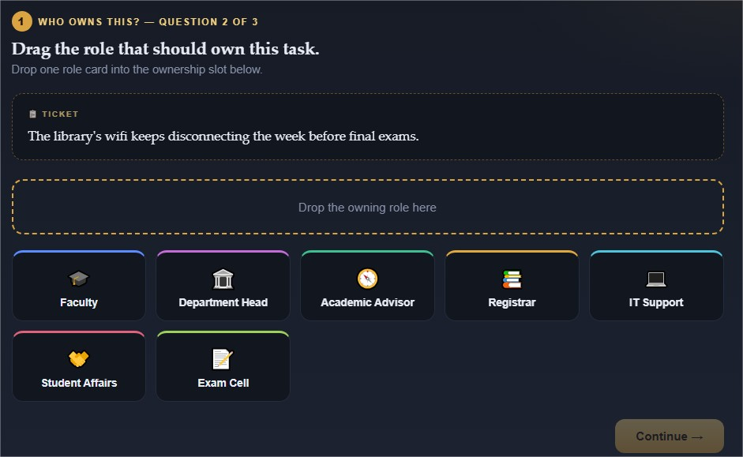
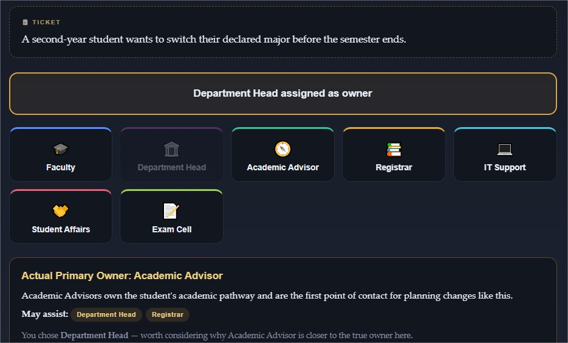
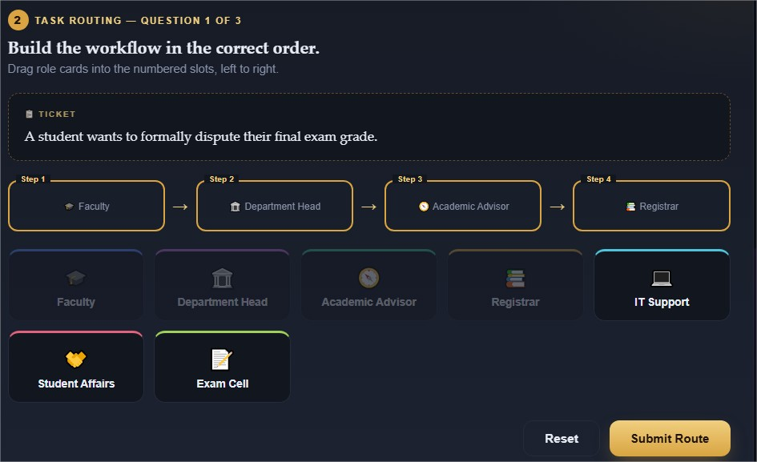
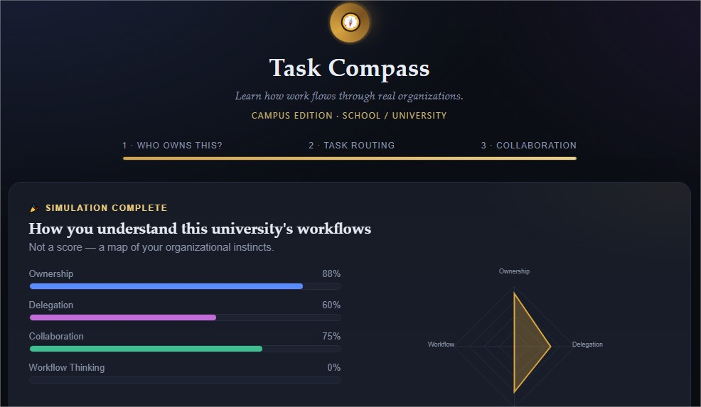

# Day 37/60 – Build Task Compass

🚀 As part of the **#60DayClaudeChallenge**, today I built **Task Compass**, an interactive workplace simulation designed to help users understand how work flows through real organizations.

Rather than testing knowledge of job titles, the application focuses on teaching **ownership, delegation, collaboration, escalation, and workflow thinking** through realistic workplace scenarios.

Built as a **single self-contained HTML application** using HTML, CSS, and Vanilla JavaScript, it runs completely offline without external libraries or frameworks.

---

## 🌐 **Live Demo:** https://neon-stroopwafel-186480.netlify.app/

# 🎯 Project Objective

Create a management simulation that helps learners understand how organizations function by making decisions in realistic workplace situations.

The experience encourages users to think like managers by identifying ownership, coordinating teams, and understanding how work moves across departments.

---

# 🏢 Workplace Simulation

At the beginning of the experience, users select the type of workplace they want to explore, such as:

- Tech Company
- Startup
- Corporate Office
- Hospital / Healthcare
- School / University
- Manufacturing
- Retail Business
- Media Agency
- Freelancer / Small Business

Each workplace generates unique tasks and collaboration scenarios.

---

# 🧩 Stage 1 – Who Owns This?

Users receive realistic workplace tasks and must identify the primary owner from a set of role cards.

Instead of simply indicating whether the answer is correct, the simulator explains:

- Why a specific role owns the task
- Which other roles support the work
- How ownership differs from collaboration

This stage reinforces accountability and role clarity.

---

# 🔄 Stage 2 – Task Routing

Users build the workflow for incoming tasks by arranging roles in the order work should flow through the organization.

Examples include:

Customer Support → QA → Backend Developer → Product Manager → Customer

After submission, the simulator animates the workflow and explains why the sequence is commonly used.

---

# 🤝 Stage 3 – Collaboration Challenge

Users solve larger organizational problems by assigning multiple roles or departments.

Example situations include:

- Customer satisfaction declines
- Sales increase dramatically
- Product launch delays
- Negative online reviews

The simulator then displays:

- Primary Owner
- Supporting Teams
- Communication Flow
- Reasoning

The emphasis is on collaboration rather than individual responsibility.

---

# 📊 Reflection Dashboard

Instead of awarding points, the application generates a personalized reflection across four learning dimensions:

- Ownership
- Delegation
- Collaboration
- Workflow Thinking

It also provides insights into:

- What you understood well
- Where you over-assigned responsibility
- Where collaboration was underestimated
- One key lesson about how organizations operate

---

# 🎨 User Experience Highlights

The application features:

- Dark Mode
- Glassmorphism UI
- Animated gradients
- Drag-and-drop interactions
- Progress indicators
- Smooth transitions
- Responsive layout
- Collectible role cards
- Work ticket-style task cards

The goal was to create a modern strategy game rather than a traditional assessment.

---

# 🧠 Key Learnings

### 1. Ownership Creates Clarity

Knowing who is responsible helps teams make decisions more efficiently.

---

### 2. Delegation Is a Leadership Skill

Effective leaders understand when to involve others and how to distribute work appropriately.

---

### 3. Collaboration Solves Complex Problems

Most organizational challenges require multiple teams working together toward a common goal.

---

### 4. Learning Through Simulation

Interactive experiences help learners understand workplace dynamics more effectively than static explanations.

---

# 📚 Biggest Takeaway

Organizations are systems of people working together.

Success depends not only on individual expertise but also on effective communication, collaboration, and shared ownership.

This project demonstrated how AI can transform management concepts into engaging simulations that prepare learners for real workplace challenges.

> Great organizations are built on clear ownership, thoughtful collaboration, and effective communication.

---

# 📸 Screenshots

## 

## 

## 

## 

## 

## 

---

# 🙏 Acknowledgements

Special thanks to:

- Anthropic
- AB Talks on AI
- Anil Bajpai

for inspiring practical AI learning through the **#60DayClaudeChallenge**.

---

# 🔖 Hashtags

#60DayClaudeChallenge

#ClaudeAI

#Management

#Leadership

#Collaboration

#Workflow

#WorkplaceLearning

#AIEngineering

#LearningInPublic

#BuildInPublic
