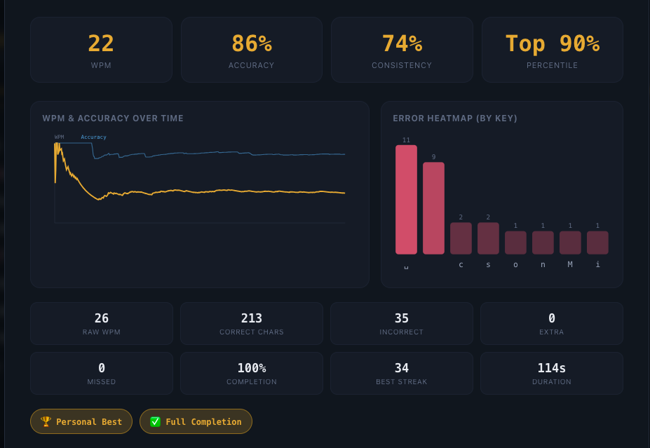
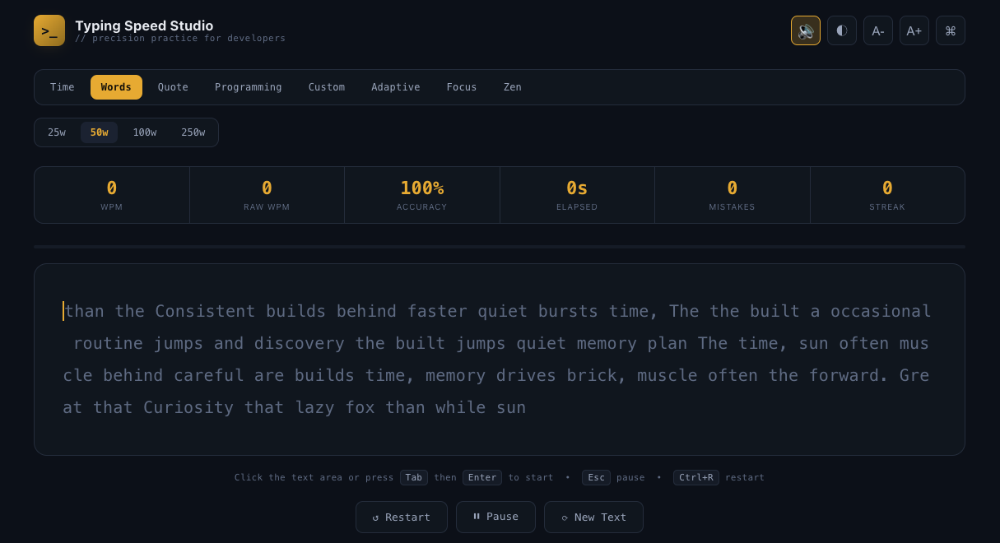
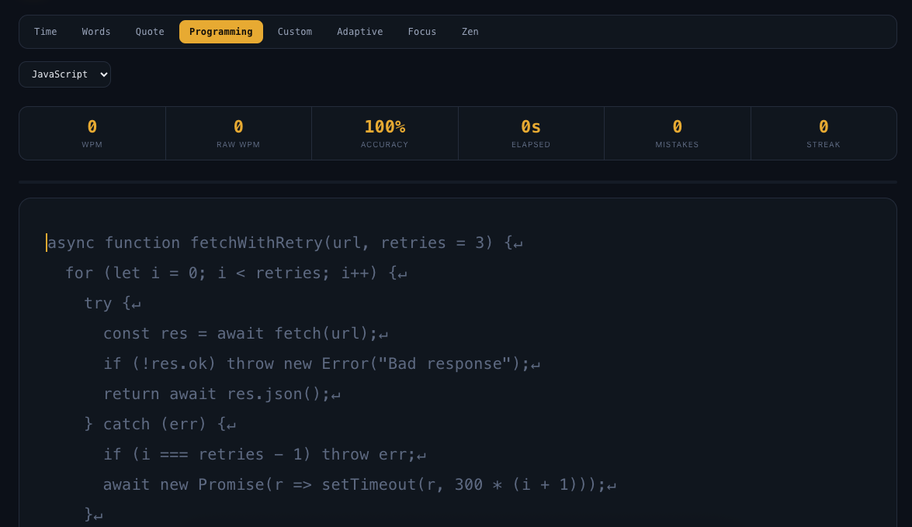
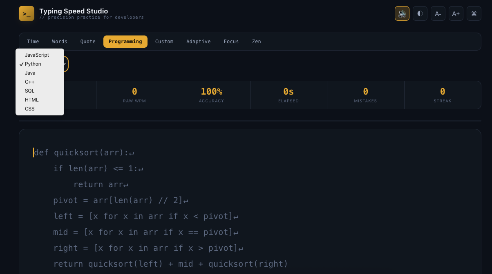

# Day 38/60 – Build Typing Speed Studio

🚀 As part of the **#60DayClaudeChallenge**, today I built **Typing Speed Studio**, a premium browser-based typing platform designed to improve typing speed, accuracy, consistency, and overall typing proficiency through an engaging learning experience.

Unlike traditional typing tests, this application combines multiple practice modes, live performance metrics, detailed analytics, and long-term progress tracking into a single offline application.

The project was developed as a **single self-contained HTML file** using HTML, CSS, and Vanilla JavaScript, requiring no external libraries or internet connection.

---

## 🌐 **Live Demo:** https://fancy-faun-67164d.netlify.app/

# 🎯 Project Objective

Create a professional typing platform that helps users practice, measure, and improve their typing skills through personalized challenges and detailed performance analysis.

The application emphasizes continuous learning by providing meaningful feedback after every session.

---

# ⌨️ Multiple Typing Modes

The platform supports a variety of practice modes to suit different learning goals.

### Time Mode

Practice for fixed durations:

- 15 Seconds
- 30 Seconds
- 60 Seconds
- 120 Seconds

---

### Word Count Mode

Complete predefined word targets:

- 25 Words
- 50 Words
- 100 Words
- 250 Words

---

### Specialized Practice

The application also includes:

- Quote Mode
- Programming Mode
- Custom Text Mode
- Adaptive Mode
- Focus Mode
- Zen Mode

Programming Mode features realistic snippets in languages such as:

- HTML
- CSS
- JavaScript
- Python
- Java
- C++
- SQL

Each practice session generates content appropriate to the selected category.

---

# 📊 Live Typing Statistics

While typing, users receive real-time feedback, including:

- Words Per Minute (WPM)
- Raw WPM
- Characters Per Minute (CPM)
- Accuracy
- Elapsed Time
- Mistake Count
- Current Streak
- Completion Percentage
- Remaining Time or Words

Correct characters, incorrect characters, and the active cursor position are highlighted to provide immediate visual feedback.

---

# 📈 Performance Analytics Dashboard

After every completed session, the application generates a detailed analytics dashboard featuring:

- WPM
- Raw WPM
- Accuracy
- Consistency
- Typing Rhythm
- Error Heatmap
- WPM Progress Graph
- Accuracy Graph
- Session Duration
- Personal Bests
- Achievement Badges
- Performance Summary
- Personalized Improvement Suggestions

The analytics help users understand both their strengths and areas for improvement.

---

# 💾 Progress Tracking

To encourage continuous learning, the application stores session history locally.

Users can:

- Review previous sessions
- Compare performance
- Track improvement over time
- Maintain streaks
- Monitor personal records

No account or internet connection is required.

---

# 🎨 User Experience Features

The application includes several customization options:

- Theme Selection
- Dark Mode
- Font Size Controls
- Keyboard Shortcuts
- Pause & Resume
- Restart Options
- Optional Sound Effects
- Responsive Layout
- Accessibility Features
- Smooth Animations

These features create an experience similar to modern commercial typing platforms.

---

# 🧠 Key Learnings

### 1. Real-Time Feedback Drives Improvement

Immediate visual and statistical feedback helps users identify mistakes and improve more effectively.

---

### 2. Analytics Make Practice Meaningful

Detailed performance reports encourage users to focus on long-term improvement rather than single-session scores.

---

### 3. Gamification Increases Motivation

Achievement badges, streak tracking, and progress history make learning more engaging and rewarding.

---

### 4. AI Accelerates Educational Application Design

Claude helped transform a traditional typing test into a feature-rich learning platform with modern UI/UX and advanced analytics.

---

# 📚 Biggest Takeaway

Typing is a foundational digital skill, and consistent practice supported by meaningful feedback leads to measurable improvement.

This project demonstrated how AI can help create educational tools that combine performance tracking, personalization, and engaging design to make learning more effective.

> The fastest typists aren't just quick—they practice consistently, measure progress, and continuously refine their technique.

---

# 📸 Screenshots

## 

## 

## 

## 

---

# 🙏 Acknowledgements

Special thanks to:

- Anthropic
- AB Talks on AI
- Anil Bajpai

for inspiring practical AI learning through the **#60DayClaudeChallenge**.

---

# 🔖 Hashtags

#60DayClaudeChallenge

#ClaudeAI

#TypingSpeed

#JavaScript

#WebDevelopment

#FrontendDevelopment

#UIUX

#EducationalTechnology

#LearningInPublic

#BuildInPublic
