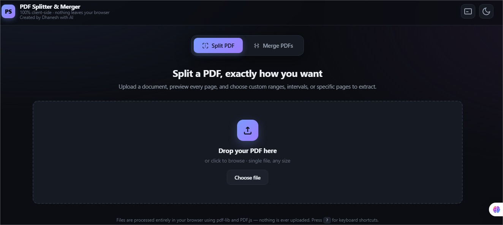
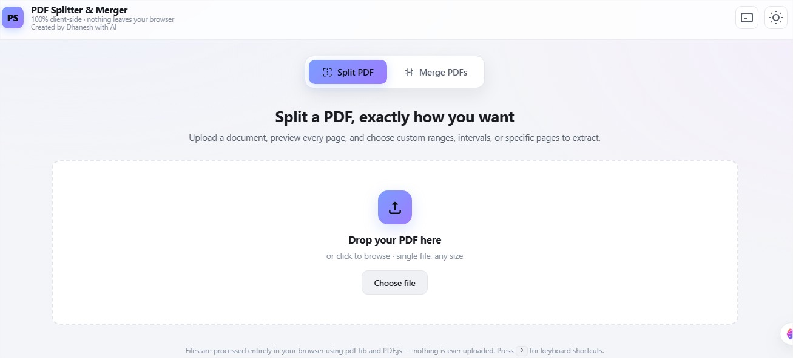
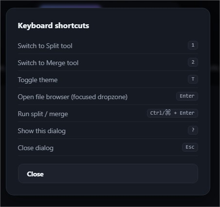
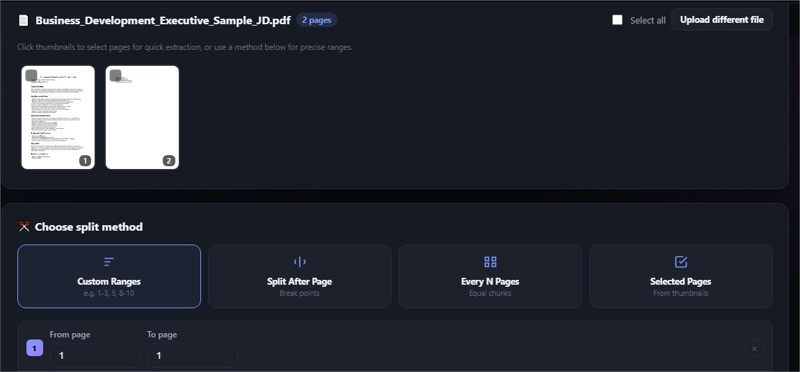
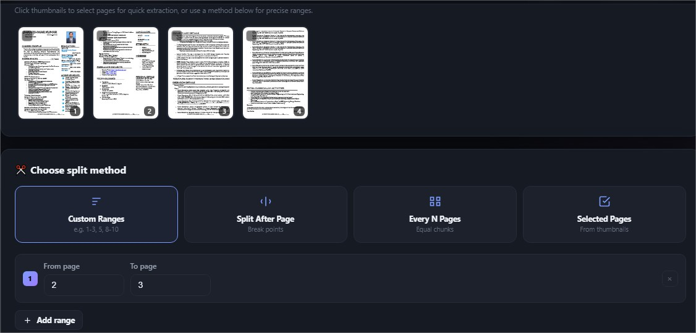
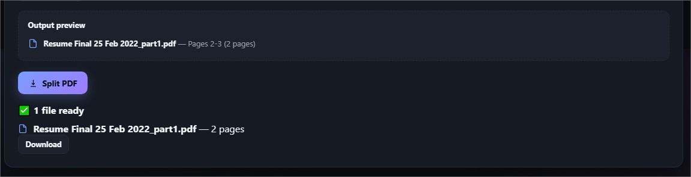
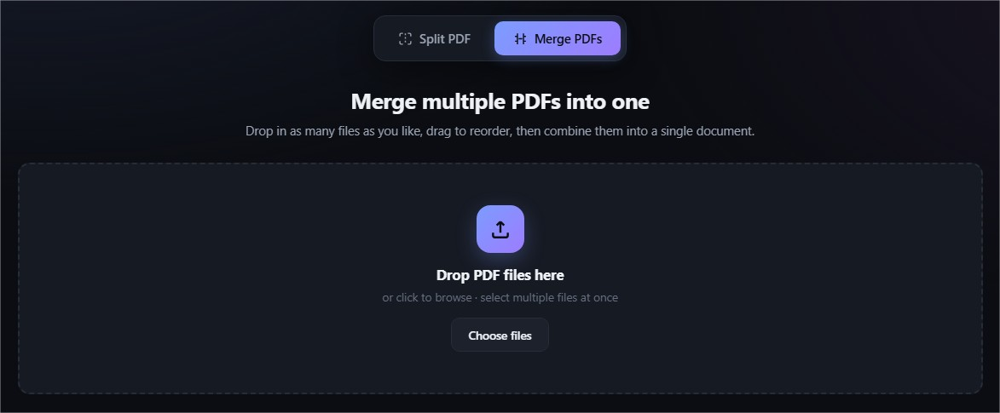
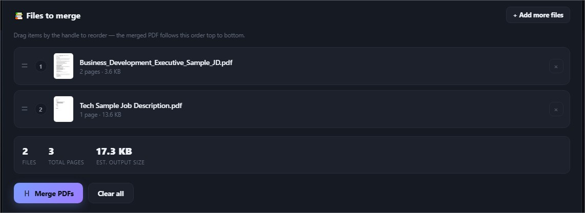

# Day 39/60 – PDF Splitter & Merger

## 📄 Overview

**PDF Splitter & Merger** is a premium browser-based document utility that allows users to split and merge PDF files entirely on the client side.

No backend servers are required. All document processing happens locally in the user's browser, ensuring complete privacy, faster performance, and offline capability after the initial load.

---

## 🌐 **Live Demo:** https://stirring-queijadas-7c88c9.netlify.app/

## ✨ Features

### 📑 PDF Splitter

- Upload PDF documents
- Automatically detect total page count
- Generate page thumbnails
- Preview pages before processing
- Split by page numbers
- Split by custom page ranges
- Split after selected pages
- Split every N pages
- Extract selected pages
- Create multiple split operations simultaneously
- Validate page ranges
- Preview output before generation
- Highlight invalid inputs

---

### 🔗 PDF Merger

- Drag & Drop PDF uploads
- Multiple file selection
- Visual PDF previews
- Display page counts
- Sort files using drag-and-drop
- Calculate total pages
- Show merge summary
- Merge PDFs instantly
- Download merged PDF

---

## 🚀 Highlights

- 100% Client-side processing
- No server uploads
- Privacy-first design
- Responsive interface
- Dark mode support
- Smooth animations
- Processing indicators
- Keyboard shortcuts
- Accessibility-friendly
- Offline support after initial load
- Modern commercial UI/UX

---

## 🛠 Technologies Used

- HTML5
- CSS3
- JavaScript (ES6+)
- PDF.js
- pdf-lib

---

## 📁 Project Structure

```
PDF Splitter & Merger
│
└── index.html
```

Everything is contained inside a single HTML file.

---

## 🎯 Learning Outcomes

- Browser-based PDF processing
- Working with PDF.js
- Manipulating PDFs using pdf-lib
- Drag-and-drop file handling
- Building responsive interfaces
- Client-side document generation
- UI/UX design for productivity applications
- Offline-first web application development

---

## 🔒 Privacy

All files remain on the user's device.

No PDFs are uploaded to external servers, making the application suitable for handling sensitive or confidential documents.

---

# Screenshots

## 

## 

## 

## 

## 

## 

## 

## 

## 🌟 Future Improvements

- PDF compression
- Rotate pages
- Delete pages
- Rearrange pages within a PDF
- Password protection
- Watermark support
- OCR for scanned PDFs
- Digital signatures
- Batch processing
- Cloud storage integration

---

## Challenge

**Day 39 / 60 — Claude AI Challenge**

Building practical, production-quality applications using AI-assisted development while exploring modern web technologies and prompt engineering.

**Today's Project:** PDF Splitter & Merger

## Prompt

```
You are an expert UI/UX designer, frontend developer, document processing specialist, and JavaScript engineer.

Before generating anything, ask the user the following question.

1. Would you like Claude to automatically design the application, or would you like to customize its features?

If the user chooses customization, ask which additional PDF features they would like included.

After collecting the response, generate a premium single-page interactive HTML application called 'PDF Splitter & Merger'.

The application should provide two primary tools:

PDF Splitter:
Allow users to upload a PDF and automatically detect the total number of pages. Display visual page thumbnails for every page and allow users to preview the document before splitting. Users should be able to split the PDF by entering page numbers, selecting custom page ranges, splitting after specific pages, splitting every N pages, or extracting selected pages into one or more new PDF files. Allow users to create multiple split ranges in a single operation, validate all page ranges, preview the resulting document structure before processing, and clearly highlight invalid inputs.

PDF Merger:
Allow users to upload multiple PDF files using drag-and-drop or file selection. Display all uploaded files in a sortable list with page counts and visual previews. Users should be able to reorder the PDFs using drag-and-drop before merging. Display the total number of files, total page count, and estimated output before generating the merged document. Generate the merged PDF and provide an easy download option.

Perform all PDF processing entirely within the browser using client-side JavaScript. Do not upload files to external servers or rely on backend services. Use reliable browser-compatible libraries where necessary and ensure the application continues to work offline after the initial page load.

Include drag-and-drop uploads, processing indicators, loading animations, responsive layouts, dark mode, accessibility features, intuitive error handling, keyboard shortcuts where appropriate, and smooth micro-interactions throughout the application.

Generate everything as a single self-contained HTML file using HTML, CSS, and JavaScript only.

Design the interface as a polished commercial application comparable to professional PDF utilities, with exceptional UI/UX, beautiful typography, modern layouts, smooth animations, intuitive navigation, and an experience users would genuinely choose over existing online PDF tools.
```
