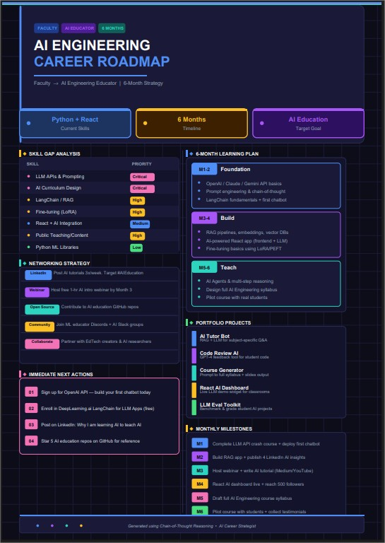

# 🚀 Day 04/60 of My AI Engineering Journey: Chain-of-Thought Prompting

## 🧠 What I Learned Today

Today, I explored one of the most powerful prompting techniques used in modern AI systems:

**Chain-of-Thought (CoT) Prompting**

Most people ask AI for an answer.

Experts ask AI to **think before answering**.

Instead of jumping directly to a solution, Chain-of-Thought prompting encourages AI to break problems into smaller reasoning steps, resulting in more accurate, structured, and actionable outputs.

---

## The Prompting Framework

I designed a prompt that acts as an **Elite AI Career Strategist**.

The AI first collects:

- Current Situation
- Existing Skills
- Target Goal
- Timeline

Then it follows a structured reasoning process:

1. Analyze the current position
2. Identify strengths
3. Identify skill gaps
4. Find the fastest path to the goal
5. Recommend learning priorities
6. Suggest projects
7. Build a networking strategy
8. Create milestones

---

## 🎯 Key Learning

### Without Chain-of-Thought

❌ Generic advice

### With Chain-of-Thought

✅ Personalized roadmap  
✅ Better reasoning  
✅ Structured recommendations  
✅ Higher-quality outputs

---

## 💡 Takeaway

> The quality of AI output depends not only on what you ask, but on how you guide the AI to think.

As a faculty member preparing students for the AI era, I believe learning prompting techniques is becoming as important as learning programming languages.

---

### Suggested Image Caption

**CHAIN-OF-THOUGHT PROMPTING**

🧠 Don't Ask AI for Answers  
➡️ Ask AI to Think Step-by-Step

📄 Better Reasoning  
🎯 Better Decisions  
🚀 Better Results

**Generated using Chain-of-Thought Reasoning**

#60DayClaudeChallenge #AIEngineering #PromptEngineering #ChainOfThought #GenerativeAI #ArtificialIntelligence #AIEducation #TeachingWithAI #LinkedInLearning
