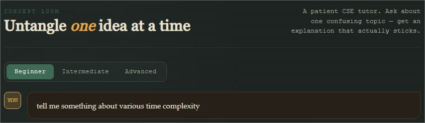
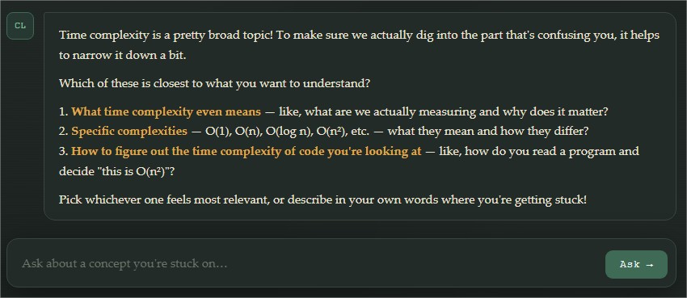
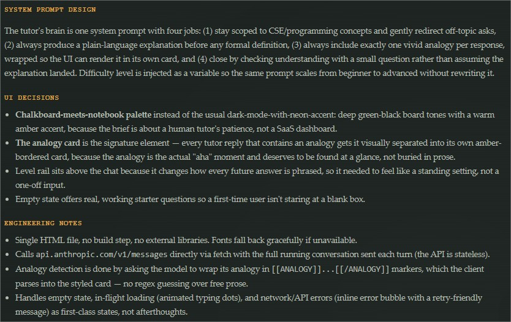
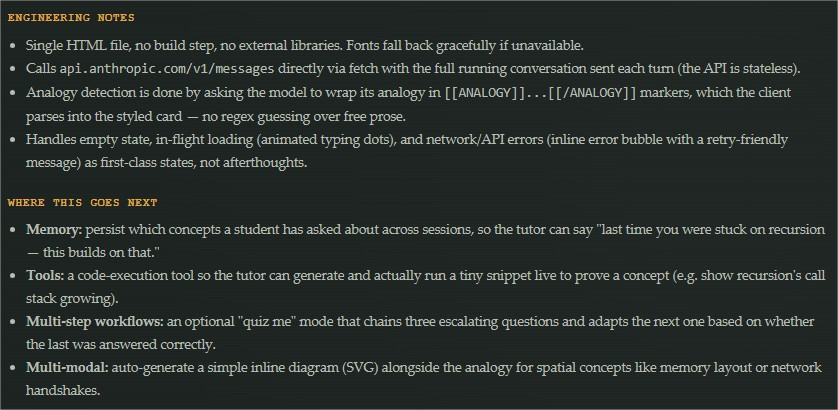

# Day 40/60 – Build an AI Assistant Builder

🚀 As part of the **#60DayClaudeChallenge**, today I built **AI Assistant Builder**, an interactive application that helps users design and generate specialized AI assistants through a guided interview process.

Rather than creating a generic chatbot, the application focuses on building assistants with a clear purpose, defined audience, structured inputs, and meaningful outputs.

The project demonstrates how **product thinking, prompt engineering, conversation design, and frontend development** come together to create effective AI applications.

---

# 🎯 Project Objective

Build an application that guides users through designing a production-ready AI assistant.

Instead of asking users to write prompts manually, the application interviews them, generates a high-quality system prompt, and builds a purpose-specific interface.

---

# 📝 Guided Assistant Design

The application starts with a structured interview using multiple-choice questions.

Users define:

### 1. Assistant Type

Choose the domain and niche for the assistant.

Examples include:

- Education
- Healthcare
- Finance
- Marketing
- Software Development
- HR
- Legal
- Productivity

---

### 2. Target Audience

Identify who the assistant is designed for and the most important outcome users should achieve in a single session.

This keeps the assistant focused on solving a specific problem.

---

### 3. Input Types

Users define how information will be provided, such as:

- Free Text
- Form Fields
- Uploaded Files
- Pasted Documents
- Multi-turn Conversations

The interface adapts to the selected input method.

---

### 4. Output Format

The application supports multiple output styles, including:

- Structured Reports
- Recommendations with Reasoning
- Conversational Chat
- Generated Documents
- Scores & Verdicts

Choosing the right output format improves usability and user satisfaction.

---

### 5. Tone & Personality

Users can customize the assistant's communication style:

- Professional
- Friendly
- Expert
- Playful

This helps align the assistant with its intended audience.

---

# 🧠 AI Assistant Brain

Based on the interview, the application automatically generates a production-quality **System Prompt** covering:

- Role
- Scope
- Constraints
- Response Structure
- Edge Case Handling
- Output Format
- Conversation Guidelines

This becomes the intelligence behind the assistant.

---

# 💻 Assistant Interface

The generated application includes:

- Purpose-built UI
- Claude API integration using `fetch`
- Loading states
- Error handling
- Empty state guidance
- Responsive layout
- Smooth animations and micro-interactions

The interface is designed specifically for the assistant's use case rather than using a generic chat layout.

---

# 📚 Documentation Panel

A built-in **"How This Was Built"** section explains:

- System prompt design decisions
- UI/UX choices
- Prompt engineering strategy
- Future enhancements such as tools, memory, and multi-step workflows

This makes the application both a product and a learning resource.

📸 **Insert Screenshot: Documentation Panel**

---

# 🧠 Key Learnings

### 1. Great AI Starts with Great Questions

Understanding the problem before generating prompts leads to more effective AI assistants.

---

### 2. System Prompts Shape Behavior

A well-designed system prompt defines the assistant's role, boundaries, and response quality.

---

### 3. Product Thinking Matters

Successful AI applications balance user needs, interface design, and technical implementation.

---

### 4. Prompt Engineering Is Product Design

Prompt engineering is not just about writing instructions—it's about designing intelligent experiences that consistently deliver value.

---

# 📚 Biggest Takeaway

The future of AI lies in **specialized assistants** built for specific users and workflows.

This project demonstrated that creating an effective AI assistant requires more than connecting to an LLM—it requires thoughtful conversation design, structured prompts, and user-centered product development.

> Great AI assistants solve a specific problem exceptionally well, not every problem reasonably well.

---

# 📸 Screenshots

## 

## 

## 

## 

---

# 🙏 Acknowledgements

Special thanks to:

- Anthropic
- AB Talks on AI
- Anil Bajpai

for inspiring practical AI learning through the **#60DayClaudeChallenge**.

---

# 🔖 Hashtags

#60DayClaudeChallenge

#ClaudeAI

#AIAssistant

#PromptEngineering

#SystemPrompts

#AIProduct

#ProductDesign

#FrontendDevelopment

#LearningInPublic

#BuildInPublic
