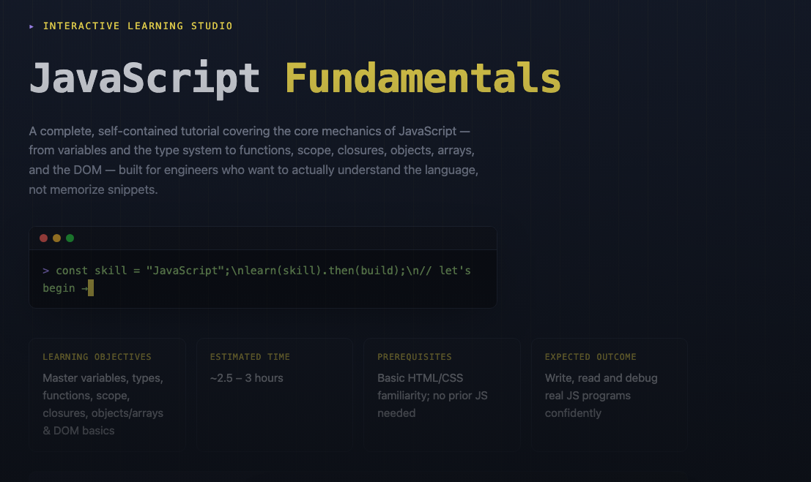
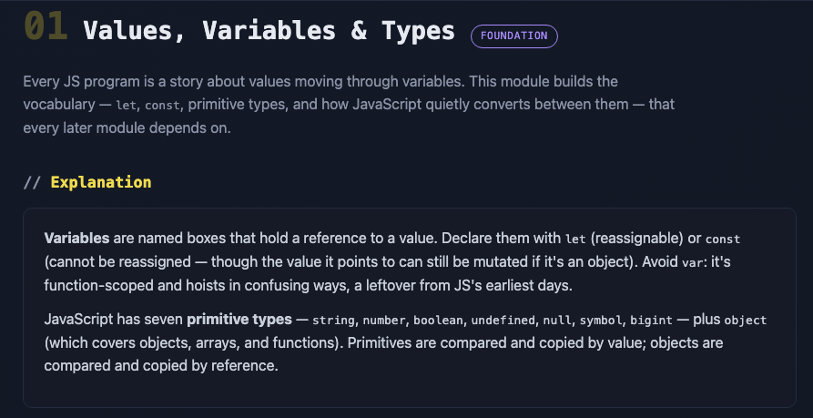
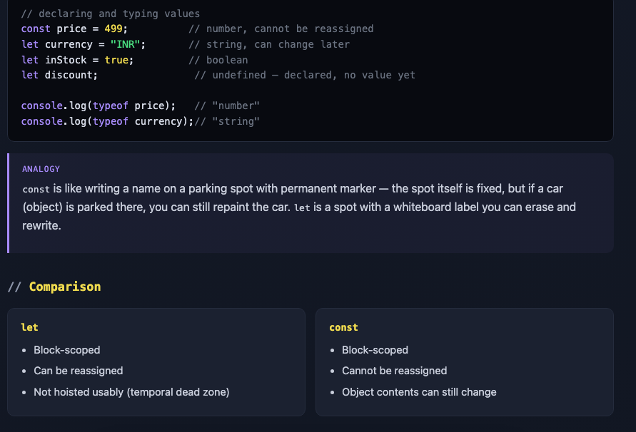
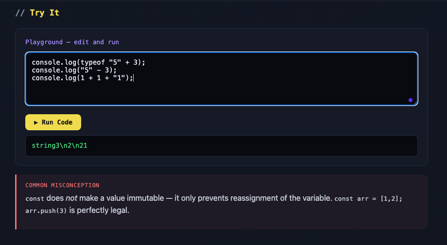

# Day 41/60 – Build an Interactive Learning Studio

🚀 As part of the **#60DayClaudeChallenge**, today I built **Interactive Learning Studio**, an AI-powered educational platform that transforms complex topics into complete, interactive learning experiences.

Unlike traditional tutorials or learning roadmaps, the application teaches an entire topic from foundational concepts to practical mastery through guided modules, interactive exercises, quizzes, and personalized feedback.

Built as a **single self-contained HTML application** using HTML, CSS, and Vanilla JavaScript, it runs entirely offline without requiring external libraries or frameworks.

## 🌐 **Live Demo:** https://spiffy-tiramisu-27d753.netlify.app/

---

# 🎯 Project Objective

Design an interactive learning platform that delivers complete topic-based tutorials through structured instruction and active learning.

Instead of overwhelming learners with information, the application gradually builds understanding through progressively challenging modules.

---

# 📝 Personalized Learning Experience

Before generating a tutorial, the application guides users through a structured selection process to identify a learning topic with the right scope.

The selected topic becomes the foundation for an interactive tutorial tailored specifically to that subject.

---

# 📖 Learning Introduction

Every tutorial begins with an overview that includes:

- Learning Objectives
- Estimated Completion Time
- Prerequisites
- Expected Outcomes
- Reward System

This helps learners understand what they will achieve before starting.

---

# 🧩 Four Progressive Learning Modules

The tutorial is divided into four increasingly advanced modules.

Each module contains:

- Detailed Explanations
- Real-World Examples
- Analogies
- HTML/CSS/SVG Diagrams
- Comparisons
- Practical Exercises
- Common Misconceptions
- Key Takeaways
- Interactive Activities

This structure supports both conceptual understanding and practical application.

---

# ✅ Interactive Quizzes

At the end of every module, learners complete a four-question quiz.

Features include:

- Automatic Scoring
- Instant Feedback
- Answer Explanations
- Performance Summary

The next module unlocks only after completing the quiz, encouraging mastery before progression.

---

# 🏆 Final Assessment

After completing all modules, learners face a comprehensive practical challenge designed to apply everything they have learned.

The application then provides:

- Completion Summary
- Achievement Recognition
- Learning Progress

---

# 📚 Continue Learning Resources

To support ongoing growth, the platform recommends:

- Books
- Official Documentation
- Research Papers
- Online Communities
- Practice Platforms
- Suggested Search Keywords
- AI Prompts for Deeper Exploration

This encourages learners to continue beyond the tutorial.

---

# 🎨 User Experience Highlights

The application features:

- Responsive Design
- Dark Mode
- Smooth Animations
- Progress Tracking
- Quiz Scoring
- Completion Tracking
- Printable Notes
- Modern Learning Interface

The goal was to create an experience comparable to commercial online learning platforms.

---

# 🧠 Key Learnings

### 1. Learning Is a Journey

Breaking a topic into structured modules helps learners build confidence and retain knowledge more effectively.

---

### 2. Interaction Improves Retention

Exercises, quizzes, and immediate feedback reinforce understanding better than passive reading alone.

---

### 3. AI Can Enhance Education

AI can help create personalized, engaging, and scalable learning experiences tailored to individual needs.

---

### 4. Instructional Design Matters

Well-designed educational experiences combine clear objectives, active practice, reflection, and continuous feedback.

---

# 📚 Biggest Takeaway

Education is most effective when learners actively participate in the process.

This project demonstrated how AI can transform traditional tutorials into interactive learning experiences that promote understanding, curiosity, and long-term retention.

> Great learning doesn't just deliver information—it builds confidence through guided practice and meaningful feedback.

---

# 📸 Screenshots

## 

## 

## 

## 

---

# 🙏 Acknowledgements

Special thanks to:

- Anthropic
- AB Talks on AI
- Anil Bajpai

for inspiring practical AI learning through the **#60DayClaudeChallenge**.

---

# 🔖 Hashtags

#60DayClaudeChallenge

#ClaudeAI

#Education

#EdTech

#InstructionalDesign

#LearningExperience

#AIEngineering

#BuildInPublic

#LearningInPublic

#InteractiveLearning
