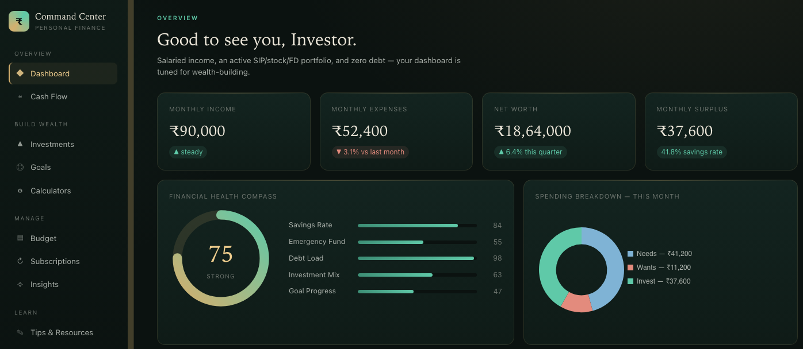
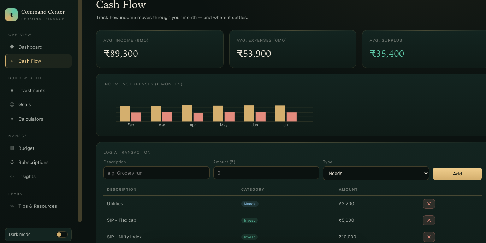
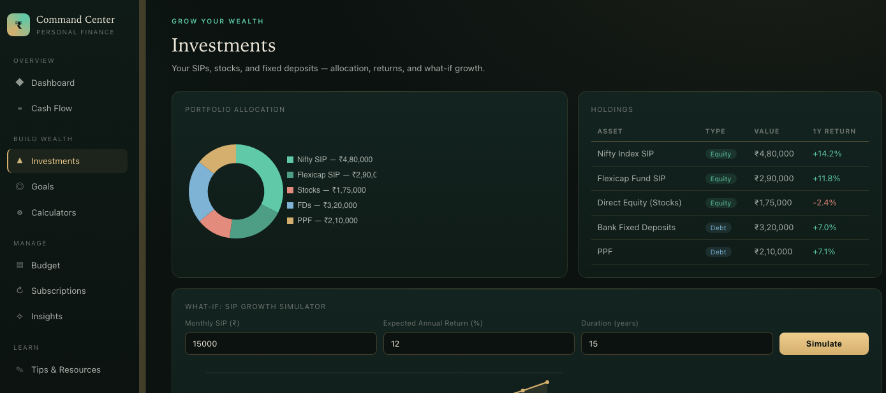
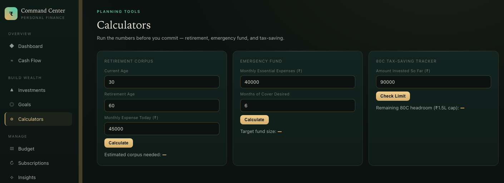
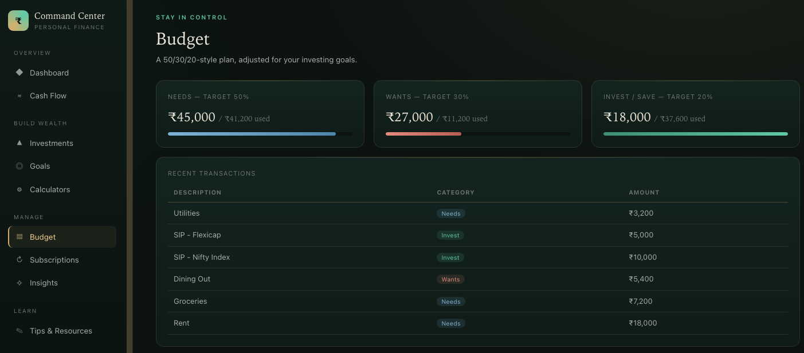
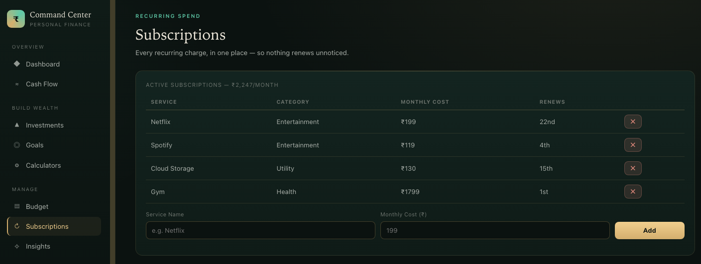
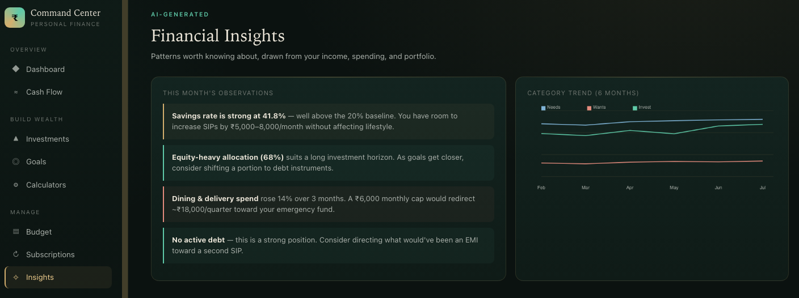
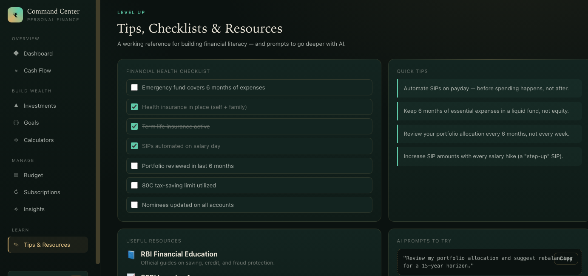

# Day 42/60 – Build a Personal Financial Command Center

🚀 As part of the **#60DayClaudeChallenge**, today I built **Personal Financial Command Center**, an interactive financial dashboard designed to help users understand, organize, and improve their personal finances.

Rather than functioning as a simple expense tracker, the application provides a complete financial overview with personalized insights, planning tools, simulations, and progress tracking.

Built as a **single self-contained HTML application** using HTML, CSS, and Vanilla JavaScript, it runs completely offline without external libraries or frameworks.

---

# 🎯 Project Objective

Create a financial platform that empowers users to make informed financial decisions through visualization, planning, and personalized recommendations.

The application adapts its dashboard based on the user's financial profile, making the experience relevant for different life stages and financial goals.

---

# 👤 Personalized Financial Profile

The experience begins with a guided questionnaire to understand the user's financial situation.

The dashboard can be tailored for profiles such as:

- Student
- Salaried Employee
- Freelancer
- Business Owner
- Family
- Investor
- Retired Individual

Additional follow-up questions personalize the dashboard even further.

---

# 📊 Financial Overview Dashboard

The main dashboard provides a clear snapshot of financial health, including:

- Total Income
- Monthly Expenses
- Savings
- Investments
- Debt
- Cash Flow
- Financial Health Score

This overview helps users quickly understand their current financial position.

---

# 💵 Income, Expenses & Budgeting

Dedicated modules allow users to:

- Track income sources
- Categorize expenses
- Set monthly budgets
- Compare planned vs. actual spending

Visual summaries make it easy to identify spending patterns.

---

# 🎯 Savings & Financial Goals

Users can define financial goals such as:

- Emergency Fund
- Vacation
- Home Purchase
- Education
- Retirement

The dashboard tracks progress and estimates the time required to achieve each goal.

---

# 📈 Investments & Debt Management

The application includes modules for:

### Investments

- Portfolio Overview
- Asset Allocation
- Investment Growth

### Debt

- Loan Tracking
- EMI Monitoring
- Debt Repayment Progress

These modules help users balance wealth creation with financial obligations.

---

# 🧮 Financial Planning Tools

The dashboard includes interactive tools such as:

- EMI Calculator
- Savings Calculator
- Budget Planner
- Net Worth Tracker
- Cash Flow Analysis

Users can also explore **What-If Simulations** to understand the long-term impact of financial decisions.

---

# 🤖 AI Insights & Recommendations

Based on the user's financial profile and activity, the application generates personalized insights, including:

- Budget Improvement Suggestions
- Savings Opportunities
- Spending Patterns
- Investment Considerations
- Financial Health Score
- Actionable Recommendations

The focus is on helping users make informed decisions rather than simply displaying data.

---

# 📚 Financial Literacy Resources

To encourage continuous learning, the application concludes with:

- Financial Tips
- Planning Checklists
- Learning Resources
- Additional AI Prompts for Financial Planning

This helps users continue improving their financial knowledge beyond the dashboard.

---

# 🧠 Key Learnings

### 1. Financial Awareness Comes Before Financial Growth

Understanding income, expenses, and cash flow is the foundation of better financial decision-making.

---

### 2. Visualization Improves Decision-Making

Interactive charts and dashboards make financial information easier to interpret and act upon.

---

### 3. Personalization Matters

A financial dashboard is most effective when it reflects the user's goals, responsibilities, and financial profile.

---

### 4. AI Can Support Financial Education

AI can help users better understand their finances by providing personalized insights, planning tools, and practical recommendations.

---

# 📚 Biggest Takeaway

Personal finance is not just about recording transactions—it's about making informed decisions that improve long-term financial well-being.

This project demonstrated how AI can transform financial data into meaningful guidance through interactive dashboards and personalized insights.

> Financial success begins with awareness, grows through planning, and is sustained by consistent, informed decisions.

---

# 📸 Screenshots

## 

## 

## 

## 

## 

## 

## 

## 

---

# 🙏 Acknowledgements

Special thanks to:

- Anthropic
- AB Talks on AI
- Anil Bajpai

for inspiring practical AI learning through the **#60DayClaudeChallenge**.

---

# 🔖 Hashtags

#60DayClaudeChallenge

#ClaudeAI

#PersonalFinance

#FinancialLiteracy

#DashboardDesign

#AIEngineering

#FrontendDevelopment

#BuildInPublic

#LearningInPublic

#MoneyManagement

### Prompt

```
# Personal Financial Command Center

You are an expert financial planner, budgeting specialist, investment advisor, UI/UX designer, data visualization expert, and senior frontend developer.

Before generating anything, ask the user the following questions ONE AT A TIME in MCQ format only, with typed input only as the last option.

1. Who is this financial dashboard for?
(Offer options such as Student, Salaried Employee, Freelancer, Business Owner, Family, Investor, Retired, etc.)

2. Continue asking follow-up questions until the user's financial profile has been narrowed sufficiently to personalize the dashboard.
Do not stop after identifying only the user type. Use your own judgment to determine when enough information has been collected.

3. Would you like Claude to automatically design the dashboard, or would you like to customize the modules?
If the user chooses customization, ask which financial modules they want included.

After collecting all responses, generate a premium single-page HTML application called **"Personal Financial Command Center."**

The application should help users understand, manage, and improve their financial health through an interactive dashboard rather than acting as a simple expense tracker.

Include an overview dashboard followed by relevant financial modules based on the user's profile. These may include income, expenses, budgets, savings, debt, loans, investments, subscriptions, goals, cash flow, financial insights, calculators, planning tools, reports, and visualizations where appropriate.

Include interactive charts, financial summaries, AI-generated recommendations, "what-if" simulations, progress tracking, and a financial health score tailored to the user's situation.

Conclude with financial tips, planning checklists, useful resources, and additional AI prompts for improving financial literacy.

Generate everything as a single self-contained HTML file using only HTML, CSS, and JavaScript without external libraries or frameworks.

Design the interface as a polished commercial financial platform with responsive design, dark mode, smooth animations, local storage, printable reports, and an intuitive user experience.
```
