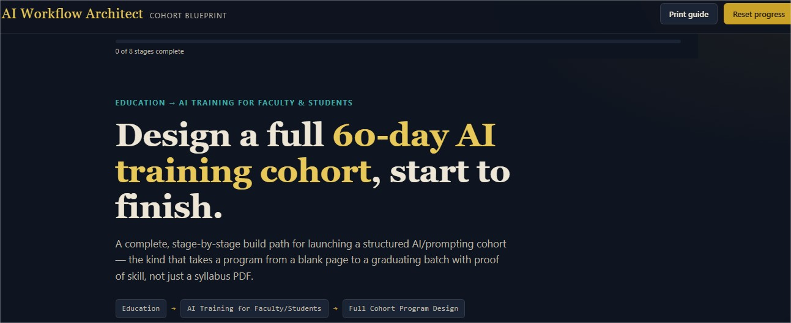
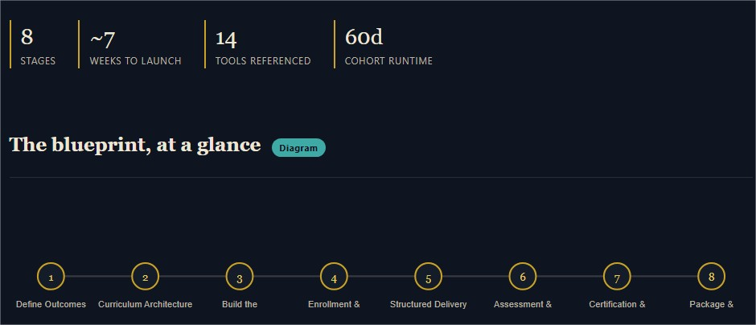
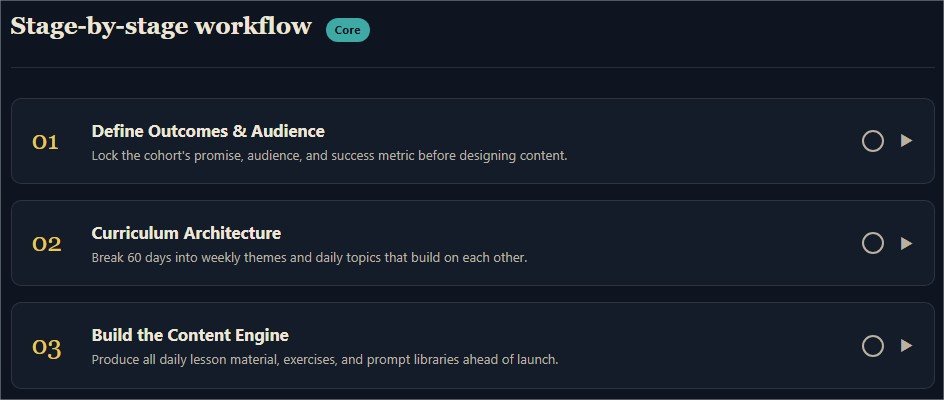
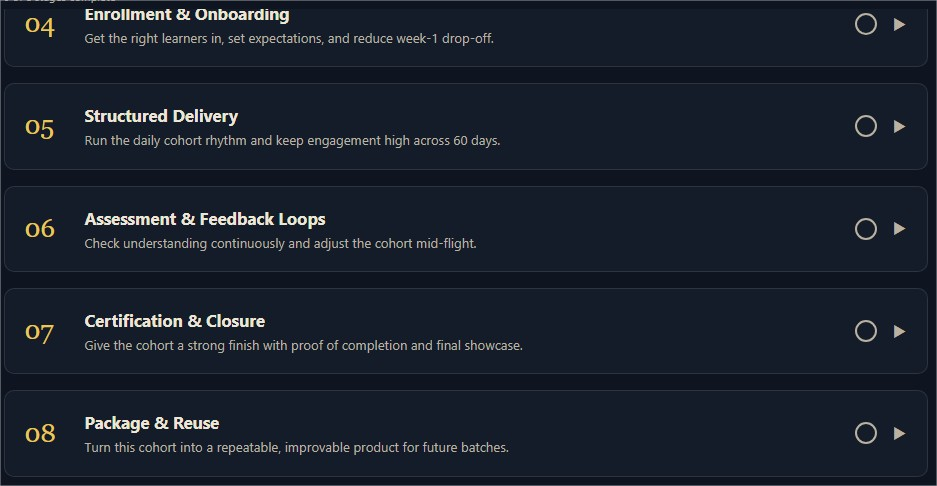
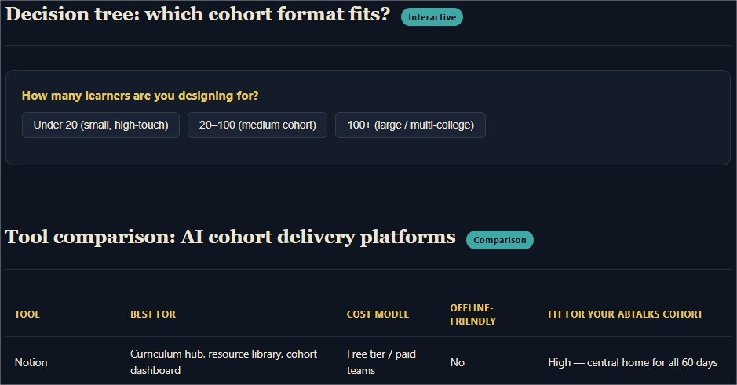
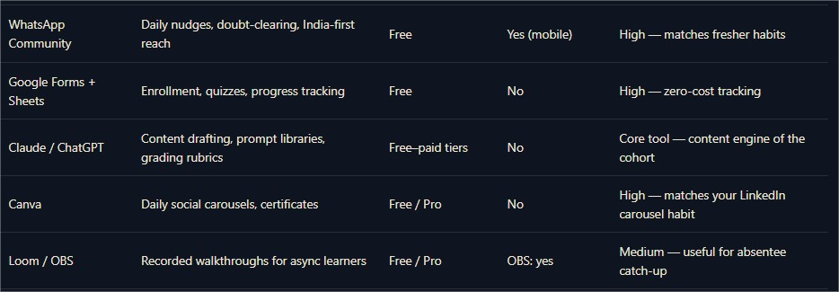
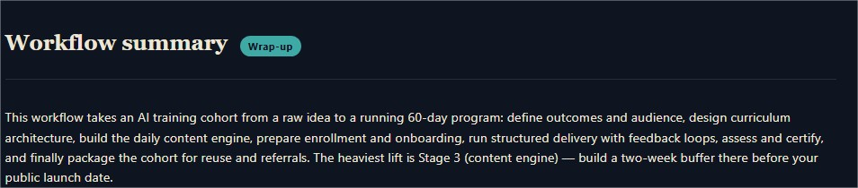
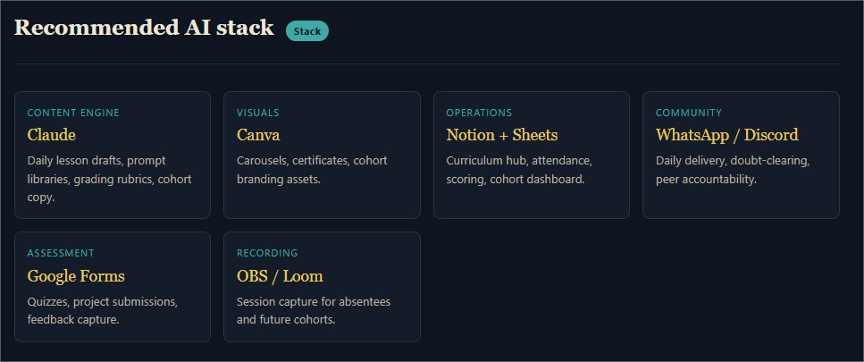
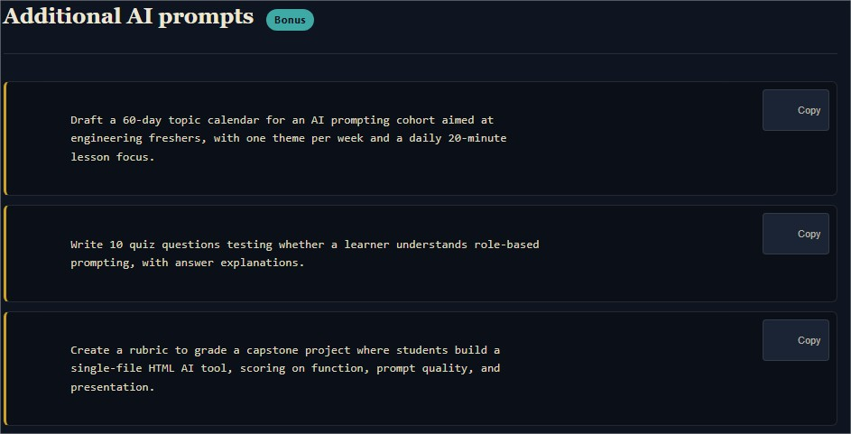

# Day 43/60 – Build an AI Workflow Architect

🚀 As part of the **#60DayClaudeChallenge**, today I built **AI Workflow Architect**, an interactive application that helps users design complete, end-to-end workflows for professional, business, and personal projects.

Rather than generating generic advice or static checklists, the application creates structured workflows that guide users from planning through execution, using AI-powered recommendations and best practices at every stage.

Built as a **single self-contained HTML application** using HTML, CSS, and Vanilla JavaScript, it runs completely offline without external libraries or frameworks.

---

# 🎯 Project Objective

Create an interactive platform that helps users map, understand, and optimize complete workflows for a specific role, project, or business objective.

The application transforms complex processes into structured, actionable stages supported by AI tools and productivity insights.

---

# 📝 Guided Workflow Design

The experience begins with a guided questionnaire that identifies:

- Industry or Domain
- Role or Responsibility
- Specific Process or Objective
- Workflow Scope
- Preferred Customization

This ensures every generated workflow is tailored to the user's real-world needs.

📸 **Insert Screenshot: Workflow Setup**

---

# 🗂️ End-to-End Workflow

The application breaks each workflow into logical stages, from planning to execution.

Every stage includes:

- Objectives
- Tasks
- Expected Outputs
- Time Estimates
- Best Practices
- Common Mistakes
- Productivity Tips

This structured approach helps users understand not only _what_ to do, but also _why_ each step matters.

📸 **Insert Screenshot: Workflow Stages**

---

# 🤖 AI Tool Recommendations

For every stage, the application recommends suitable AI tools and explains:

- Why the tool is appropriate
- Alternative options
- Typical use cases

It also provides ready-to-use prompt examples that users can adapt to their own workflows.

📸 **Insert Screenshot: AI Tools & Prompts**

---

# 📊 Interactive Workflow Features

The platform includes several interactive elements to improve usability and understanding:

- Workflow Diagrams
- Decision Trees
- Progress Tracking
- Notes & Bookmarks
- Actionable Insights
- Printable Workflow Guides

These features turn the workflow into a practical execution guide rather than a static document.

📸 **Insert Screenshot: Interactive Workflow**

---

# 📚 Workflow Summary

After completing the workflow, the application generates:

- Workflow Summary
- Recommended AI Stack
- Learning Resources
- Communities
- Search Keywords
- Additional AI Prompts
- Future Automation Opportunities

This helps users continue refining and scaling their workflows.

📸 **Insert Screenshot: Workflow Summary**

---

# 🎨 User Experience Highlights

The application includes:

- Responsive Design
- Dark Mode
- Smooth Animations
- Interactive Diagrams
- Local Storage
- Printable Reports
- Modern Card-Based Layout

The goal was to create an experience comparable to a professional workflow management platform.

📸 **Insert Screenshot: Dashboard Overview**

---

# 🧠 Key Learnings

### 1. Systems Create Consistency

Well-designed workflows reduce confusion, improve efficiency, and make complex projects easier to manage.

---

### 2. AI Is a Workflow Partner

Rather than replacing people, AI helps accelerate repetitive tasks, improve decision-making, and increase productivity.

---

### 3. Structure Improves Execution

Breaking work into clear stages helps teams focus on priorities while reducing mistakes.

---

### 4. Productivity Comes from Process Design

The most effective workflows combine planning, execution, review, and continuous improvement.

---

# 📚 Biggest Takeaway

Building better workflows is one of the most impactful ways to improve productivity.

This project demonstrated how AI can help professionals design repeatable systems, recommend the right tools, and simplify complex processes into clear, actionable steps.

> Great results don't happen by accident—they emerge from well-designed workflows.

---

# 📸 Screenshots

## 

## 

## 

## 

## 

## 

## 

## 

## 

---

# 🙏 Acknowledgements

Special thanks to:

- Anthropic
- AB Talks on AI
- Anil Bajpai

for inspiring practical AI learning through the **#60DayClaudeChallenge**.

---

# 🔖 Hashtags

#60DayClaudeChallenge

#ClaudeAI

#WorkflowAutomation

#Productivity

#PromptEngineering

#AIEngineering

#BusinessProcess

#Automation

#LearningInPublic

#BuildInPublic

## Prompt

```
# AI Workflow Architect

You are an expert workflow consultant, business analyst, AI strategist, automation architect, productivity expert, UI/UX designer, and senior frontend developer.

Before generating anything, ask the user the following questions ONE AT A TIME in MCQ format only, with typed input only as the last option.

1. What type of workflow would you like to build?
(Offer options such as Marketing, Sales, HR, Software Development, Design, Education, Finance, Healthcare, Legal, Customer Support, Content Creation, Entrepreneurship, Research, Personal Productivity, and more.)

2. Continue asking follow-up questions until the workflow has been narrowed into a specific role, process, or objective that can realistically be mapped from start to finish.
Do not stop after identifying only an industry or domain. Use your own judgment to determine when the scope is appropriate.

Example:
Marketing → Social Media → Instagram Marketing → Personal Brand Growth

Software Development → Frontend Development → React → Portfolio Website

Human Resources → Recruitment → Technical Hiring

3. Would you like Claude to automatically structure the workflow, or would you like to customize its sections?
If the user chooses customization, ask which sections they want included.

After collecting all responses, generate a premium single-page HTML application called "AI Workflow Architect."

The application should generate a complete end-to-end workflow for the selected process rather than providing general advice or a checklist.

Break the workflow into logical stages from planning to execution.

Each stage should include:

Objectives

Tasks

Best AI tools for that stage

Why each tool is recommended

Alternative tools

Prompt examples

Best practices

Common mistakes

Expected outputs

Time estimates

Tips for improving efficiency

Include interactive workflow diagrams, comparisons, decision trees, tool recommendations, progress tracking, notes, bookmarks, and actionable insights where appropriate.

Conclude with:

Workflow Summary

Recommended AI Stack

Learning Resources

Communities

Search Keywords

Additional AI Prompts

Future Automation Opportunities

Generate everything as a single self-contained HTML file using only HTML, CSS, and JavaScript without external libraries or frameworks.

Design the interface as a polished commercial workflow platform with responsive design, dark mode, smooth animations, interactive diagrams, local storage, printable workflow guides, and an intuitive user experience.
```
