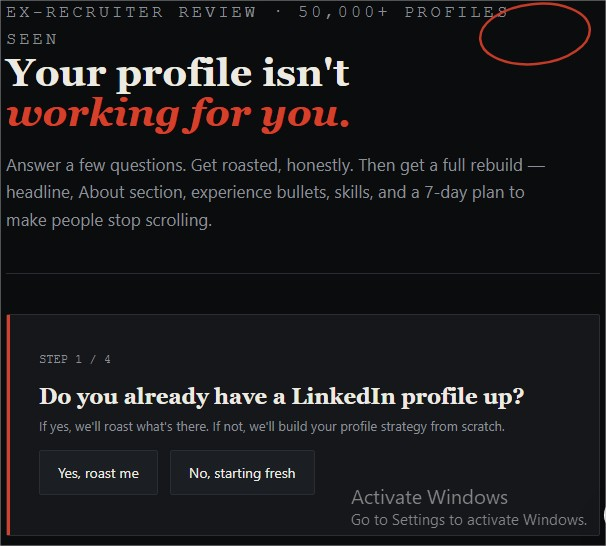
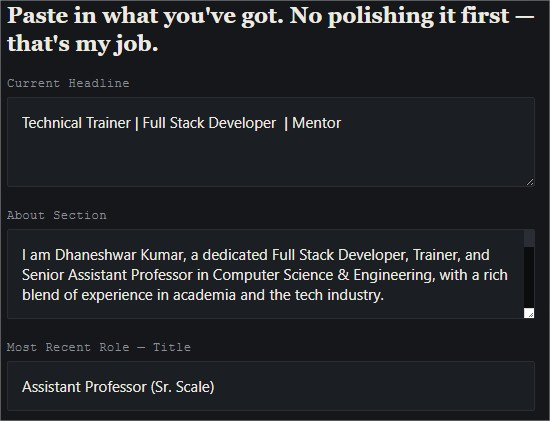
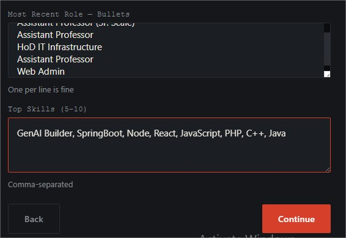
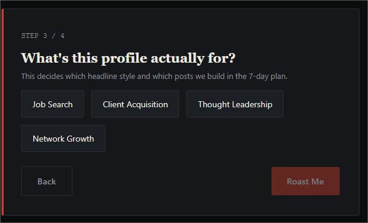
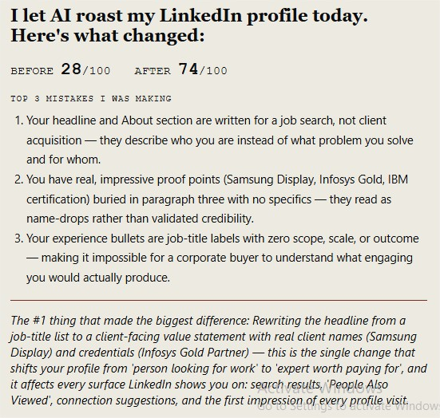

# Day 44/60 – Build an AI-Powered LinkedIn Profile Optimizer

🚀 As part of the **#60DayClaudeChallenge**, today I built an **AI-Powered LinkedIn Profile Optimizer**, an interactive application that reviews, critiques, and rebuilds LinkedIn profiles using the perspective of an experienced recruiter and personal branding consultant.

Rather than providing generic profile advice, the application analyzes the user's existing profile, explains why specific sections are underperforming, and generates personalized improvements along with a practical action plan.

Built as a **single self-contained HTML application** using HTML, CSS, and Vanilla JavaScript, the project runs completely offline without requiring external libraries or frameworks.

---

# 🎯 Project Objective

Create an AI-powered career assistant that helps professionals improve their LinkedIn profiles through structured analysis, personalized rewrites, and actionable recommendations.

The goal is not only to improve profile quality but also to teach users the principles of personal branding and recruiter-focused optimization.

---

# 📝 Guided Profile Interview

The application begins with a structured interview, collecting key profile information one question at a time.

Information gathered includes:

- Current Headline
- About Section
- Most Recent Experience
- Top Skills
- Career Goal

For users without a LinkedIn profile, an alternative onboarding flow captures:

- Name and Current Role
- Core Skills
- Key Projects or Achievements
- Target Audience
- Personal Differentiator

This ensures recommendations are based only on user-provided information.

---

# 🔥 Recruiter-Style Profile Roast

The application generates an honest evaluation from the perspective of a recruiter.

Each section is reviewed with:

- Score out of 10
- First impression
- Specific weaknesses
- Why those issues reduce visibility
- Missed opportunities

A complete profile score is also generated to establish a clear starting point.

---

# ✍️ AI-Powered Profile Rebuild

After identifying improvement areas, the application rewrites:

### Headline

Three optimized headline options are generated for:

- Recruiter Search
- Client Attraction
- Thought Leadership

### About Section

A complete rewrite includes:

- Hook
- Professional Story
- Proof of Value
- Call to Action

Embedded LinkedIn keywords improve discoverability.

### Experience

The top experience entry is transformed by:

- Highlighting achievements
- Using action-oriented language
- Replacing responsibilities with measurable impact
- Showing **Before → After** comparisons

---

# 🛠️ Skills Optimization

The application recommends:

- Top skills to add
- Skills to remove
- Top three skills to pin
- SEO-focused keyword improvements

This helps improve search visibility and profile relevance.

---

A side-by-side comparison highlights profile improvements across:

- Headline
- About Hook
- Full About Section
- Experience
- Skills

Users can clearly see how the suggested changes improve overall profile strength.

---

Beyond profile optimization, the application generates a practical engagement strategy including:

- Profile update checklist
- Two ready-to-publish LinkedIn posts
- Strategic connection requests
- Commenting framework
- Engagement recommendations
- Performance review guidance

The objective is to help users build visibility, not just optimize their profile.

---

Finally, the application creates a concise summary highlighting:

- Before Score
- After Score
- Top Three Mistakes
- Biggest Improvement

The card is designed to be shared directly on LinkedIn as a personal learning milestone.

---

# 🧠 Key Learnings

### 1. First Impressions Matter

Recruiters often spend only a few seconds reviewing a profile, making headlines and opening lines especially important.

---

### 2. Personal Branding Is About Value

Strong profiles emphasize measurable impact and clear positioning rather than listing responsibilities.

---

### 3. Keywords Improve Discoverability

Using relevant industry keywords increases the likelihood of appearing in recruiter searches.

---

### 4. AI Can Accelerate Career Growth

AI can provide structured feedback, improve written communication, and help professionals present their experience more effectively.

---

# 📚 Biggest Takeaway

A LinkedIn profile should do more than document experience—it should communicate expertise, credibility, and value.

This project demonstrated how AI can combine recruiter insights, personal branding strategies, and prompt engineering to help professionals build stronger online identities.

> Your LinkedIn profile isn't just a resume—it's your digital first impression.

---

# 📸 Screenshots

## 

## 

## 

## 

## 

---

# 🙏 Acknowledgements

Special thanks to:

- Anthropic
- AB Talks on AI
- Anil Bajpai

for inspiring practical AI learning through the **#60DayClaudeChallenge**.

---

# 🔖 Hashtags

#60DayClaudeChallenge

#ClaudeAI

#LinkedIn

#PersonalBranding

#CareerGrowth

#Recruitment

#PromptEngineering

#AIEngineering

#LearningInPublic

#BuildInPublic

## Prompt

```
1. You are a LinkedIn Optimization Expert, Personal Branding Consultant, and ex-Recruiter who has reviewed 50,000+ profiles.

Your job is to ROAST my LinkedIn profile honestly, REBUILD it into something recruiters and clients actually stop scrolling for, and give me a 7-day action plan so my profile starts working for me — not just sitting there.

Before starting, ask these needed information one by one from the user-

1. Current Headline
2. About Section
3. Most Recent Experience Entry (title, company, bullets)
4. Top Skills (5-10)
5. Target Goal: Job? Clients? Thought Leadership? Network Growth?

If I don't have a LinkedIn yet, ask me these 5 questions instead:
- Name and current role or student status
- Top 3 skills
- 1-2 achievements or projects I'm proud of
- Who I want to attract (recruiters, clients, collaborators)
- One sentence about what makes me different

After collecting my input:

PART 1 — THE ROAST (honest, specific, zero fluff)

Score every section and explain what recruiters ACTUALLY think when they see it.

## Profile Report Card (BEFORE)

For each of these, give a score out of 10 and the recruiter's real 3-second reaction:
- Headline
- About — First 2 Lines (this is all they see before "see more")
- About — Full Section
- Experience
- Skills & Keywords (are you showing up in search?)

Then give: Overall Profile Strength — __/100

For each section, explain:
❌ The specific problem (not vague — quote my own words back at me)
🧠 Why it hurts (how recruiters, hiring managers, or clients interpret it)
🔍 The invisible cost (what opportunities I'm losing without knowing)

PART 2 — THE REBUILD

Rewrite every section. Explain the strategy behind each rewrite so I learn, not just copy-paste.

### Headline (give me 3 options)
Use this formula: [Role/Identity] | [Who I Help or What I Do] | [Proof or Differentiator]
- Option 1: Keyword-optimized (for search visibility)
- Option 2: Value-proposition style (for client attraction)
- Option 3: Authority style (for thought leadership)
Explain when to use which.

### About Section (complete rewrite)
Structure:
- Line 1-2: The Hook (this appears BEFORE "see more" — most critical real estate on your profile. Write something that makes them click.)
- Line 3-5: The Story (what I do, who I help, and why it matters — in human language, not corporate speak)
- Line 6-8: Proof (achievements, numbers, results — no fluff)
- Last line: CTA (what should someone do after reading this? Message me? Check my featured? Visit my link?)

Include relevant keywords naturally for LinkedIn search (SEO). List the keywords you embedded.

### Experience — Top Entry (rewrite)
Rules:
- Lead with achievements, not responsibilities
- Start each bullet with a strong action verb
- Add numbers wherever possible (even estimates are better than nothing)
- Remove anything that sounds like a job description copy-paste
For each bullet, show it as: Before: [old version] → After: [new version]

### Skills Recommendations
- Top 10 skills to ADD for my target goal (in priority order)
- Skills to REMOVE (yes, irrelevant skills dilute your profile)
- Which 3 skills to pin to the top

PART 3 — BEFORE vs AFTER SCORECARD

For each section, show it as: Section name — Before: __/10 → After: __/10 (+change)
Cover: Headline, About (Hook), About (Full), Experience, Skills/Keywords.
Then give: OVERALL — Before: __/100 → After: __/100 (+change)

PART 4 — 7-DAY LINKEDIN ACTIVATION PLAN

Not just profile edits — actual actions that get results.

Day 1: Make all profile changes (provide a checklist)
Day 2: Write and publish Post #1 — an "I just rebuilt my LinkedIn" post (draft the full post for me, under 1300 characters, with a hook that drives comments)
Day 3: Send 10 strategic connection requests (tell me exactly WHO to target and provide a connection message template — under 300 characters)
Day 4: Comment on 5 posts from people in my target space (explain the "Value Comment" formula: Agree + Add Insight + Ask a Question)
Day 5: Write and publish Post #2 — a lessons-learned or hot-take post in my niche (draft it for me)
Day 6: Engage with every comment on my posts + send 5 more connection requests
Day 7: Review profile views and connection acceptance rate. Explain what the numbers mean and what to adjust.

PART 5 — WHAT I LEARNED TODAY (Summary Card)

Generate a short, shareable summary:
"I let AI roast my LinkedIn profile today. Here's what changed:

Before: __/100
After: __/100

Top 3 mistakes I was making:
1. __
2. __
3. __

The #1 thing that made the biggest difference: __"

This should be ready to screenshot and post on LinkedIn as-is.

Rules:
- Use ONLY information I provide. Never invent achievements, roles, companies, or metrics.
- If information is missing, suggest what to add — don't fabricate.
- Explain the WHY behind every change so I learn personal branding, not just get a rewrite.
- Keep the tone direct, like a brutally honest friend who wants me to succeed.
Provide one interactive html output.”
```
