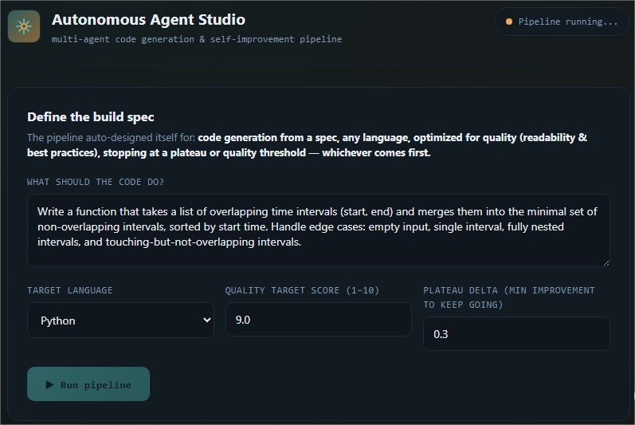
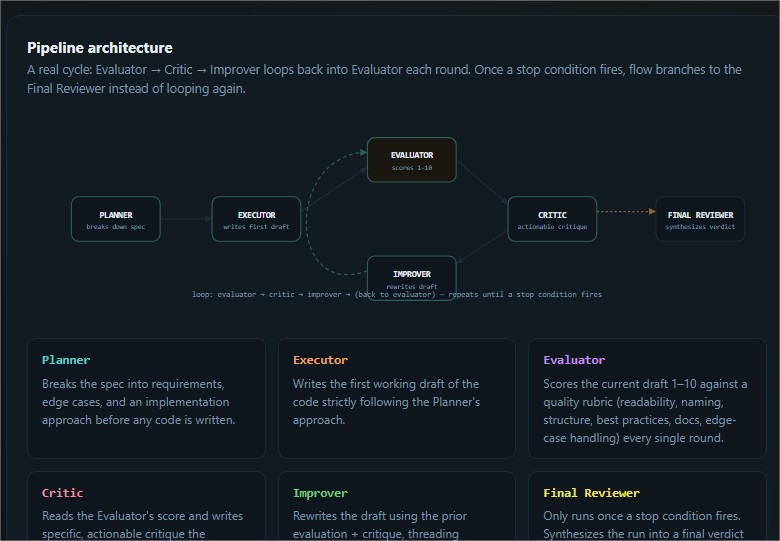
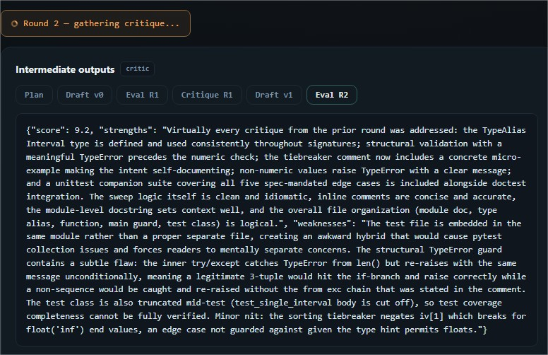
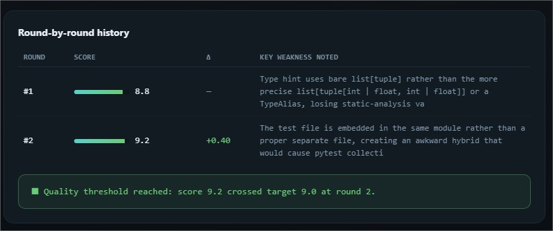
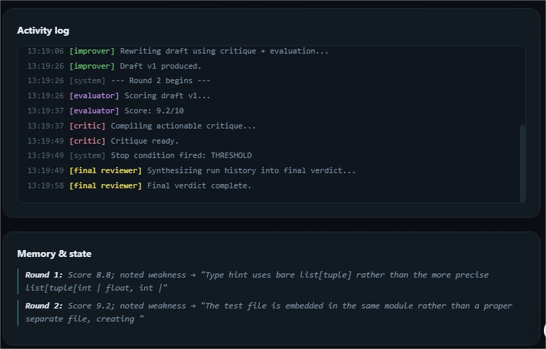
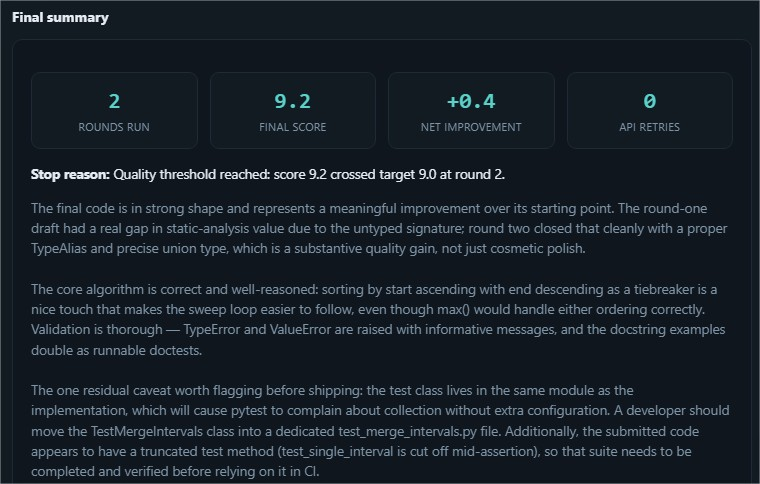
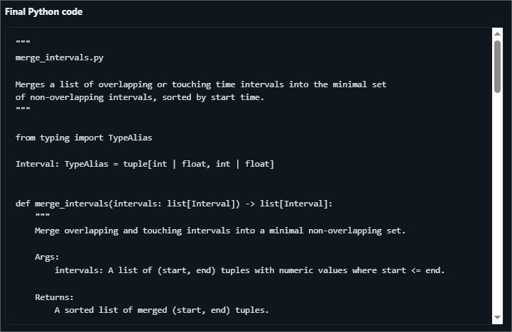
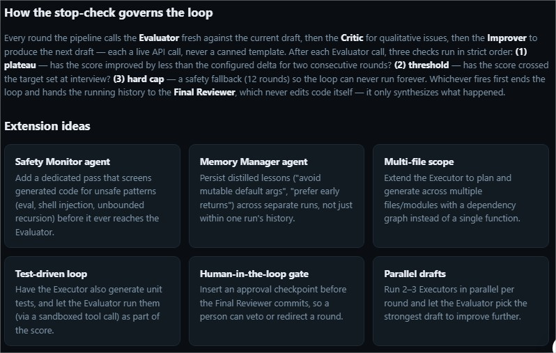
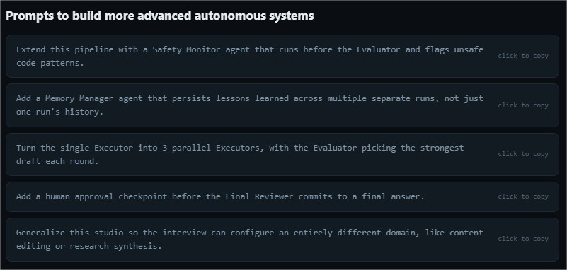

# Day 46/60 – Build an Autonomous Agent Studio

🚀 As part of the **#60DayClaudeChallenge**, today I built **Autonomous Agent Studio**, an interactive platform that demonstrates how multiple AI agents can collaborate to solve complex tasks through planning, execution, evaluation, critique, and continuous improvement.

Unlike traditional AI assistants that generate a single response, this application orchestrates a team of specialized AI agents working together in an iterative loop until predefined success conditions are achieved.

Built as a **single self-contained HTML application** using HTML, CSS, and Vanilla JavaScript, the project features a modern interface, live workflow visualization, and multi-agent orchestration concepts.

---

# 🎯 Project Objective

Design a production-inspired autonomous AI system capable of coordinating multiple specialized agents to complete complex workflows through continuous evaluation and refinement.

The platform demonstrates how autonomous systems can improve outputs over multiple iterations instead of relying on a single AI response.

---

# 📝 Guided Workflow Configuration

The experience begins with an interactive interview that collects:

- Workflow Domain
- Specific Use Case
- Success Criteria
- Stopping Conditions
- Preferred Agent Configuration

This information personalizes the orchestration pipeline before execution begins.

📸 **Insert Screenshot: Workflow Configuration**

---

# 🤖 Multi-Agent Architecture

The application dynamically assembles a team of specialized AI agents, each with a clearly defined responsibility.

### 🧭 Planner

Breaks the objective into logical execution steps.

---

### ⚙️ Executor

Performs the requested task using the execution plan.

---

### 📊 Evaluator

Measures the output against predefined quality metrics.

---

### 🔍 Critic

Identifies weaknesses, risks, and opportunities for improvement.

---

### 🚀 Improver

Uses evaluator and critic feedback to refine the current solution.

---

### 🧠 Memory Manager

Maintains context, previous iterations, and important observations throughout the workflow.

---

### 🛡️ Safety Monitor

Checks for compliance, safety considerations, and policy alignment.

---

### ✅ Final Reviewer

Validates the final output once stopping conditions are satisfied.

📸 **Insert Screenshot: Agent Architecture**

---

# 🔄 Autonomous Improvement Loop

One of the most important features of the application is its continuous improvement cycle.

Rather than following a fixed sequence, the system repeatedly executes:

**Evaluator → Critic → Improver**

The workflow continues until one of the following conditions is met:

- Target quality threshold achieved
- Performance improvement plateaus
- Safety iteration limit reached

This iterative approach mirrors how modern autonomous AI systems refine outputs over time.

📸 **Insert Screenshot: Workflow Loop**

---

# 📊 Live Orchestration Dashboard

The dashboard provides real-time visibility into the autonomous workflow, including:

- Active Agent
- Current Round
- Workflow Visualization
- Iteration History
- Activity Log
- Intermediate Outputs
- Memory Updates
- Evaluation Reports
- Retry Count
- Final Stop Reason

These features help users understand how information flows between agents during execution.

📸 **Insert Screenshot: Dashboard**

---

# 📈 Performance Summary

After execution completes, the application generates a detailed summary containing:

- Final Output
- Agent Performance
- Execution Statistics
- Architecture Overview
- Improvement History
- Future Extension Ideas
- Suggested AI Prompts

This helps users understand both the outcome and the reasoning process behind it.

📸 **Insert Screenshot: Performance Summary**

---

# 🎨 User Experience Highlights

The platform includes:

- Responsive Design
- Dark Mode
- Animated Workflow Diagram
- Interactive Loop Visualization
- Smooth Animations
- Loading States
- Error Recovery
- Progress Indicators
- Modern Card-Based Layout

The interface is designed to resemble professional AI orchestration platforms.

📸 **Insert Screenshot: UI Overview**

---

# 🧠 Key Learnings

### 1. AI Systems Can Collaborate

Breaking complex problems into specialized agent roles improves organization, scalability, and transparency.

---

### 2. Iteration Improves Quality

Continuous evaluation and refinement often produce better results than a single-pass generation process.

---

### 3. Memory Enables Context

Maintaining state across multiple iterations helps autonomous systems make more informed decisions.

---

### 4. Autonomous AI Requires Governance

Evaluation, safety monitoring, and stopping conditions are essential for building reliable agentic systems.

---

# 📚 Biggest Takeaway

The next generation of AI applications will move beyond single-model interactions toward collaborative, autonomous systems capable of planning, reasoning, improving, and validating their own work.

This project demonstrated how agent orchestration can transform AI from a conversational tool into an intelligent workflow engine.

> The future of AI isn't one powerful agent—it's multiple specialized agents working together toward a common goal.

---

# 📸 Screenshots

## 

## 

## 

## 

## 

## 

## 

## 

## 

---

# 🙏 Acknowledgements

Special thanks to:

- Anthropic
- AB Talks on AI
- Anil Bajpai

for inspiring practical AI learning through the **#60DayClaudeChallenge**.

---

# 🔖 Hashtags

#60DayClaudeChallenge

#ClaudeAI

#AutonomousAgents

#AgenticAI

#ArtificialIntelligence

#PromptEngineering

#WorkflowAutomation

#AIEngineering

#LearningInPublic

#BuildInPublic

## Prompt

```
# Autonomous Agent Studio

You are an expert AI systems architect, agentic workflow designer, prompt engineer, automation engineer, conversation designer, UX designer, and senior frontend developer.

**Interview first, one question at a time, MCQ only** (free text only for a final "Other" option):
1. What kind of autonomous AI agent should we build? (offer domains/use cases)
2. Narrow follow-ups until the workflow is specific enough to automate — don't stop at just a domain.
3. Primary success criteria (accuracy, speed, quality score, approval, etc.)
4. Stopping condition — offer options suited to the chosen workflow.
5. Auto-design vs. customize components (if customize, ask which agents to include).

After the interview, build a single-page HTML app, **"Autonomous Agent Studio,"** that runs a real multi-agent orchestration pipeline live against the Claude API (`fetch` to `https://api.anthropic.com/v1/messages`, no key needed) — planning, executing, evaluating, remembering, improving, and repeating until a stopping condition is met.

Choose from these agents based on the workflow: Planner, Executor, Evaluator, Critic, Improver, Memory Manager, Safety Monitor, Final Reviewer. Give each a production-quality system prompt.

## Non-negotiable: it must be a real loop
- Implement the round portion as an actual `while`/`for` loop that re-calls Evaluator → Critic → Improver each pass with a **live API call every time**. No fixed/hardcoded sequence, and no pre-set round count — the number of rounds is a runtime result of the stop check, not a value chosen upfront.
- Every agent output shown in the UI (score, critique, reasoning) must be the literal text from that round's API response. No regex, canned strings, or rule-based scoring standing in for a model call.
- State must thread forward: each Improver call gets the prior round's evaluation + critique; each Evaluator call gets the current draft + rubric. Keep a running history array (score, critique, draft, delta) that the UI can display.
- Check every round, in order: (1) plateau — score improved less than a small delta for 2 straight rounds; (2) threshold — score crossed the target set at interview; (3) hard iteration cap (safety fallback only, not the intended ending). Log and surface which one fired.

## Dashboard
Show: workflow visualization (draw the loop as a real cycle — return arrow from Improver to Evaluator, with a separate branch to Final Reviewer once a stop condition fires, not a straight pipeline), active agent, live status, iteration history, activity log, intermediate outputs, memory updates, evaluation reports, round-over-round improvements, retry count, and final summary naming the exact stop reason. Round indicator should read as open-ended ("Round 3 — checking stop condition…"), not "Round 3 of 5."

Explain each agent's responsibility and how the stop-check governs information flow between rounds.

## Close with
Final output, agent performance summary, execution stats, architecture overview, extension ideas, and further prompts for building more advanced autonomous systems.

## Build constraints
Single self-contained HTML file, vanilla HTML/CSS/JS only, no external libraries. Commercial-grade polish: responsive, dark mode, smooth animations, interactive visualizations, robust error handling/retries, loading states, graceful failure recovery, zero syntax errors.
```
