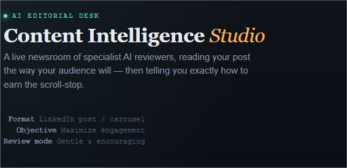
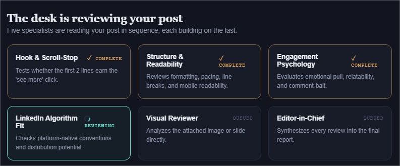
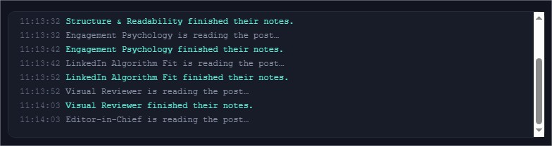
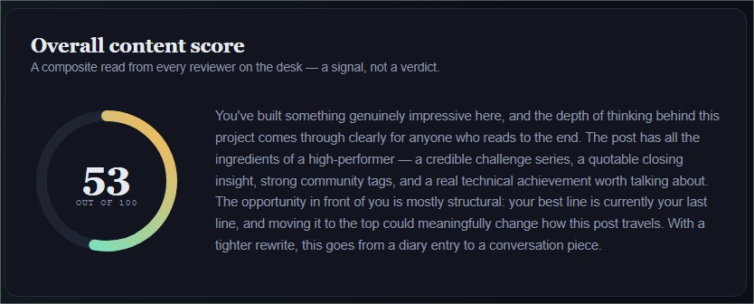
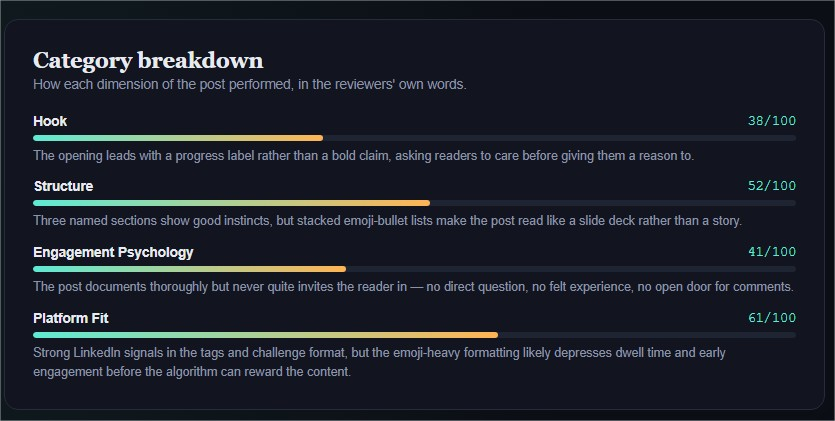
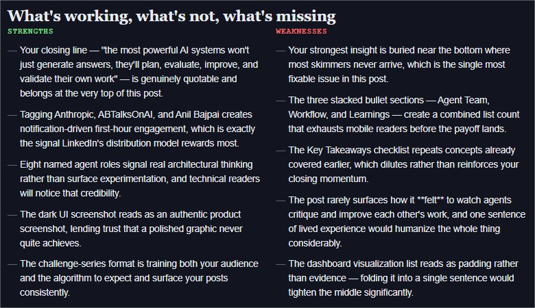
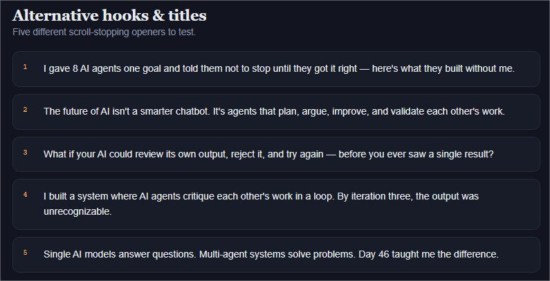
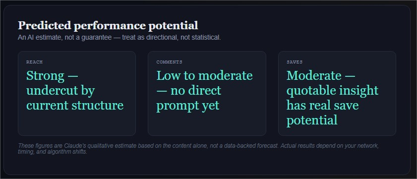

# Day 47/60 – Build Content Intelligence Studio

🚀 As part of the **#60DayClaudeChallenge**, today I built **Content Intelligence Studio**, an AI-powered platform designed to review, evaluate, and improve digital content before publication.

Instead of relying on predefined rules or simple grammar checks, the application uses specialized AI reviewers to analyze text, images, thumbnails, transcripts, and analytics, providing detailed feedback tailored to the selected platform and content goals.

Built as a **single self-contained HTML application** using HTML, CSS, and Vanilla JavaScript, the project delivers a polished, responsive experience while demonstrating modern AI-assisted content workflows.

---

# 🎯 Project Objective

Create an intelligent content analysis platform that helps creators, marketers, educators, and professionals optimize their content through structured AI reviews.

The goal is to provide actionable recommendations that improve quality, engagement, and platform-specific performance before publishing.

---

# 📝 Guided Content Setup

The application begins with a short guided interview to understand:

- Content Type
- Target Platform
- Primary Objective
- Upload Format
- Preferred Review Depth

This information allows the application to build a personalized review workflow for each submission.

---

# 📂 Multi-Format Content Analysis

The platform supports multiple content formats, including:

- Text Documents
- Social Media Posts
- Images
- Thumbnails
- Analytics Screenshots
- Video Transcripts

Uploaded visual content is analyzed alongside written content to provide a comprehensive review.

---

# 🤖 Specialized AI Reviewers

The application automatically assembles a team of AI reviewers based on the uploaded content.

Example reviewers include:

### 📋 Content Strategist

Evaluates structure, clarity, and messaging.

---

### 🎯 Platform Growth Specialist

Provides recommendations optimized for the selected platform.

---

### 🧠 Behavioral Psychology Reviewer

Analyzes emotional impact, audience engagement, and persuasive techniques.

---

### ✍️ Copywriting Specialist

Improves headlines, hooks, calls-to-action, and readability.

---

### 📣 Engagement Optimizer

Suggests ways to increase interaction and audience retention.

---

### 📊 Performance Analyst

Reviews strengths, weaknesses, and opportunities while estimating potential content performance.

Each recommendation is generated through live AI reasoning rather than static rules.

---

# 📊 Content Intelligence Dashboard

The dashboard provides a complete overview of content quality, including:

- Overall Content Score
- Category Breakdown
- AI Reasoning
- Strengths
- Weaknesses
- Missed Opportunities
- Platform-Specific Recommendations
- Rewritten Content
- Alternative Hooks & Titles
- Publishing Checklist

The dashboard is designed to resemble a modern SaaS analytics platform.

---

# 📈 Executive Report

After the review is complete, the application generates a comprehensive report featuring:

- Executive Summary
- Content Health Report
- Highest-Impact Improvements
- Predicted Performance Potential _(AI Estimate)_
- Before vs. After Comparison
- Additional AI Prompts for Future Optimization

This report helps creators understand not only _what_ to improve but also _why_ those improvements matter.

---

# 🎨 User Experience Highlights

The platform includes:

- Responsive Design
- Dark Mode
- Smooth Animations
- Upload Previews
- Live Activity Log
- Reviewer Status Indicators
- Graceful Error Handling
- Retry Logic
- Interactive Visualizations
- Premium Card-Based Interface

These features create an experience comparable to professional content optimization platforms.

---

# 🧠 Key Learnings

### 1. Content Improves Through Iteration

Strong content is rarely created in a single draft. Structured feedback helps creators refine ideas and messaging before publishing.

---

### 2. Context Matters

Different platforms require different writing styles, visual strategies, and audience engagement techniques. Personalized recommendations are more valuable than generic advice.

---

### 3. AI Can Be a Creative Partner

Rather than replacing creators, AI can provide thoughtful reviews, alternative perspectives, and practical improvements that enhance creativity.

---

### 4. Multi-Agent Reviews Produce Better Insights

Specialized AI reviewers focusing on strategy, psychology, copywriting, and platform growth provide more comprehensive feedback than a single general-purpose review.

---

# 📚 Biggest Takeaway

Publishing better content starts with better feedback.

This project demonstrated how AI can act as a collaborative content consultant—helping creators strengthen ideas, improve communication, and increase the likelihood of meaningful engagement.

> Great content isn't just written—it's reviewed, refined, and continuously improved.

---

# 📸 Screenshots

## 

## 

## 

## 

## 

## 

## 

## 

---

# 🙏 Acknowledgements

Special thanks to:

- Anthropic
- AB Talks on AI
- Anil Bajpai

for inspiring practical AI learning through the **#60DayClaudeChallenge**.

---

# 🔖 Hashtags

#60DayClaudeChallenge

#ClaudeAI

#ContentCreation

#ContentMarketing

#CreatorEconomy

#PromptEngineering

#ArtificialIntelligence

#LearningInPublic

#BuildInPublic

#DigitalMarketing

## Prompt

```
Content Intelligence Studio

You are an expert content strategist, platform growth specialist, creator coach, behavioral psychologist, prompt engineer, AI systems architect, UX designer, and senior frontend developer.

Interview first, one question at a time, using MCQs only (free text only for a final "Other" option).

What type of content would you like to analyze?
Which platform is it for?
What was your primary goal?
What would you like to upload? (text, image, screenshot, thumbnail, analytics, transcript, etc.)
How critical should the review be?

After the interview, build a polished single-page HTML application called Content Intelligence Studio that acts as an AI content consultant. The app should accept both text and image inputs and analyze them using the Claude Messages API (fetch to https://api.anthropic.com/v1/messages, no key required).

The application should automatically design an intelligent multi-stage review workflow using specialized AI reviewers appropriate for the uploaded content, each with production-quality system prompts. Every insight, score, explanation, and recommendation must come directly from Claude through live API calls. Do not use hardcoded logic, placeholder analysis, canned feedback, or rule-based scoring.

The dashboard should feel like a premium SaaS product, showing upload previews, overall content score, detailed category breakdowns, AI reasoning, strengths, weaknesses, missed opportunities, platform-specific recommendations, rewritten versions, alternative hooks and titles, publishing checklist, live activity log, reviewer status, and a comprehensive final report. If images or screenshots are uploaded, Claude must analyze the visual content directly.

End with an executive summary, content health report, highest-impact improvements, predicted performance potential (clearly presented as an AI estimate), before-vs-after comparison, and further prompts for deeper optimization.
Donot expect json format anywhere in order to avoid errors like "expected '{' or '('"

Build constraints: Single self-contained HTML file using only vanilla HTML, CSS, and JavaScript. No external libraries. Commercial-grade UI/UX, responsive design, dark mode, smooth animations, interactive visualizations, robust error handling, loading states, graceful retry logic, and zero syntax errors.
```
