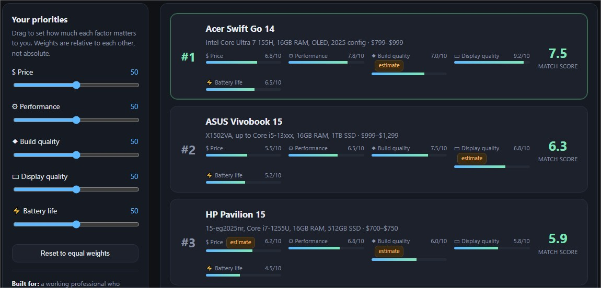

# Day 48/60 – Build Compare & Decide Builder

🚀 As part of the **#60DayClaudeChallenge**, today I built **Compare & Decide Builder**, an AI-powered decision support application that helps users compare multiple options using transparent research, measurable criteria, and interactive scoring.

Rather than presenting fixed rankings or subjective opinions, the application guides users through a structured interview, gathers evidence from trusted sources, and generates a customizable comparison dashboard where rankings update instantly based on personal priorities.

Built as a **single self-contained HTML application** using HTML, CSS, and Vanilla JavaScript, the project emphasizes transparency, evidence-based analysis, and an intuitive user experience.

---

# 🎯 Project Objective

Create an interactive research and comparison platform that helps users make informed decisions using verifiable data instead of assumptions.

The application combines structured interviews, real-world research, adjustable weighting, and transparent scoring to support confident decision-making.

---

# 📝 Guided Decision Interview

The experience begins with a short interactive interview that collects:

- Decision Category
- Options to Compare
- Intended User
- Success Goal
- Evaluation Criteria
- Preferred Data Sources
- Weighting Preference

These responses determine both the research process and the comparison framework.

📸 **Insert Screenshot: Decision Interview**

---

# 🔍 Evidence-Based Research

The application researches each option against the selected criteria using trusted, citable sources.

For every comparison, it:

- Collects verifiable data
- Lists the original sources
- Flags estimated or incomplete information
- Avoids unsupported claims

Transparency is prioritized over presenting artificial certainty.

📸 **Insert Screenshot: Research Panel**

---

# 📊 Interactive Comparison Dashboard

The dashboard compares every option using measurable criteria such as:

- Cost
- Quality
- Time
- Risk
- Availability
- Performance
- Reliability

Users can adjust criterion weights and immediately see updated rankings based on their own priorities.

📸 **Insert Screenshot: Comparison Dashboard**

---

# 🎚️ Dynamic Weighting System

Rather than forcing a single "best" option, the application allows users to:

- Increase or decrease criterion importance
- Observe live score recalculations
- Explore different decision scenarios
- Understand why rankings change

This encourages more personalized and thoughtful decision-making.

📸 **Insert Screenshot: Weight Controls**

---

# 📚 Transparent Research Sources

Every researched data point is accompanied by a visible citation panel.

The application also identifies:

- Verified facts
- Estimated values
- Synthetic placeholders (when applicable)

This helps users distinguish between confirmed information and assumptions.

📸 **Insert Screenshot: Sources Panel**

---

# 📝 Research Methodology

A collapsible **"How this was researched"** section explains:

- Data collection methods
- Source selection
- Handling conflicting information
- Confidence levels
- Any assumptions required

Providing methodology alongside results improves trust and reproducibility.

📸 **Insert Screenshot: Research Methodology**

---

# 🎨 User Experience Highlights

The application includes:

- Responsive Design
- Dark Mode
- Interactive Charts & Rankings
- Adjustable Weight Sliders
- Loading States
- Empty-State Handling
- Error Recovery
- Modern SaaS-Style Interface

These features create a polished experience suitable for both casual users and professional decision-making.

📸 **Insert Screenshot: UI Overview**

---

# 🧠 Key Learnings

### 1. Transparency Builds Trust

Showing sources and research methods helps users understand where recommendations come from and increases confidence in the results.

---

### 2. Every Decision Is Personal

The "best" choice depends on the user's priorities, making adjustable weighting more valuable than fixed rankings.

---

### 3. Evidence Matters

Reliable, citable data leads to stronger decisions than intuition alone.

---

### 4. Interactive Analysis Improves Understanding

Allowing users to explore different scenarios encourages deeper thinking and more informed choices.

---

# 📚 Biggest Takeaway

Decision-support tools should empower users—not replace their judgment.

This project demonstrated how AI can combine research, transparency, and interactive visualization to help people compare options with confidence.

> Better decisions begin with better evidence—and the flexibility to prioritize what matters most.

---

# 📸 Screenshot

## 

---

# 🙏 Acknowledgements

Special thanks to:

- Anthropic
- AB Talks on AI
- Anil Bajpai

for inspiring practical AI learning through the **#60DayClaudeChallenge**.

---

# 🔖 Hashtags

#60DayClaudeChallenge

#ClaudeAI

#DecisionMaking

#Research

#DataVisualization

#PromptEngineering

#AIEngineering

#LearningInPublic

#BuildInPublic

#EvidenceBasedDecisionMaking

## Prompt

```
Compare & Decide Builder

You are an expert research analyst, data journalist, UX designer, and frontend developer.

Before generating anything, interview the user ONE QUESTION AT A TIME in quiz form (MCQs only).

1. What are you trying to decide between? (Ask for the general category, then present four realistic examples of comparable options in that category.)
2. Who is this tool for, and what's the one decision they need to walk away confident about?
3. What criteria matter in this comparison? (Ask for at least four measurable criteria, e.g. cost, time, risk, quality, availability.)
4. Where should the underlying data come from? (Ask the user to name at least two real, citable sources per criterion, or confirm you should research and cite real sources yourself.)
5. Should the user be able to weight criteria by personal priority, or see one fixed ranking?

After collecting the answers:

1. Research and verify real data points for each option against each criterion, using only sources you can name and cite. Do not invent numbers, benchmarks, or scores.

2. Build a premium single-file HTML application (HTML/CSS/JavaScript only, no external libraries) that lets the user adjust criteria weights and see a ranked result update live.

The application should:
- Display a visible sources panel listing every citation used.
- Flag clearly if any data point is an estimate or a synthetic placeholder rather than sourced fact.
- Handle loading states, empty states, and edge cases gracefully.
- Be fully responsive with clean, professional visual design.

3. Add a collapsible "How this was researched" panel explaining where each data point came from and any conflicts between sources you had to resolve.

Generate the complete application only after all interview questions have been answered.

Return ONLY the complete HTML inside one code block.
```
