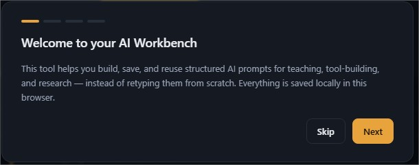
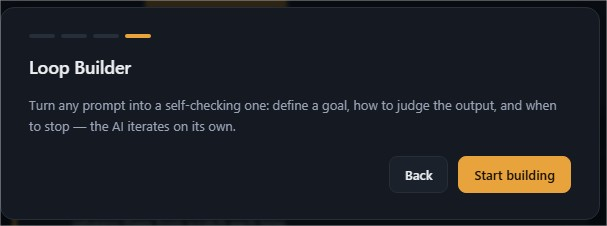
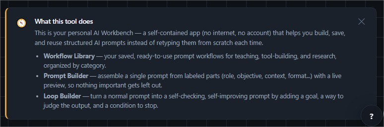
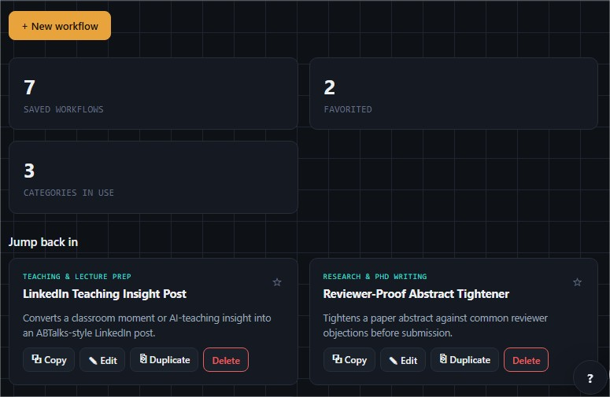

# Day 49/60 – Build a Personal AI Playbook

🚀 As part of the **#60DayClaudeChallenge**, today I built **Personal AI Playbook**, an interactive platform that helps users design reusable AI workflows instead of collecting disconnected prompts.

The application begins with a guided interview to understand how the user actually works with AI—their profession, common tasks, preferred models, productivity challenges, and goals. Based on these responses, it generates a personalized playbook filled with modular workflow systems, editable templates, and reusable prompt-building components.

Built as a **single self-contained HTML application** using HTML, CSS, and Vanilla JavaScript, the project focuses on teaching users how to create adaptable AI systems rather than simply providing prompt collections.

---

# 🎯 Project Objective

Create a personalized AI productivity platform that enables users to build, customize, and reuse intelligent workflows tailored to their daily work.

The goal is to replace static prompt libraries with flexible building blocks that can be combined into thousands of workflow variations.

---

# 📝 Personalized AI Interview

The application begins with an interactive interview to understand:

- Profession or Role
- Primary AI Use Cases
- Daily Repetitive Tasks
- Productivity Bottlenecks
- Preferred AI Models
- Experience Level
- Desired Outcomes

This ensures every workflow generated is relevant to the user's real-world needs.

---

# 📚 Personalized Workflow Library

Instead of presenting generic prompts, the application organizes reusable workflows into meaningful categories based on the user's responses.

Each workflow includes:

- Editable Templates
- Custom Variables
- Practical Examples
- Best Practices
- One-Click Copy
- Reusable Components

Users can create, edit, duplicate, favorite, search, filter, and save workflows using local storage.

---

# 🧩 Prompt Builder

One of the core features is the interactive **Prompt Builder**, where users assemble prompts using modular building blocks.

Available blocks include:

- 👤 Role
- 🎯 Objective
- 📚 Context
- 📏 Constraints
- 🧠 Reasoning Strategy
- 📄 Output Format
- 🎨 Tone
- 💡 Examples
- ✅ Quality Checks

Each block clearly explains:

- What it does
- Why it matters
- How it improves prompt quality

A live preview updates continuously as users build their prompts.

---

# 🔄 Loop Builder

The **Loop Builder** transforms ordinary prompts into autonomous AI workflows by allowing users to define:

- Goals
- Evaluation Criteria
- Improvement Strategy
- Stop Conditions
- Safety Rules

This encourages iterative, self-improving AI systems rather than one-time prompt execution.

---

# 💾 Workflow Management

The application allows users to:

- Save Workflows
- Edit Existing Workflows
- Duplicate Templates
- Mark Favorites
- Search & Filter
- Import & Export Playbooks

Local storage ensures workflows remain available across browser sessions.

---

# ❓ Built-In Learning Experience

To help first-time users, the application includes:

- A persistent "What is this?" help panel
- Plain-language explanations
- Self-descriptive navigation labels
- Context-aware empty states
- Section subtitles that explain purpose

Rather than hiding advanced concepts, the interface teaches prompt engineering while users build workflows.

---

# 🎨 User Experience Highlights

The platform features:

- Responsive Design
- Dark Mode
- Smooth Animations
- Keyboard Shortcuts
- Local Storage
- Import & Export
- Interactive Dashboard
- Beautiful Typography
- Premium SaaS Interface

These design choices create a polished, professional experience suitable for everyday AI users.

---

# 🧠 Key Learnings

### 1. AI Systems Outperform Static Prompts

Reusable workflows are more adaptable and maintainable than isolated prompts.

---

### 2. Modularity Improves Flexibility

Breaking prompts into reusable components makes them easier to customize for different scenarios.

---

### 3. UX Can Teach Prompt Engineering

Clear explanations, live previews, and guided builders help users understand _why_ prompts work—not just how to write them.

---

### 4. Personalization Increases Productivity

Tailoring workflows to individual roles and tasks creates more relevant and effective AI assistance.

---

# 📚 Biggest Takeaway

The future of AI productivity lies in building reusable systems rather than memorizing prompts.

This project demonstrated how thoughtful UX, modular design, and personalized workflows can empower users to create AI solutions that evolve with their needs.

> Great AI users don't collect prompts—they build systems that consistently solve problems.

---

# 📸 Screenshots

## 

## 

## 

## 

---

# 🙏 Acknowledgements

Special thanks to:

- Anthropic
- AB Talks on AI
- Anil Bajpai

for inspiring practical AI learning through the **#60DayClaudeChallenge**.

---

# 🔖 Hashtags

#60DayClaudeChallenge

#ClaudeAI

#PromptEngineering

#ArtificialIntelligence

#Productivity

#WorkflowAutomation

#AIEngineering

#LearningInPublic

#BuildInPublic

#GenerativeAI

## Prompt

```
Personal AI Playbook

You are an expert AI workflow designer, prompt engineer, productivity consultant, UX designer, and senior frontend developer.

Interview first, one question at a time using MCQs whenever possible (free text only when absolutely necessary). Your goal is to understand how the user actually uses AI.

Discover things like:

* Profession or role
* Primary AI use cases
* Daily repetitive tasks
* Biggest productivity bottlenecks
* Preferred AI models
* Experience level
* Desired outcomes

Only begin building after you have enough context.

Generate a premium, fully interactive Personal AI Playbook as a single self-contained HTML file using only HTML, CSS, and JavaScript (no external libraries).

The playbook should be completely personalized based on the interview. Instead of generic prompts, create reusable AI workflow systems that match the user's needs. Each workflow should include editable templates, customizable variables, practical examples, best practices, and one-click copy.

The application should intelligently organize workflows into relevant categories instead of showing unnecessary ones.

Include a Prompt Builder that lets users assemble prompts from reusable building blocks such as role, objective, context, constraints, reasoning strategy, output format, tone, examples, and quality checks while showing a live preview.

Include a Loop Builder that converts any normal prompt into an autonomous looping prompt by allowing users to define goals, evaluation criteria, improvement strategy, stop conditions, and safety rules.

Rather than storing hundreds of prompts, generate modular building blocks that can be combined into thousands of prompt variations tailored to the user's workflow. Give dropdown options wherever needed, to avoid workload on the user.

Allow users to create, edit, duplicate, favorite, search, filter, and save their own workflows using local storage.

## Make the purpose unmistakable to a first-time viewer
Someone opening this file cold — with no context, possibly just a screenshot — should understand what it is within seconds. To achieve that:
- Include a persistent, plain-language explainer visible on the main view by default (not just a one-time onboarding modal), stating what the tool does and what its main sections are for. It can be dismissible, but only via user action.
- Add a permanent, always-visible "What is this?" affordance (e.g. a small help button) that re-opens the full explanation on demand, at any time — not just on first run.
- Use plain, self-descriptive navigation labels for every section (e.g. "Dashboard," not invented jargon like "Deck" or "Hub"). If you introduce a novel term for a feature, define it in the UI the first time it appears.
- In both the Prompt Builder and Loop Builder, every building block must carry a short, visible explanation of what it does and why it matters — shown both (a) in the block picker before it's added, and (b) inside the assembled block once it's in use. Someone should never have to guess what "Reasoning strategy" or "Stop conditions" means or why it's there.
- Section subtitles and empty states should describe purpose in plain language, not just decorative flavor text (e.g. "Your saved AI prompt workflows, at a glance" rather than "Your AI operating system, at a glance").

The interface should feel like a polished commercial SaaS product with beautiful typography, smooth animations, responsive design, dark mode, keyboard shortcuts, onboarding, import/export, and thoughtful UX throughout.

Focus on teaching users how to build reusable AI systems rather than simply giving them prompts.
```
