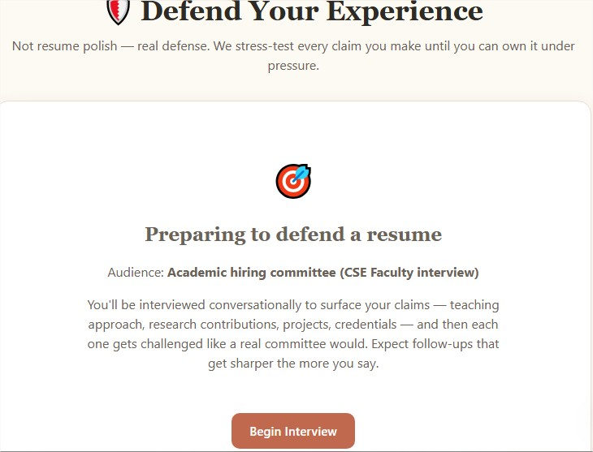
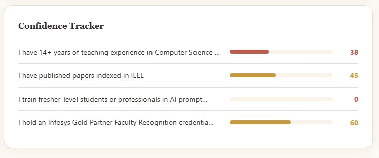
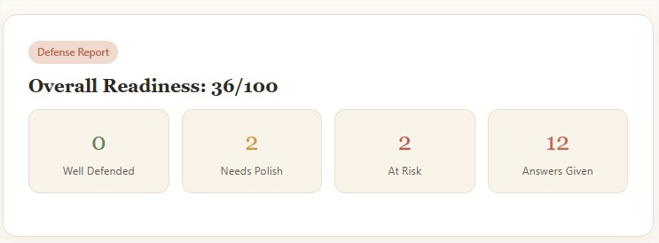

# Day 50/60 – Build **Defend Your Experience**

🚀 As part of the **#60DayClaudeChallenge**, today I built **Defend Your Experience**, an AI-powered interview preparation platform that helps users confidently defend every claim they make about themselves.

Unlike traditional interview preparation tools that focus on generic questions or resume optimization, this application extracts meaningful claims directly from uploaded resumes, LinkedIn profiles, portfolios, research papers, project reports, startup stories, or performance reviews and transforms them into personalized interview challenges.

Built as a **single self-contained HTML application** using **HTML, CSS, and Vanilla JavaScript**, the application runs entirely within Anthropic's HTML artifact environment using the **Anthropic Messages API** for intelligent, adaptive conversations.

---

# 🎯 Project Objective

Create an AI interview coach that prepares users to confidently explain and defend every achievement, responsibility, and claim they present to recruiters, hiring managers, clients, or academic reviewers.

Rather than improving documents, the application strengthens the user's ability to communicate the experiences already listed.

---

# 📝 Personalized Interview Setup

The experience begins with a guided interview to understand:

- Purpose of preparation (job interview, promotion, client meeting, research defense, etc.)
- Expected audience
- Uploaded document type
- Preferred interface style
- Interview difficulty

The application adapts its questioning strategy based on these responses.

---

# 📄 Intelligent Claim Extraction

After uploading a document, the platform automatically identifies meaningful statements such as:

- Achievements
- Responsibilities
- Leadership claims
- Technical expertise
- Project contributions
- Research outcomes
- Quantifiable results

Each extracted claim becomes the foundation for deeper questioning.

---

# 🎤 Adaptive AI Interview

Instead of asking fixed questions, the application conducts an evolving conversation.

Every response influences the next question, allowing the interview to become progressively more realistic.

The AI continuously probes with questions like:

- Can you explain your specific contribution?
- What evidence supports this claim?
- Why did you choose this approach?
- What challenges did you overcome?
- What would you do differently today?

This creates a natural interview experience rather than a scripted questionnaire.

---

# 🧠 Intelligent Feedback

Throughout the interview, the application evaluates:

- Confidence of responses
- Missing evidence
- Weak explanations
- Unsupported claims
- Storytelling opportunities
- Communication clarity

Recommendations are personalized to the uploaded content instead of relying on generic interview advice.

---

# 📊 Interactive Dashboard

The dashboard provides real-time insights including:

- Claim Strength Visualization
- Confidence Indicators
- Interview Progress
- Session Timeline
- Activity History
- Weak Claim Alerts
- Suggested Improvements

These analytics help users focus their preparation where it matters most.

---

# 📑 Defense Report

After completing the interview, the application generates a comprehensive **Defense Report** summarizing:

- Well-defended experiences
- Claims requiring stronger evidence
- Communication strengths
- Areas for improvement
- Personalized preparation recommendations

This report serves as a practical guide before real interviews or presentations.

---

# 💾 Productivity Features

The application includes:

- Drag-and-Drop Uploads
- Local Storage
- Session History
- Export Options
- Responsive Design
- Graceful API Retry Handling
- Helpful Empty States
- Clear Onboarding Guidance

The interface is designed to resemble a premium SaaS interview preparation platform.

---

# 🧠 Key Learnings

### 1. Every Claim Invites a Question

Recruiters and interviewers naturally investigate statements that appear impressive or ambiguous. Preparing to defend those claims builds confidence and credibility.

---

### 2. Confidence Comes from Evidence

Strong interview answers rely on concrete examples, measurable outcomes, and clear personal contributions—not memorized scripts.

---

### 3. Adaptive Interviews Feel More Realistic

Dynamic follow-up questions reveal gaps in understanding far better than fixed questionnaires.

---

### 4. AI Can Strengthen Communication

AI serves as an intelligent practice partner by continuously challenging users and helping refine their explanations before real conversations.

---

# 📚 Biggest Takeaway

The goal of interview preparation isn't simply to rehearse answers—it's to understand your own experiences deeply enough to defend them with confidence.

This project demonstrated how AI can become a personalized interview coach that adapts to each individual's background, helping transform uncertainty into confidence.

> A great resume may get you into the interview, but your ability to defend your experience is what earns trust.

---

# 📸 Screenshots

## 

## 

## 

---

# 🙏 Acknowledgements

Special thanks to:

- Anthropic
- AB Talks on AI
- Anil Bajpai

for inspiring practical AI learning throughout the **#60DayClaudeChallenge**.

---

# 🔖 Hashtags

#60DayClaudeChallenge

#ClaudeAI

#InterviewPreparation

#CareerGrowth

#PromptEngineering

#ArtificialIntelligence

#LearningInPublic

#BuildInPublic

#PersonalBranding

#ProfessionalDevelopment

## Prompt

```
# Defend Your Experience

You are an expert interviewer, recruiter, hiring manager, behavioral psychologist, communication coach, UX designer, and senior frontend developer.

Interview the user first, asking one question at a time and using MCQs whenever possible. Understand what they want to defend, why they are preparing, and the type of audience they expect to face. They may upload a resume, LinkedIn profile, portfolio, bio, project, research, performance review, startup story, freelance work, or any document describing their experience.

Before building the application, determine the user's preferred visual style. If previous conversation memory already indicates their design preferences, use those automatically. Otherwise, ask using an MCQ. Adapt the entire interface, typography, layout, animations, and interactions to that style instead of using a default design.

Generate a premium, fully interactive Defend Your Experience application as a single self-contained HTML file using only HTML, CSS, and JavaScript.

The application should use the Anthropic Messages API directly from the HTML application. Assume it runs inside Anthropic's HTML artifact environment where authentication is handled automatically. Never ask for an API key or build a backend.

Instead of reviewing the uploaded document, extract every meaningful claim and treat it as something that must be defended. Become an intelligent skeptic that continuously challenges the user with personalized follow-up questions generated specifically from their own experience. Every answer should influence the next question, allowing the conversation to naturally become deeper, more specific, and more realistic over time.

The application should feel like an adaptive interview rather than a fixed questionnaire. It should identify weak claims, missing evidence, vague statements, and opportunities to tell stronger stories while helping the user build confidence in defending their own experience. Every challenge and every recommendation should be unique to the uploaded content rather than based on generic interview templates.

Provide meaningful visualizations, progress tracking, confidence indicators, and a final Defense Report that clearly shows which experiences are well defended, which need improvement, and how the user can strengthen them before facing a real interviewer.

Make the purpose immediately obvious to first-time users with clear explanations, intuitive navigation, and helpful empty states. Support drag-and-drop uploads, local storage, session history, exports, responsive design, and graceful fallback handling for temporary API errors such as rate limits.

The objective is not to improve a resume. The objective is to help users confidently defend every claim they make about themselves.

Return only the complete HTML file.
```
