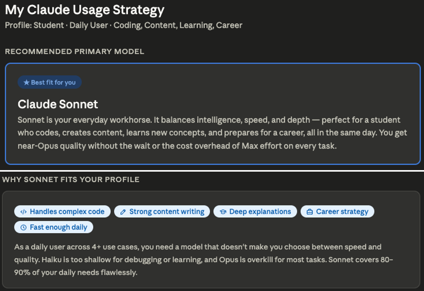

# 🚀 Day 07/60 – Claude Model Selection & Reasoning Effort

Many people assume that all AI models behave the same way.

They don't.

Choosing the right model can significantly impact:

✅ Response quality

✅ Speed

✅ Cost

✅ Reasoning depth

✅ Coding performance

---

# 🤔 The Common Mistake

Most users do this:

```text
Use the same AI model for every task.
```

Examples:

- Simple email writing
- Research analysis
- Complex coding
- Strategic planning

All using the same model.

### Result?

Either you're paying more than necessary or getting weaker outputs than expected.

---

# 🎯 Think Like an AI Engineer

Different tasks require different levels of reasoning.

The key is matching the model to the task.

---

# ⚡ Low Reasoning Effort

### Best For

- Grammar correction
- Email drafting
- Content rewriting
- Summarization
- Formatting text
- Quick Q&A

### Goal

- Fast responses
- Lower cost
- High efficiency

### Example

```text
Rewrite this email professionally.
```

A fast model can handle this easily.

---

# ⚖️ Medium Reasoning Effort

### Best For

- Lesson planning
- Blog writing
- Learning roadmaps
- Data interpretation
- Content creation
- Documentation

### Goal

- Balance speed and quality
- Moderate reasoning depth

### Example

```text
Create a 30-day roadmap to learn AI Engineering.
```

This requires some planning and organization but not deep multi-step reasoning.

---

# 🧠 High Reasoning Effort

### Best For

- System design
- Software architecture
- Multi-step problem solving
- AI Agent workflows
- Research synthesis
- Complex debugging
- Strategic decision-making

### Goal

- Deep thinking
- Better accuracy
- Higher-quality outcomes

### Example

```text
Design an AI-powered Resume Optimizer with ATS scoring,
RAG integration, and interview preparation features.
```

This requires:

- Analysis
- Planning
- Trade-off evaluation
- Multi-step reasoning

---

# 🔥 Same Prompt, Different Outcomes

## Task

```text
Create a learning roadmap for AI Engineering.
```

### Standard Model Output

- Generic milestones
- Generic resources
- Generic projects

---

### Reasoning-Focused Model Output

- Identifies prerequisite skills
- Detects learning dependencies
- Creates realistic timelines
- Suggests personalized projects
- Provides strategic learning paths

---

# 🧩 Model Selection Framework

Before choosing a model, ask:

### 1️⃣ How complex is the task?

### 2️⃣ How important is accuracy?

### 3️⃣ Do I need speed or depth?

### 4️⃣ Is this creative work or reasoning work?

### 5️⃣ Am I optimizing for quality, cost, or both?

---

# 💡 The AI Engineering Triangle

```text
Prompt Engineering
        +
Context Engineering
        +
Model Selection
        =
Better AI Results
```

---

# 🚀 Why Model Selection Matters

Many users focus only on prompts.

Others focus only on context.

But even a perfect prompt and perfect context can be limited if the selected model lacks the reasoning capability required for the task.

Choosing the right model can often improve results more than rewriting the prompt multiple times.

---

# 🧠 Day 07 Learning Outcome

The best AI users don't just write better prompts.

They choose the right model for the right task.

> Better Model Selection
>
> Better Reasoning
>
> Better Results

---

# 🎯 Quick Challenge

Think about the last task you gave to an AI.

Ask yourself:

- Did it really require deep reasoning?
- Could a faster model have handled it?
- Would a reasoning model have improved the outcome?

Understanding this distinction is a key step toward becoming an effective AI Engineer.

---

# 📌 Key Takeaways

- Not all AI models are designed for the same tasks.
- Simple tasks require speed, not deep reasoning.
- Complex tasks benefit from reasoning-focused models.
- Model selection impacts quality, speed, and cost.
- AI Engineers choose models strategically.

---

# 🚀 Final Thought

Most people ask:

> "What prompt should I use?"

AI Engineers ask:

> "What model should solve this problem?"

That shift in thinking makes all the difference.

## 

#AIEngineering #ClaudeAI #PromptEngineering #ContextEngineering #ModelSelection #GenerativeAI #ArtificialIntelligence #LLM #AIAgents #MachineLearning #LearnAI #AIProductivity #TechLearning #FutureOfAI #60DaysOfAI
