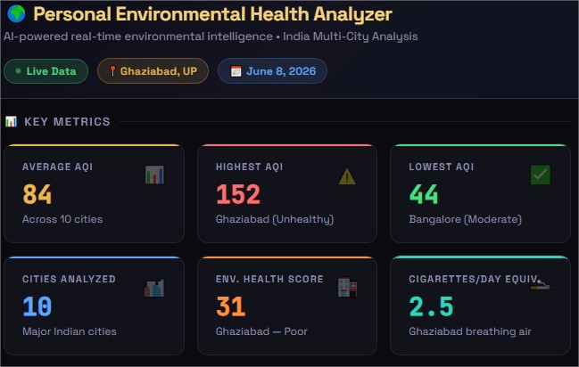
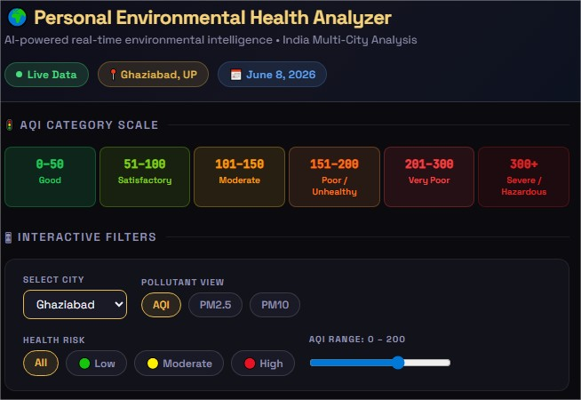
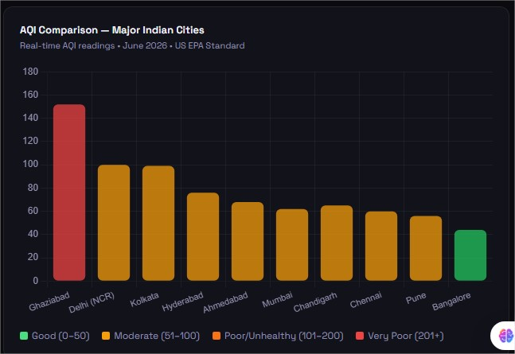
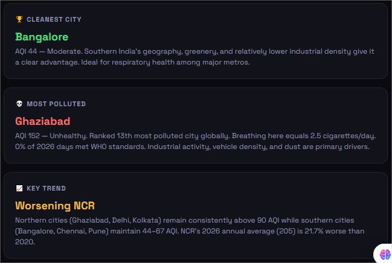
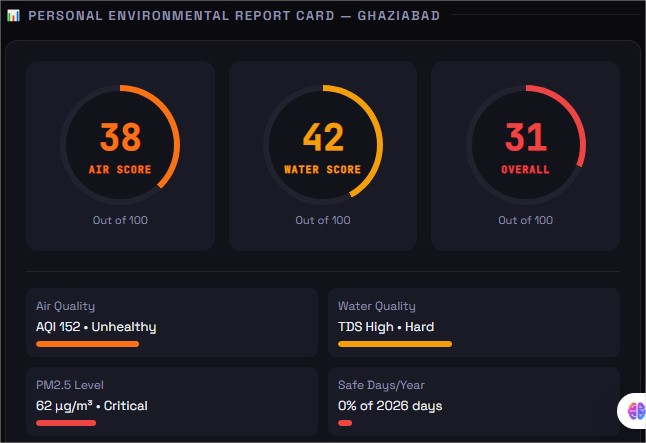
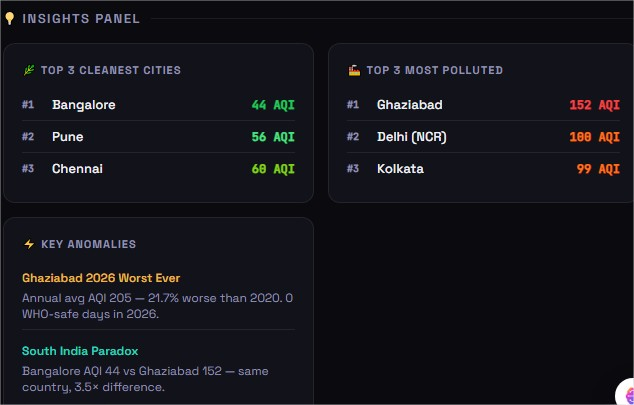
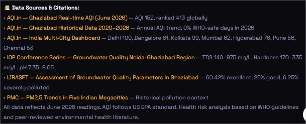

# Day 08/60 – Build Your First AI-Powered Dashboard

🚀 Today I built my first AI-powered dashboard using Claude Artifacts: **Personal Environmental Health Analyzer**.

## 🌍 Project Goal

Analyze environmental health indicators for a city by combining:

- Air Quality Index (AQI) data
- Water quality information
- Automated data collection
- Data validation and cleaning
- Actionable insights

For this project, I selected **Ghaziabad, Uttar Pradesh** as the target city.

---

## 💡 What Makes This Interesting?

The Artifact doesn't rely only on user-uploaded datasets.

I designed it to:

- Use a provided dataset when available
- Automatically search for the latest AQI and water-quality data when no dataset exists
- Handle missing values and data inconsistencies
- Validate data quality before analysis
- Generate meaningful environmental health insights

---

## 🧠 Key AI Engineering Concepts Learned

### 1. Context Engineering

Providing Claude with precise instructions for data acquisition, validation, and analysis.

### 2. Autonomous Data Collection

Designing workflows where AI can identify missing information and retrieve relevant public data.

### 3. Data Quality Management

Ensuring the analysis remains reliable by cleaning and validating incoming data.

### 4. AI-Powered Dashboards

Transforming raw environmental data into understandable visual insights.

---

## 📚 Biggest Takeaway

Building AI applications is not just about prompting.

The real value comes from designing systems that can:

- Gather information
- Validate information
- Analyze information
- Present information

This exercise showed how AI can move beyond chat and become a practical decision-support tool.

---

## 📸 Screenshots

### Screenshot 2: Dashboard Interface

## 

Insert screenshot of the dashboard home screen.

### Screenshot 3: Ghaziabad Environmental Analysis

## 

### Screenshot 4: Key Insights & Recommendations

## 

## 

## 

## 

## 

```text
Prompt
   ↓
Data Retrieval
   ↓
Data Validation
   ↓
Analysis
   ↓
Dashboard
```

This workflow diagram highlights the engineering process behind the solution.

---

## 🔖 Hashtags

#60DayClaudeChallenge #ClaudeAI #Anthropic #AIArtifacts #ContextEngineering #DataAnalytics #EnvironmentalHealth #DashboardDevelopment #PromptEngineering #AICareer #LearningInPublic #Day08 #BuildInPublic
