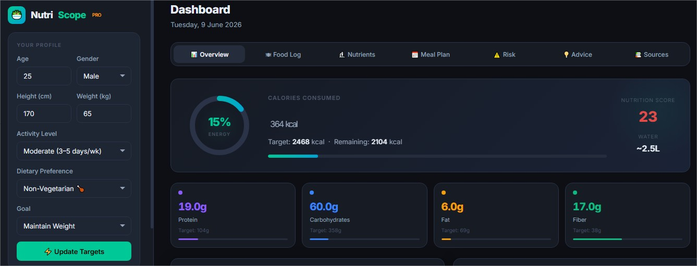
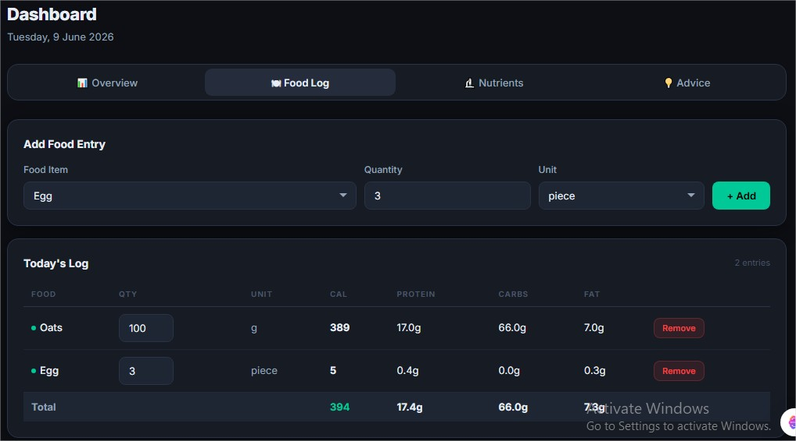
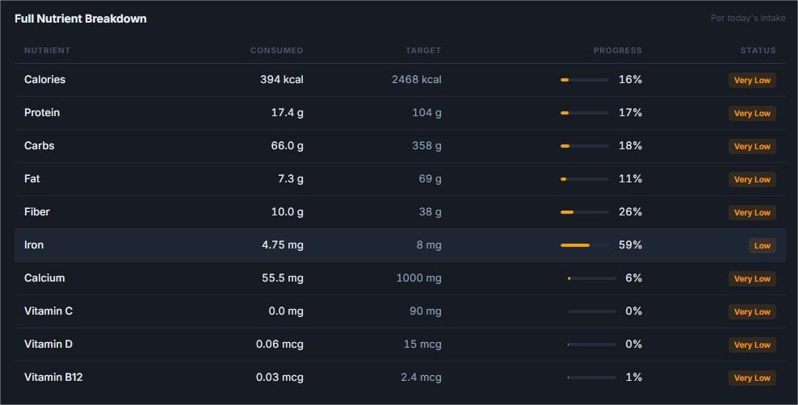
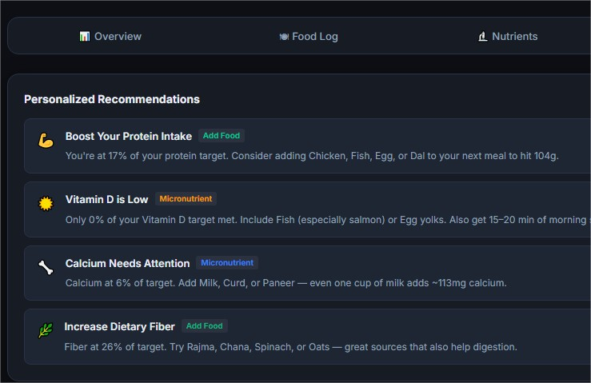
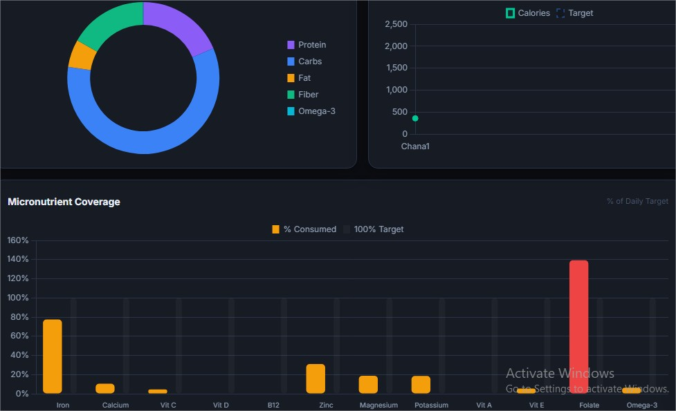
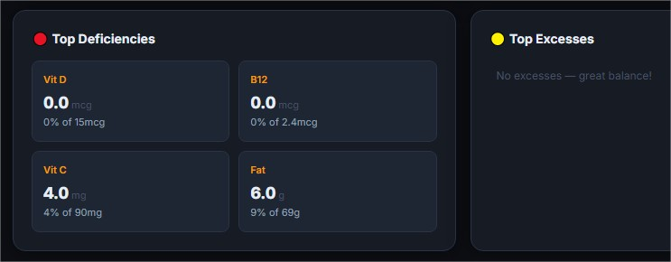

# Day 09/60 – Build & Enhance an AI Nutrition Analytics App

🚀 Continuing my AI Engineering journey, today I built and enhanced an AI-powered nutrition analytics application called **NutriScope** using Claude.

What started as a simple nutrition tracker evolved into a more practical analytics platform through iterative prompt engineering.

---

## 🥗 Project: NutriScope

NutriScope is a nutrition analytics dashboard that helps users:

- Track daily food intake
- Monitor macro and micronutrients
- Analyze nutritional deficiencies
- Receive personalized dietary recommendations
- Visualize nutrition data through interactive dashboards

---

## Version 1: Basic Nutrition Analytics

The first version focused on:

### User Profile Management

- Age
- Gender
- Height
- Weight
- Activity Level
- Dietary Preference

### Food Logging

- Add food items
- Enter quantity and units
- Edit and remove entries

### Nutrition Tracking

- Calories
- Protein
- Carbohydrates
- Fat
- Fiber
- Iron
- Calcium
- Vitamin C
- Vitamin D
- Vitamin B12

### Dashboard Features

- Energy Progress
- Macro Distribution
- Nutrient Completion
- Deficiency Analysis

---

## Version 2: Enhanced with CSV Upload

After evaluating the first version, I improved the prompt and added a new capability:

### 📂 CSV Upload Support

Users can now upload nutrition logs directly from CSV files instead of entering data manually.

### Benefits

- Faster data entry
- Better user experience
- Supports larger datasets
- Enables bulk nutrition analysis
- More practical for real-world applications

This enhancement demonstrated how small prompt changes can significantly improve application functionality.

---

## 🧠 AI Engineering Concepts Learned

### 1. Prompt Iteration

The first output is rarely the final product.

Improving prompts incrementally can unlock new features without rewriting the application from scratch.

### 2. Requirement Engineering

Well-defined requirements lead to more accurate and complete AI-generated applications.

### 3. Feature Enhancement Through AI

Adding CSV upload functionality showed how AI can rapidly evolve a product from MVP to a more production-ready solution.

### 4. Dashboard Design Thinking

Building analytics applications requires thinking beyond data collection and focusing on insights and decision-making.

### 5. AI-Assisted Full-Stack Development

Using a single prompt, Claude generated:

- UI Components
- Data Models
- Nutrition Calculations
- Dashboard Visualizations
- Recommendation Engine

---

## 📚 Biggest Takeaway

AI Engineering is not just about generating code.

It is about:

- Defining requirements clearly
- Iterating intelligently
- Testing outputs
- Enhancing features systematically

The transition from Version 1 to Version 2 reinforced an important lesson:

> Better prompts create better products.

---

## 📸 Screenshots

## 

## 

## 

## 

## 

## 

```text
Version 1 Prompt
        ↓
Initial Nutrition App
        ↓
Prompt Enhancement
        ↓
CSV Upload Feature
        ↓
NutriScope V2
```

This visual comparison clearly demonstrates the impact of prompt engineering on application capabilities.

---

## 💡 Key Learning

A small improvement in prompt quality can create a significant improvement in application capability.

Prompt Engineering is becoming an essential skill for AI-assisted software development.

---

#AIEngineering
#ClaudeAI
#PromptEngineering
#NutritionAnalytics
#DataVisualization
#WebDevelopment
#DashboardDesign
#AIApps
#BuildInPublic
#LearningInPublic
#NutritionTech
#FullStackDevelopment
#Anthropic
#Day09
#60DaysOfAI
