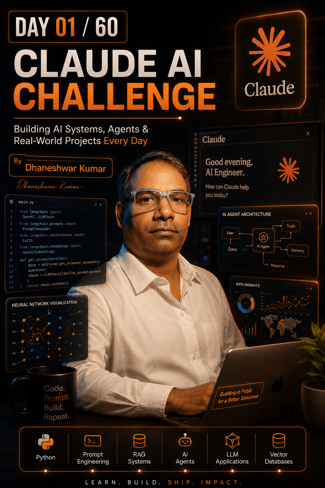

<h1 align="center">Hi 👋, I'm Dhaneshwar Kumar</h1>

<h3 align="center">
Computer Science Professor • Full-Stack Developer • AI Explorer
</h3>

Building AI Agents, RAG Systems, and Real-World LLM Applications 🚀

Passionate about teaching, building software, and exploring the latest advancements in Artificial Intelligence, Generative AI, and Large Language Models.

Currently on a **60-Day Claude AI Challenge** where I am building and sharing practical AI projects, agents, and real-world applications.

---

## 🌟 About Me

- 🎓 Professor of Computer Science & Engineering
- 💻 Full-Stack Developer
- 🤖 Exploring AI Agents, RAG Systems, and LLM Applications
- 📚 Mentor and Technology Trainer
- 🧩 Competitive Programming Enthusiast
- 🌱 Continuous Learner

---

## 🚀 Current Focus

- Prompt Engineering
- Claude AI
- AI Agents
- Retrieval-Augmented Generation (RAG)
- Vector Databases
- LangChain
- Full-Stack Development
- React & JavaScript Ecosystem

---

## 🛠️ Tech Stack

### Languages

- Java
- JavaScript
- Python
- C++
- SQL

### Frontend

- React
- Tailwind CSS
- Bootstrap
- HTML5
- CSS3

### Backend

- Node.js
- Express.js
- REST APIs

### Database

- MySQL
- MongoDB
- PostgreSQL

### AI & GenAI

- Claude AI
- OpenAI
- LangChain
- Vector Databases
- Prompt Engineering
- RAG Systems

---

# 🤖 My AI Profile

  

---

## 📈 60-Day Claude AI Challenge

Building in public and sharing my AI journey:

✅ Prompt Engineering  
✅ AI Agents  
✅ RAG Systems  
✅ LLM Applications  
✅ Vector Databases  
✅ Real-World AI Projects

---

## 📫 Connect With Me

- LinkedIn: https://www.linkedin.com/in/dhaneshwar-kumar-a3ba15121/
- GitHub: https://github.com/Dhannesh
- Email: dhannesh@gmail.com

---

## 💡 Quote

> "Life Runs on Code."

---

⭐ If you find my work interesting, feel free to follow my journey and connect with me.
